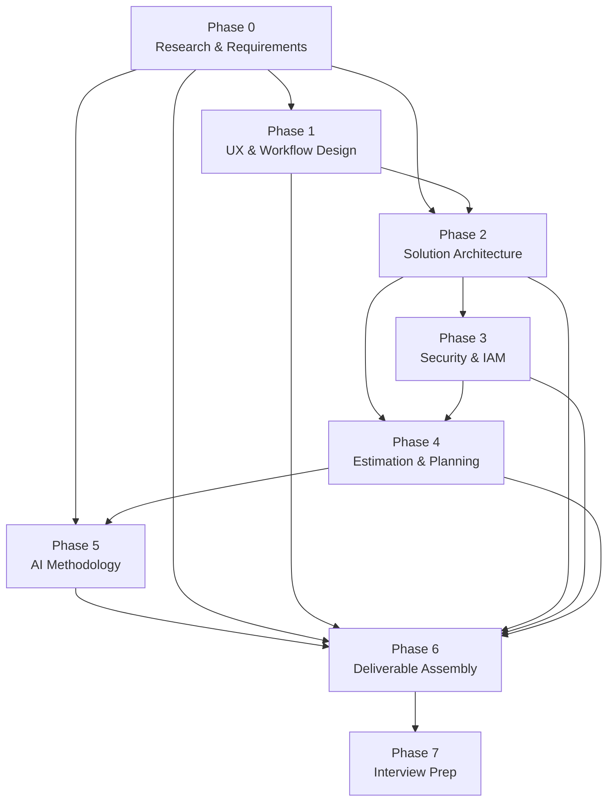

# CVS Health Legacy System Transformation — Master Plan

## Executive Summary

This engagement produces a **Solution Architecture Document** for CVS Health's Legacy System Transformation initiative — modernizing IBMi (AS/400) green screen applications with new UI/UX. The document is a take-home assignment for the **Principal Architect, Solution Engineering and Automation** role. It will be presented to a hiring panel in a 15-20 minute presentation followed by Q&A.

The deliverable must address 5 key considerations: Legacy System Integration, IAM Strategy, HCD Design Principles, Technology Stack, and Change Management. It must also demonstrate dual competency: principal architect leadership AND thought leadership over the GenAI data science team Paul would manage.

### Engagement Classification

- **Engagement type**: `modernization` (per `engagement.schema.json`)
- **Canonical flow**: Migration — `req → ip → arch → dm → sr → est → ppl → [pro] → rv` (per CLAUDE.md)
- **`/proposal` note**: The canonical flow includes `/proposal`, but the deliverable is a Solution Architecture Document for a job interview, not a client SOW. Phase 6 (Assembly) should evaluate whether `/proposal` adds value or whether manual assembly better serves the custom format.

### Dual Competency Thread

The GenAI Data Scientist JD reveals the team Paul would lead builds:
- LLM workflows transforming unstructured clinical notes into structured referral outputs
- GCP-native pipelines (BigQuery, Vertex AI, Cloud Storage)
- Evaluation/guardrails for GenAI output safety
- Salesforce + care platform integrations

This thread is woven into Phases 0 (requirements), 2 (architecture), 3 (security), and 5 (methodology).

---

## Dependency Graph



**Execution order: 0 → 1 → 2 → 3 → 4 → 5 → 6 → 7** (sequential)

---

## Phase Index

| Phase | Title | Skills | Complexity | Dependencies | Key Output |
|-------|-------|--------|-----------|--------------|------------|
| **0** | Research & Requirements | `/requirements`, `/review` | Large | None | Research findings + `requirements.json` |
| **1** | UX & Workflow Design | None (design doc) | Medium | Phase 0 | UX design document |
| **2** | Solution Architecture | `/integration-plan`, `/architecture`, `/data-model`, `/review` | Very Large | Phases 0, 1 | `integration_plan.json` + `architecture.json` + `data_model.json` |
| **3** | Security & IAM | `/security-review`, `/review` | Large | Phase 2 | `security_review.json` + IAM strategy |
| **4** | Estimation & Planning | `/estimate`, `/project-plan`, `/review` | Large | Phases 2, 3 | `estimate.json` + `project_plan.json` |
| **5** | AI Methodology | None (documentation) | Medium | Phases 0-4 | AI methodology section + citations |
| **6** | Deliverable Assembly | `/review` (+ optional `/proposal`) | Very Large | All prior phases | Final `solution-architecture-document.md` |
| **7** | Interview Prep | None (preparation) | Large | Phase 6 | Presentation script + Q&A + study guide |

---

## Iterative Execution Cycle

Each phase follows a **plan → human review → execute → context handoff → improve future plans** cycle.

```
┌─────────────────────────────────────────────────────────┐
│  1. ENTER PLAN MODE                                     │
│     • Load the phase plan file                          │
│     • Read context summaries from all completed phases  │
│     • Read latest versions of all future phase plans    │
│     • Adapt the current phase plan based on accumulated │
│       learnings (new findings, corrected assumptions,   │
│       refined scope from prior phases)                  │
│     • Present adapted plan to Paul for review           │
│                                                         │
│  2. HUMAN REVIEW (Paul)                                 │
│     • Paul reviews adapted plan                         │
│     • Paul approves, adjusts, or asks questions         │
│     • Paul confirms: "execute this phase"               │
│                                                         │
│  3. EXIT PLAN MODE → EXECUTE                            │
│     • Run the phase: web research, skill invocations,   │
│       document writing, quality review                  │
│     • For skill invocations: check engagement.json      │
│       lifecycle_state for prerequisite KB files          │
│     • Produce all specified artifacts                   │
│     • After writing KB files: update engagement.json    │
│       lifecycle_state and run KB validation              │
│     • Run quality gate (>= 7.5/10 review score)        │
│                                                         │
│  4. CONTEXT HANDOFF                                     │
│     • Write phase context summary to:                   │
│       .claude/plans/cvs-engagement/context/             │
│         phase-N-context.md                              │
│     • Context summary includes:                         │
│       - Key findings and decisions made                 │
│       - Artifacts produced (file paths + descriptions)  │
│       - Surprises or pivots from the original plan      │
│       - Research depth assessment                       │
│       - New assumptions discovered                      │
│       - Confirmed or rejected prior assumptions         │
│       - Insights that should influence future phases    │
│       - Paul's feedback and direction changes           │
│                                                         │
│  5. UPDATE FUTURE PHASE PLANS                           │
│     • Review ALL remaining phase plan files             │
│     • Update each with:                                 │
│       - New file paths / artifacts from this phase      │
│       - Refined research directives based on learnings  │
│       - Adjusted scope (expand or contract)             │
│       - Corrected assumptions                           │
│       - New context that changes the approach           │
│     • Update master-plan.md if structural changes       │
│                                                         │
│  6. HUMAN CHECKPOINT (Paul)                             │
│     • Paul reviews phase outputs                        │
│     • Paul reviews updated future plans                 │
│     • Paul confirms: "proceed to next phase"            │
│     • Or: "re-run this phase" / "adjust scope"          │
└─────────────────────────────────────────────────────────┘
```

### Engagement Lifecycle Management

The SA Agent tracks engagement state via `knowledge_base/engagement.json`:
- **Phase 0** creates `engagement.json` with `engagement_type: "modernization"` and initial `lifecycle_state`
- **Each skill-invoking phase** updates its domain entry in `lifecycle_state` (status, version, file)
- **After writing any KB file**, run: `python tests/validate_knowledge_base.py` to validate against schemas
- **Prerequisites**: Before invoking a skill, verify upstream KB files have status `complete` or `approved` in `engagement.json`

### Context Directory Structure

```
.claude/plans/cvs-engagement/context/
├── phase-0-context.md    ← Written after Phase 0 completes
├── phase-1-context.md    ← Written after Phase 1 completes
├── phase-2-context.md    ← Written after Phase 2 completes
├── phase-3-context.md    ← Written after Phase 3 completes
├── phase-4-context.md    ← Written after Phase 4 completes
├── phase-5-context.md    ← Written after Phase 5 completes
├── phase-6-context.md    ← Written after Phase 6 completes
└── phase-7-context.md    ← Written after Phase 7 completes
```

### Context Summary Template

Each `phase-N-context.md` follows this structure:

```markdown
# Phase N Context Summary

**Completed**: [date]
**Status**: [complete | complete-with-caveats]

## Key Findings
- [Bullet list of the most important discoveries]

## Artifacts Produced
| File | Description |
|------|-------------|
| `path/to/file` | What it contains |

## Decisions Made
- [Decision]: [rationale]

## Surprises and Pivots
- [What differed from the plan and why]

## Assumptions
### Confirmed
- [Assumption N]: confirmed by [source]
### Rejected
- [Assumption N]: rejected because [reason]
### New
- [Assumption N+1]: [statement] — needs confirmation

## Insights for Future Phases
- **Phase X**: [specific insight that should change Phase X's approach]
- **Phase Y**: [specific insight]

## Paul's Feedback
- [Direction changes, preferences, corrections from Paul during this phase]
```

---

## How to Start Each Session

When Paul says "let's execute Phase N":

1. Enter plan mode
2. Read: `.claude/plans/cvs-engagement/phase-N-*.md` (the current phase plan)
3. Read: `.claude/plans/cvs-engagement/context/phase-*-context.md` (all completed phase contexts)
4. Read: All remaining future phase plans (to understand downstream needs)
5. Adapt the current phase plan based on accumulated context
6. Present adapted plan to Paul
7. On approval: exit plan mode and execute

---

## Consolidated File Paths

### Assignment Sources
- `.claude/plans/references/solution-architect-case-study-and-interview.md`
- `.claude/plans/references/CVS - GenAI Data Scientist Job Description .pdf`

### Paul's Career and Brand (base: `C:\dev\paulprae-com`)
- `data/generated/career-data.json` — career history (CRITICAL for honesty mapping)
- `data/sources/knowledge/brand/identity.json` — brand identity
- `data/sources/knowledge/brand/communication-styles.json` — communication styles
- `data/sources/knowledge/brand/values.json` — values
- `data/sources/knowledge/content/writing-formulas.json` — writing formulas (STAR, PAS, BAB, AIDA)
- `data/sources/knowledge/career/companies.json` — company history
- `data/sources/knowledge/career/projects.json` — project portfolio

### Paul's Recent Architectures (base: `C:\dev\paulprae-com`)
- `README.md` — paulprae.com overview
- `docs/technical-design-document.md` — technical design
- `docs/ai-architecture.md` — AI architecture patterns
- `docs/devops.md` — DevOps and CI/CD
- `docs/security.md` — security architecture

### Paloist Architecture (base: `C:\dev\paloist-core`)
- `docs/solution-architecture.md` — solution architecture
- `docs/security-and-privacy.md` — security and privacy

### Quality Benchmarking Exemplars
- `.claude/plans/references/reference-materials-index.md` — index of real-world SA deliverables
- Hyperbloom, AVAHI, Florence, AGADA reference materials in `.claude/plans/references/`
- Use these to benchmark deliverable quality in Phase 6 (Assembly)

### Agent Config (this repo)
- `.claude/rules/guiding-principles.md` — 42 technology principles
- `knowledge_base/system_config.json` — agent configuration (READ-ONLY)
- `knowledge_base/schemas/` — all JSON schemas for KB validation
- `.claude/plans/references/sa-best-practices-research-2026.md` — SA frameworks research
- `.repo-metadata.json` — agent version and capability metadata

### Directory Exclusion
- **NEVER** read `.claude/plans/archive/` — unrelated project artifacts

---

## Planning Assumptions

1. **IBMi/AS/400 knowledge gap**: Paul rates himself 1/5 on IBMi — every technical claim about IBMi must be web-researched and cited. Cannot catch hallucinations without sources.
2. **GCP as CVS's primary cloud**: CVS JD emphasizes GCP (7+ years preferred). Paul's cloud narrative is AWS-primary. Must research GCP equivalents deeply and frame AWS experience as transferable. GCP is selected because CVS uses it, not as a default vendor preference (per CLAUDE.md: "Technology-agnostic: recommend best-fit via WebSearch, never default to specific vendors").
3. **Healthcare compliance**: HIPAA is the baseline. CVS operates in pharmacy benefits (PBM), which also touches HITECH, state privacy laws, and DEA regulations for controlled substances.
4. **Single Markdown deliverable**: Final output is one GFM-compatible Markdown document that exports cleanly to Word. Target < 300 KB.
5. **Panel interview format**: 15-20 minute presentation + Q&A. Panel members each drill on individual key considerations.
6. **Dual competency**: Paul must demonstrate both principal architect capability AND thought leadership for managing GenAI data scientists.
7. **Honesty-first**: Paul's direct experience is cited with confidence. Researched knowledge is explicitly labeled. Assumptions are numbered and flagged for confirmation.
8. **AI-assisted, human-owned**: The deliverable is Paul's work, assisted by AI tooling. Paul reviews and owns every section.

---

## Output Structure

```
.claude/plans/cvs-engagement/
├── master-plan.md                          ← This file
├── phase-0-research-and-requirements.md    ← Standalone planning prompt
├── phase-1-ux-and-workflow-design.md       ← Standalone planning prompt
├── phase-2-solution-architecture.md        ← Standalone planning prompt
├── phase-3-security-and-iam.md             ← Standalone planning prompt
├── phase-4-estimation-and-planning.md      ← Standalone planning prompt
├── phase-5-ai-methodology-and-citation.md  ← Standalone planning prompt
├── phase-6-deliverable-assembly.md         ← Standalone planning prompt
├── phase-7-interview-prep.md               ← Standalone planning prompt
└── context/                                ← Phase context summaries (written during execution)
    ├── .gitkeep
    └── phase-N-context.md                  ← One per completed phase

knowledge_base/                             ← KB artifacts produced by skills
├── engagement.json                         ← Created Phase 0, updated each phase
├── requirements.json                       ← Phase 0
├── integration_plan.json                   ← Phase 2
├── architecture.json                       ← Phase 2
├── data_model.json                         ← Phase 2
├── security_review.json                    ← Phase 3
├── estimate.json                           ← Phase 4
├── project_plan.json                       ← Phase 4
├── reviews.json                            ← Phases 0, 2, 3, 4, 6
└── system_config.json                      ← READ-ONLY reference

outputs/cvs-legacy-transformation/          ← Final deliverable
└── solution-architecture-document.md       ← Phase 6

private/interview-prep/                     ← Phase 7 (gitignored)
├── presentation-script.md
├── study-guide.md
├── qa-bank.md
└── cheat-sheet.md
```
