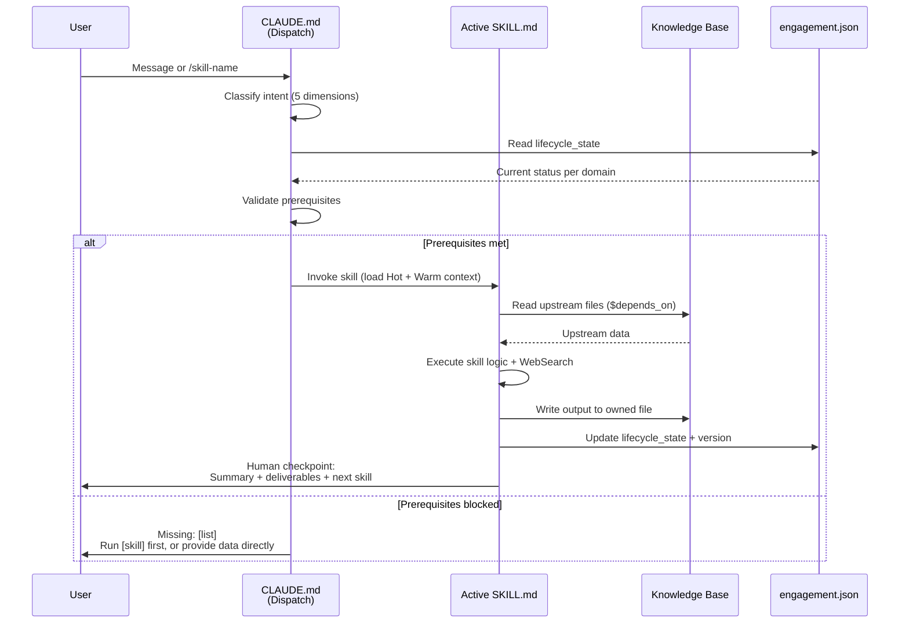
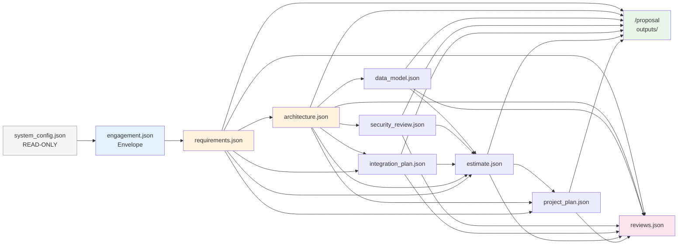
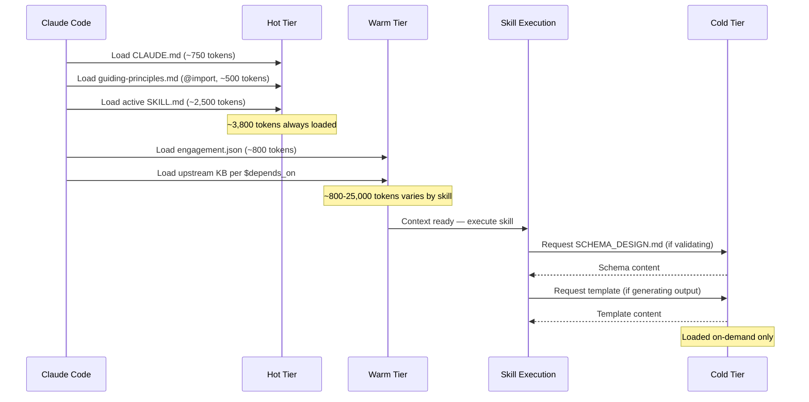
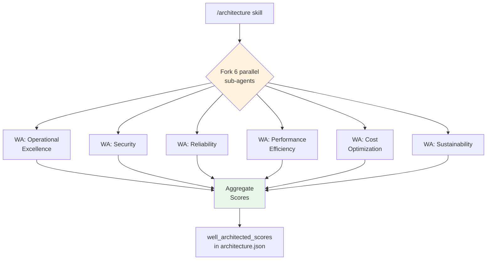

# Phase 3: System Architecture & Technical Design

> Generated: 2026-03-15 | Phase: 3 of 9
> Inputs: master-plan.md, requirements.md (106 FR + 22 NFR + 13 CCR), workflow-design.md (I/O contracts, dispatch, state flow), phase-1-results.md (88 patterns, 13 gaps), guiding-principles.md (42 principles), SCHEMA_DESIGN.md (~2,400 lines), pre-sales-lifecycle.md
> Web Research: Claude Code plugins-reference (2026-03-15), Claude Code skills docs (2026-03-15), Claude Code sub-agents docs (2026-03-15)

---

## Architectural Decisions

### Decision 1: Single Agent for Sequential Reasoning

**Choice**: All 9 SA lifecycle skills run within the single agent's context. No skill uses `context: fork` by default.

**Citation**: Google/MIT [arXiv:2512.08296](https://arxiv.org/abs/2512.08296) — multi-agent systems degrade performance by 39-70% on sequential reasoning tasks. The SA lifecycle is inherently sequential: requirements → architecture → data model → security → estimate → project plan → proposal → review.

**Citation**: Anthropic [context engineering](https://www.anthropic.com/engineering/effective-context-engineering-for-ai-agents) — "When each step in a task alters the state required for subsequent steps, multi-agent systems tend to struggle because important context can get lost."

### Decision 2: Sub-Agents Only for Parallelizable Reviews

**Choice**: Two sub-agents for independent parallel evaluations only:
- `parallel-wa-reviewer` — evaluates one Well-Architected pillar independently (6 parallel invocations)
- `stride-analyzer` — analyzes one STRIDE threat category independently (6 parallel invocations)

**Citation**: Google/MIT — "Centralized coordination achieved 80.8% improvement on parallelizable tasks." WA pillars and STRIDE categories are independently analyzable with no shared state.

**Citation**: Claude Code [sub-agents docs](https://code.claude.com/docs/en/sub-agents) — "Subagents cannot spawn other subagents." Confirms leaf-node-only usage.

### Decision 3: Progressive Context Loading

**Choice**: Three-tier context loading (Hot/Warm/Cold) with progressive disclosure.

**Citation**: Anthropic context engineering — "Use progressive disclosure — lightweight identifiers, not full objects" and "Curate for the smallest set of high-signal tokens."

### Decision 4: Skills at Plugin Root, Inline Execution

**Choice**: All SKILL.md files at `skills/<name>/SKILL.md`. Skills run inline (no `context: fork`).

**Citation**: Claude Code [skills docs](https://code.claude.com/docs/en/skills) — "Skills at `skills/` directory with `<name>/SKILL.md` structure." Skill content "loads when invoked" into the main conversation, preserving context for sequential operation.

### Decision 5: Minimal Tool Grants (Least Privilege)

**Choice**: Base tools for all skills: Read, Write, Edit, Glob, Grep, WebSearch, WebFetch. Only `/architecture`, `/security-review`, and `/review` get the Agent tool.

**Citation**: Anthropic context engineering — "Design minimal, non-overlapping toolsets." Claude Code skills docs — "`allowed-tools` restricts tools without per-use approval."

**Citation**: Guiding Principle #20 — "Use least privileged access."

### Decision 6: KB File Name Normalization

**Choice**: Standardize on SCHEMA_DESIGN.md names, resolving discrepancies with master-plan.md:

| Master Plan Name | Normalized Name | Rationale |
|---|---|---|
| `security_assessment.json` | `security_review.json` | Matches skill name `/security-review` |
| `integration_map.json` | `integration_plan.json` | Matches skill name `/integration-plan` |
| `estimates.json` | `estimate.json` | Matches skill name `/estimate` |

All references in this document and downstream phases use the normalized names.

---

## Section 1: Plugin Directory Layout

```
solutions-architecture-agent/                    # Plugin root
├── .claude-plugin/
│   └── plugin.json                              # Plugin manifest [Phase 4]
├── skills/                                      # 9 SA skills [Phase 5]
│   ├── requirements/
│   │   └── SKILL.md                             # /requirements [Phase 5]
│   ├── architecture/
│   │   └── SKILL.md                             # /architecture [Phase 5]
│   ├── estimate/
│   │   └── SKILL.md                             # /estimate [Phase 5]
│   ├── project-plan/
│   │   └── SKILL.md                             # /project-plan [Phase 5]
│   ├── proposal/
│   │   └── SKILL.md                             # /proposal [Phase 5]
│   ├── data-model/
│   │   └── SKILL.md                             # /data-model [Phase 5]
│   ├── security-review/
│   │   └── SKILL.md                             # /security-review [Phase 5]
│   ├── integration-plan/
│   │   └── SKILL.md                             # /integration-plan [Phase 5]
│   └── review/
│       └── SKILL.md                             # /review [Phase 5]
├── agents/                                      # Sub-agent definitions [Phase 5]
│   ├── parallel-wa-reviewer.md                  # WA pillar reviewer [Phase 5]
│   └── stride-analyzer.md                       # STRIDE category analyzer [Phase 5]
├── hooks/
│   └── hooks.json                               # Hook configuration [Phase 5]
├── .claude/                                     # Project config (NOT plugin components)
│   ├── settings.json                            # Permissions [Phase 4]
│   ├── settings.local.json                      # Local overrides (git-ignored)
│   ├── rules/                                   # Path-scoped and unscoped rules
│   │   ├── guiding-principles.md                # 42 principles (unscoped) [KEEP]
│   │   ├── skills.md                            # Skill editing rules (skills/**) [Phase 5]
│   │   ├── knowledge-base.md                    # KB rules (knowledge_base/**) [Phase 5]
│   │   └── security.md                          # Security rules (private/**) [KEEP]
│   └── plans/                                   # Planning artifacts [KEEP]
│       ├── master-plan.md
│       ├── phase-1-results.md
│       ├── requirements.md
│       ├── workflow-design.md
│       ├── technical-design.md                  # This file [Phase 3]
│       └── references/                          # Reference materials (git-ignored)
├── knowledge_base/                              # Persistent engagement state
│   ├── system_config.json                       # Read-only reference [Phase 6]
│   ├── engagement.json                          # Engagement envelope [Phase 6]
│   ├── requirements.json                        # Discovery output [Phase 6]
│   ├── architecture.json                        # Architecture decisions [Phase 6]
│   ├── data_model.json                          # Data model specs [Phase 6]
│   ├── security_review.json                     # Threat model & compliance [Phase 6]
│   ├── integration_plan.json                    # Integration points [Phase 6]
│   ├── estimate.json                            # Cost models & team [Phase 6]
│   ├── project_plan.json                        # Phases & milestones [Phase 6]
│   ├── reviews.json                             # Review scores & history [Phase 6]
│   ├── schemas/                                 # JSON Schema validation
│   │   ├── SCHEMA_DESIGN.md                     # Schema design doc [KEEP]
│   │   ├── engagement.schema.json               # [Phase 6]
│   │   ├── requirements.schema.json             # [Phase 6]
│   │   ├── architecture.schema.json             # [Phase 6]
│   │   ├── estimate.schema.json                 # [Phase 6]
│   │   ├── project_plan.schema.json             # [Phase 6]
│   │   ├── data_model.schema.json               # [Phase 6]
│   │   ├── security_review.schema.json          # [Phase 6]
│   │   ├── integration_plan.schema.json         # [Phase 6]
│   │   ├── reviews.schema.json                  # [Phase 6]
│   │   ├── system_config.schema.json            # [Phase 6]
│   │   └── .repo-metadata.schema.json           # [Phase 6]
│   └── README.md                                # KB usage guide [Phase 6]
├── templates/                                   # Output templates
│   ├── requirements-template.md                 # [Phase 6]
│   ├── architecture-template.md                 # [Phase 6]
│   └── security-checklist.md                    # [Phase 6]
├── tests/                                       # Validation scripts
│   ├── validate_knowledge_base.py               # [Phase 6]
│   ├── validate_consistency.py                  # [Phase 6]
│   ├── validate_urls.py                         # [KEEP]
│   └── README.md                                # [Phase 6]
├── docs/                                        # User documentation [Phase 8]
│   ├── README.md
│   └── getting-started.md
├── .github/                                     # GitHub config [Phase 4/8]
│   ├── copilot-instructions.md
│   ├── pull_request_template.md
│   ├── ISSUE_TEMPLATE/
│   ├── workflows/validate-knowledge-base.yml
│   └── CODEOWNERS
├── CLAUDE.md                                    # Core agent identity [Phase 5]
├── ARCHITECTURE.md                              # System architecture doc [Phase 8]
├── README.md                                    # Plugin README [Phase 8]
├── CONTRIBUTING.md                              # Contributor guide [Phase 8]
├── SECURITY.md                                  # Security policy [KEEP]
├── LICENSE                                      # MIT [KEEP]
└── .repo-metadata.json                          # Version & counts [Phase 4]
```

**Verification**: Every file maps to a creating phase. No orphan files. Plugin components (skills/, agents/, hooks/) at root, not inside `.claude-plugin/`.

---

## Section 2: CLAUDE.md Design

**Target**: Under 200 lines. Uses @import, not inline copies. This is the complete draft for Phase 5.

```markdown
# AI Solutions Architecture Agent

An AI agent covering the **solutions architecture lifecycle**: requirements discovery, system design, data modeling, security review, integration planning, estimation, project planning, and proposal assembly. Designs solutions — does NOT implement or deploy.

**Owner**: Modular Earth LLC (@paulpham157)
**License**: MIT
**Platform**: Claude Code plugin

## Skills

| Skill | Invocation | Purpose | KB Output |
|-------|-----------|---------|-----------|
| Requirements Discovery | `/requirements` | Progressive discovery (quick/standard/comprehensive), AI suitability | `requirements.json` |
| Solution Architecture | `/architecture` | System design, tech stack, diagrams, WA scoring | `architecture.json` |
| Estimation | `/estimate` | LOE, cost, team composition, confidence scoring | `estimate.json` |
| Technical Project Plan | `/project-plan` | Phased roadmap, sprints, milestones, dependencies | `project_plan.json` |
| Proposal Assembly | `/proposal` | SOW assembly from KB (4 proposal types) | `outputs/` |
| Data Modeling | `/data-model` | ER, vector, graph, ontology, governance | `data_model.json` |
| Security & Privacy Review | `/security-review` | STRIDE, compliance, defense-in-depth, AI security | `security_review.json` |
| Integration Planning | `/integration-plan` | APIs, migration, legacy bridging, data flows | `integration_plan.json` |
| Deliverable Review | `/review` | LLM-as-judge, 3 iterations, 5 dimensions | `reviews.json` |

@.claude/rules/guiding-principles.md

## Engagement Lifecycle

### Canonical Flows

| Flow | Sequence | When |
|------|----------|------|
| **Greenfield** | req → arch → dm → sr → est → ppl → pro → rv | Complete 0-to-1 engagement |
| **Migration** | req → ip → arch → dm → sr → est → ppl → pro → rv | Migration/modernization |
| **Streamlined** | req → arch → est → pro | Small projects, time-constrained |
| **Assessment** | req → arch → [sr] → pro | Discovery-only, pre-commitment |
| **Quick Qualify** | req (quick tier) | Pipeline qualification |

### Dispatch

When a user message arrives:

1. If slash command → direct dispatch to skill
2. If natural language → classify across 5 dimensions:
   - User objective, domain, current phase, target skill, context needed
   - If unambiguous → dispatch; if ambiguous → present 2-4 options
3. Validate prerequisites: check `engagement.json` lifecycle_state for required upstream KB files
   - `complete` or `approved` → proceed
   - `draft` or `in_progress` → warn, offer to proceed or finish upstream
   - `not_started` or missing → block, list missing prerequisites
4. Invoke skill
5. After completion: update `engagement.json`, present human checkpoint

### Phase-Skip Rules

- **Skip allowed**: upstream KB file exists with status `complete` or `approved`
- **Skip with warning**: upstream KB file exists but status is `draft` or `in_progress`
- **Skip blocked**: required upstream KB file does not exist
- **Optional skip**: skill not on critical path for engagement type

## Quality Standards

- **Well-Architected compliance**: AWS 6 pillars + GenAI Lens, Azure WAF, GCP WAF on every architecture
- **Exemplar-level quality**: deliverables compare against real SA exemplars
- **Technology-agnostic**: recommend best-fit via WebSearch, never default to specific vendors
- **Confidence scoring**: COMPLETE/PARTIAL/INCOMPLETE (requirements), HIGH/MEDIUM/LOW (estimates), 0-10 (WA pillars)
- **Human checkpoints**: after every skill — summarize, list deliverables, suggest next skill

## Scope Boundary

| This Agent Does | Engineering Agent Does (Future) |
|----------------|-------------------------------|
| Requirements discovery | Code generation |
| System architecture | Deployment scripts |
| Data modeling | CI/CD pipelines |
| Security review | Prompt engineering |
| Integration planning | Testing implementation |
| Cost estimation | Infrastructure provisioning |
| Project planning | Monitoring setup |
| Proposal assembly | Production operations |

If a user requests implementation: acknowledge, explain scope, note for future Engineering Agent.

## Knowledge Base

- **10 JSON files** in `knowledge_base/` — each skill owns one file, writes only to it
- **`system_config.json`** is READ-ONLY — reference but never modify
- **`.repo-metadata.json`** is the single source of truth for version and counts
- **Blackboard pattern**: skills communicate only through KB files, never directly
- **`$depends_on`**: each KB file declares upstream dependencies
- **State tracking**: `engagement.json` maintains lifecycle_state for all domain files
- **Versioning**: MAJOR.MINOR per domain file; engagement.json tracks current versions
- Schemas at `knowledge_base/schemas/`; validate with `python tests/validate_knowledge_base.py`

## Plugin

When installed as a plugin, skills appear as `solutions-architecture-agent:skill-name`.
```

**Line count**: 98 lines (under 200 limit). **Verification**: includes identity, 9-skill table, @import principles, dispatch logic, scope boundary, KB rules, quality standards.

---

## Section 3: Skill Inventory with SKILL.md Frontmatter

### 3.1 /requirements — Requirements Discovery

```yaml
---
name: requirements
description: "Run progressive requirements discovery workshops (quick/standard/comprehensive). Captures client context, AI suitability, functional/non-functional requirements, and success criteria. Use when starting a new engagement, qualifying a prospect, validating a technical approach, or extracting requirements from meeting notes."
argument-hint: "[client context or meeting notes]"
allowed-tools: Read, Write, Edit, Glob, Grep, WebSearch, WebFetch
---
```

| Field | Value |
|-------|-------|
| Invocation | `/requirements` |
| KB Reads | `system_config.json`, `engagement.json` (if exists) |
| KB Writes | `requirements.json`, `engagement.json` (creates/updates) |
| Prerequisites | None (entry point for all flows) |
| Engagement Types | All (greenfield, migration, assessment, quick) |
| Source Patterns | R1-R8 |
| Key Requirements | FR-REQ-001 through FR-REQ-015 (15 FRs) |
| Body Outline | Tier selection logic, progressive questioning (6-step funnel), AI suitability framework, pain point classification, requirements extraction from notes, completeness validation, stakeholder-adaptive communication, migration-specific sections, BANT qualification |

### 3.2 /architecture — Solution Architecture

```yaml
---
name: architecture
description: "Design system architecture with technology stack selection, component design, Mermaid diagrams, and Well-Architected scoring. Produces dual-audience output for technical builders and business leaders. Use after requirements are complete, whether for enterprise platforms, startup MVPs, or migration targets."
argument-hint: "[constraints or focus area]"
allowed-tools: Read, Write, Edit, Glob, Grep, WebSearch, WebFetch, Agent
---
```

| Field | Value |
|-------|-------|
| Invocation | `/architecture` |
| KB Reads | `requirements.json`, `integration_plan.json` (if exists) |
| KB Writes | `architecture.json`, `engagement.json` (updates lifecycle) |
| Prerequisites | `requirements.json` status `complete` or `approved` |
| Engagement Types | All |
| Source Patterns | A1-A14 |
| Key Requirements | FR-ARC-001 through FR-ARC-018 (18 FRs) |
| Body Outline | ultrathink, multi-step design process, tech stack methodology, diagram generation (Mermaid/ASCII), cascade analysis, dual-audience output, cloud infrastructure planning, HA/DR, auto-scaling, cost-aware design, observability, AI/ML platform components, multi-agent orchestration patterns, IaC principles, WA scoring (6 pillars via parallel-wa-reviewer sub-agent) |

### 3.3 /estimate — Estimation

```yaml
---
name: estimate
description: "Generate cost estimates, LOE breakdowns, team composition, and infrastructure cost modeling with confidence scoring. Supports bottom-up, T-shirt, and three-point methods. Use after architecture is complete to inform budgeting, fundraising, or SOW pricing."
argument-hint: "[budget constraints or team info]"
allowed-tools: Read, Write, Edit, Glob, Grep, WebSearch, WebFetch
---
```

| Field | Value |
|-------|-------|
| Invocation | `/estimate` |
| KB Reads | `requirements.json`, `architecture.json`, `data_model.json` (if exists), `security_review.json` (if exists), `integration_plan.json` (if exists) |
| KB Writes | `estimate.json`, `engagement.json` (updates lifecycle) |
| Prerequisites | `requirements.json` + `architecture.json` status `complete` or `approved` |
| Engagement Types | All (except quick qualify) |
| Source Patterns | E1-E5 |
| Key Requirements | FR-EST-001 through FR-EST-008 (8 FRs) |
| Body Outline | LOE framework (optimism bias, 3-point weighted, non-coding 30-40%), cost estimation (5 categories), team composition by stage, confidence scoring, complexity checklist (0-10), 4 estimation methods, three-pass integration (T-shirt → Plan → Task) |

### 3.4 /project-plan — Technical Project Plan

```yaml
---
name: project-plan
description: "Generate phased delivery roadmaps with sprint plans, milestones, dependency graphs, decision gates, and risk registers. Supports both greenfield and migration timelines. Use after estimation is complete."
argument-hint: "[timeline constraints or team availability]"
allowed-tools: Read, Write, Edit, Glob, Grep, WebSearch, WebFetch
---
```

| Field | Value |
|-------|-------|
| Invocation | `/project-plan` |
| KB Reads | `requirements.json`, `architecture.json`, `estimate.json` |
| KB Writes | `project_plan.json`, `engagement.json` (updates lifecycle) |
| Prerequisites | `requirements.json` + `architecture.json` + `estimate.json` status `complete` or `approved` |
| Engagement Types | Greenfield, migration (not assessment or quick) |
| Source Patterns | PP1-PP3 |
| Key Requirements | FR-PPL-001 through FR-PPL-009 (9 FRs) |
| Body Outline | Phased delivery (MVP → Enhancement → Scale), decision gates (GO/Conditional/NO-GO), risk categories with mitigations, 2-week sprint planning, migration-specific timelines, milestone definition, critical path analysis, communication plan, capacity model (10 pts/week per member) |

### 3.5 /proposal — Proposal Assembly

```yaml
---
name: proposal
description: "Assemble proposals and SOWs from knowledge base data. Supports 4 types: discovery, implementation, internal, pitch deck. Reads all KB files, never re-analyzes — assembly only. Use after all required skills have completed."
argument-hint: "[proposal type: discovery|implementation|internal|pitch]"
allowed-tools: Read, Write, Edit, Glob, Grep, WebSearch, WebFetch
---
```

| Field | Value |
|-------|-------|
| Invocation | `/proposal` |
| KB Reads | ALL KB files (read-only) |
| KB Writes | `outputs/{engagement_id}/` (NOT KB files) |
| Prerequisites | Varies by proposal type: discovery needs req+arch; implementation needs all |
| Engagement Types | All |
| Source Patterns | P1-P4 |
| Key Requirements | FR-PRO-001 through FR-PRO-008 (8 FRs) |
| Body Outline | Discovery proposal (3-phase assessment, 4 decision scenarios), implementation SOW (12-section template: 1-Engagement Description, 2-Business Objectives, 3-Technical Requirements, 4-Team Leads and Roles, 5-Project Scope, 6-Services Out of Scope, 7-Change Order, 8-Anticipated Schedule, 9-Project Rate, 10-Payment Methods, 11-Assumptions, 12-Signature Block), internal proposal (12-18 slides, audience differentiation per CEO/CFO/CTO/VPs), pitch deck (10-15 slides, narrative arc: Challenge→Solution→Path Forward), KB-to-proposal mapping, decision framework (ROI thresholds), sales principles integration |

### 3.6 /data-model — Data Modeling

```yaml
---
name: data-model
description: "Design data models including entity-relationship schemas, vector database schemas, knowledge graphs, ontologies, and data governance policies. Use after architecture defines the data layer."
argument-hint: "[data source details or focus area]"
allowed-tools: Read, Write, Edit, Glob, Grep, WebSearch, WebFetch
---
```

| Field | Value |
|-------|-------|
| Invocation | `/data-model` |
| KB Reads | `requirements.json`, `architecture.json` |
| KB Writes | `data_model.json`, `engagement.json` (updates lifecycle) |
| Prerequisites | `requirements.json` + `architecture.json` status `complete` or `approved` |
| Engagement Types | Greenfield, migration (optional for assessment) |
| Source Patterns | DM1-DM7 |
| Key Requirements | FR-DM-001 through FR-DM-011 (11 FRs) |
| Body Outline | ultrathink, ER schema design, vector DB schema (chunking, embeddings, retrieval), knowledge pipeline architecture, data validation framework, graph schemas (node/edge types), ontology design (concepts, taxonomy), data governance (PII, retention, encryption, access control), data requirements capture from upstream |

### 3.7 /security-review — Security & Privacy Review

```yaml
---
name: security-review
description: "Perform comprehensive security and privacy review: STRIDE threat modeling, compliance mapping (HIPAA/SOC2/CCPA/GLBA/PCI-DSS), defense-in-depth architecture, and AI-specific security controls. Use after architecture is complete."
argument-hint: "[compliance requirements or regulatory context]"
allowed-tools: Read, Write, Edit, Glob, Grep, WebSearch, WebFetch, Agent
---
```

| Field | Value |
|-------|-------|
| Invocation | `/security-review` |
| KB Reads | `requirements.json`, `architecture.json`, `data_model.json` (if exists), `integration_plan.json` (if exists) |
| KB Writes | `security_review.json`, `engagement.json` (updates lifecycle) |
| Prerequisites | `requirements.json` + `architecture.json` status `complete` or `approved` |
| Engagement Types | All (depth varies by engagement type) |
| Source Patterns | SR1-SR9 |
| Key Requirements | FR-SR-001 through FR-SR-012 (12 FRs) |
| Body Outline | ultrathink, security requirements decomposition (5 dimensions), defense-in-depth (5 layers), least-privilege IAM, tiered network segmentation, encryption strategy, AI-specific controls (prompt injection, output filtering, model access), compliance mapping, non-negotiable guardrails, change impact analysis, STRIDE threat model (via stride-analyzer sub-agent for parallel analysis) |

### 3.8 /integration-plan — Integration Planning

```yaml
---
name: integration-plan
description: "Plan system integrations: API contracts, data flow mappings, migration strategies (strangler fig, parallel run), legacy bridging patterns, and CI/CD pipeline architecture. Use for migration engagements or systems with complex integrations."
argument-hint: "[legacy system docs or API specs]"
allowed-tools: Read, Write, Edit, Glob, Grep, WebSearch, WebFetch
---
```

| Field | Value |
|-------|-------|
| Invocation | `/integration-plan` |
| KB Reads | `requirements.json`, `architecture.json` |
| KB Writes | `integration_plan.json`, `engagement.json` (updates lifecycle) |
| Prerequisites | `requirements.json` status `complete` or `approved` |
| Engagement Types | Migration (required), greenfield (optional) |
| Source Patterns | IP1-IP8 |
| Key Requirements | FR-IP-001 through FR-IP-013 (13 FRs) |
| Body Outline | API-to-Tool Gateway design, event-driven integration, secure service-to-service, data pipeline architecture (storage lifecycle), document ingestion pipeline, data access layer, phased integration approach, CI/CD pipeline architecture, API contract definition, data flow mappings, migration strategy, legacy bridging patterns |

### 3.9 /review — Deliverable Review

```yaml
---
name: review
description: "Review any SA deliverable using LLM-as-judge methodology with 3 iteration passes. Scores on 5 dimensions (completeness, technical soundness, well-architected, clarity, feasibility). Applies dual-persona validation. Use after any skill produces output."
argument-hint: "[target KB file or focus areas]"
allowed-tools: Read, Write, Edit, Glob, Grep, WebSearch, WebFetch, Agent
---
```

| Field | Value |
|-------|-------|
| Invocation | `/review` |
| KB Reads | Target KB file + its schema |
| KB Writes | `reviews.json`, `engagement.json` (updates review_summary) |
| Prerequisites | At least one KB file with status `draft` or `complete` |
| Engagement Types | All |
| Source Patterns | RV1-RV10 |
| Key Requirements | FR-RV-001 through FR-RV-012 (12 FRs) |
| Body Outline | ultrathink, LLM-as-judge (3 iterations: discover-assess → judge-refine → final polish), TRM validation, 5-dimension scoring, prioritized improvement plans (P0-P3), dual-persona validation (Builder + Tester), quality KPIs, three-dimensional assessment (Technical + Operational + WA), LLM response quality validation, WA pillar reviews (via parallel-wa-reviewer sub-agent) |

### 3.10 Cross-Reference: FR → Skill Mapping

Total: 106 FRs mapped across 9 skills. Every FR-XXX-NNN from requirements.md Section 3 maps to exactly one skill frontmatter above.

| Skill | FR Count | FR Range | Pattern IDs | Pattern Count |
|-------|----------|----------|-------------|---------------|
| /requirements | 15 | FR-REQ-001 – FR-REQ-015 | R1-R8 | 8 |
| /architecture | 18 | FR-ARC-001 – FR-ARC-018 | A1-A14 | 14 |
| /estimate | 8 | FR-EST-001 – FR-EST-008 | E1-E5 | 5 |
| /project-plan | 9 | FR-PPL-001 – FR-PPL-009 | PP1-PP3 | 3 |
| /proposal | 8 | FR-PRO-001 – FR-PRO-008 | P1-P4 | 4 |
| /data-model | 11 | FR-DM-001 – FR-DM-011 | DM1-DM7 | 7 |
| /security-review | 12 | FR-SR-001 – FR-SR-012 | SR1-SR9 | 9 |
| /integration-plan | 13 | FR-IP-001 – FR-IP-013 | IP1-IP8 | 8 |
| /review | 12 | FR-RV-001 – FR-RV-012 | RV1-RV10 | 10 |
| **Total** | **106** | | **+ CC1-CC10** | **68 + 10 CC = 78** |

**Pattern count note**: Phase 1 reports "88 named patterns (78 skill-specific + 10 cross-cutting)." The 68 enumerated IDs above plus 10 cross-cutting (CC1-CC10) = 78. The remaining 10 reaching 88 are unnumbered sub-patterns within the major IDs (e.g., R1 contains sub-patterns for each of 3 discovery tiers). The 88 total is the canonical count referenced throughout all phases.

---

## Section 4: KB Schema Specifications

### 4.1 Authority

**SCHEMA_DESIGN.md is the authoritative schema specification.** Phase 6 implements it directly. This section confirms alignment with skill I/O contracts and documents normalizations.

### 4.2 File Inventory

| # | Data File | Owner Skill | $depends_on | Schema File | Status |
|---|-----------|------------|-------------|-------------|--------|
| 1 | `system_config.json` | READ-ONLY (human) | — | `system_config.schema.json` | UPDATE |
| 2 | `engagement.json` | All skills (create/update) | `system_config.json` | `engagement.schema.json` | NEW |
| 3 | `requirements.json` | `/requirements` | `system_config.json` | `requirements.schema.json` | REWRITE |
| 4 | `architecture.json` | `/architecture` | `requirements.json` | `architecture.schema.json` | REWRITE |
| 5 | `data_model.json` | `/data-model` | `requirements.json`, `architecture.json` | `data_model.schema.json` | NEW |
| 6 | `security_review.json` | `/security-review` | `requirements.json`, `architecture.json` | `security_review.schema.json` | NEW |
| 7 | `integration_plan.json` | `/integration-plan` | `requirements.json`, `architecture.json` | `integration_plan.schema.json` | NEW |
| 8 | `estimate.json` | `/estimate` | `requirements.json`, `architecture.json` | `estimate.schema.json` | NEW |
| 9 | `project_plan.json` | `/project-plan` | `requirements.json`, `architecture.json`, `estimate.json` | `project_plan.schema.json` | NEW |
| 10 | `reviews.json` | `/review` | (any target file) | `reviews.schema.json` | NEW |

Plus: `.repo-metadata.schema.json` (UPDATE). **Total: 11 schema files.**

### 4.3 I/O Contract Verification

Cross-reference of Section 3 skill KB Reads/Writes against workflow-design.md Section 3.1:

| Skill | Section 3 KB Reads | workflow-design.md Reads | Match |
|-------|-------------------|--------------------------|-------|
| /requirements | system_config, engagement | system_config | ✓ (engagement added for resume) |
| /architecture | requirements, integration_plan | requirements, integration_plan (if exists) | ✓ |
| /data-model | requirements, architecture | requirements, architecture | ✓ |
| /security-review | requirements, architecture, data_model, integration_plan | requirements, architecture, data_model (if exists), integration_plan (if exists) | ✓ |
| /integration-plan | requirements, architecture | requirements, architecture | ✓ |
| /estimate | requirements, architecture, data_model, security_review, integration_plan | requirements, architecture, data_model (if exists), security_review (if exists), integration_plan (if exists) | ✓ |
| /project-plan | requirements, architecture, estimate | requirements, architecture, estimate | ✓ |
| /proposal | ALL KB files | ALL KB files | ✓ |
| /review | target file + schema | target file + schema | ✓ |

All I/O contracts match. "(if exists)" conditions handled by prerequisite validation.

### 4.4 Shared Conventions

Per SCHEMA_DESIGN.md:

- **ID patterns**: `PREFIX-NNN` (zero-padded). Engagement: `eng-YYYY-NNN`. Components: `C-NNN`. Threats: `T-NNN`. See SCHEMA_DESIGN.md Shared Conventions for full table.
- **Version strings**: `MAJOR.MINOR` (e.g., `"1.2"`). Major on structural changes, minor on content updates.
- **Status enum**: `not_started → draft → in_progress → complete → approved`
- **`$depends_on`**: array of upstream filenames, informational, used by skills to determine context loading
- **`_metadata`**: every domain file includes author, date, validation_status

---

## Section 5: Rules Design

### 5.1 Rules Inventory

| File | Scope | Purpose | Line Target | Status |
|------|-------|---------|-------------|--------|
| `guiding-principles.md` | Unscoped | 42 principles governing all behavior | 66 | KEEP |
| `skills.md` | Path: `skills/**` | Rules for editing skills | ~30 | NEW [Phase 5] |
| `knowledge-base.md` | Path: `knowledge_base/**` | Rules for KB operations | ~30 | UPDATE [Phase 5] |
| `security.md` | Path: `private/**` | Rules for sensitive data | ~16 | KEEP |
| `agent-prompts.md` | Path: `ai_agents/**` | Rules for deleted directory | — | DELETE [Phase 4] |
| `refactoring-direction.md` | Unscoped | Temporary refactoring context | — | DELETE [Phase 4] |

### 5.2 Unscoped Budget

Total unscoped rules: `guiding-principles.md` = 66 lines. Under 100-line limit (NFR-002). No other unscoped rules needed.

### 5.3 New Rules Specifications

**`skills.md`** (path-scoped: `skills/**`, ~30 lines):
- Follow Agent Skills standard: SKILL.md with YAML frontmatter
- No static vendor knowledge — use WebSearch/WebFetch for dynamic references
- Include `ultrathink` in body (not frontmatter) for deep reasoning skills
- Keep SKILL.md under 500 lines; move reference material to separate files
- Each skill self-contained — no cross-skill imports at runtime
- Tool grants follow least privilege — only listed tools available

**`knowledge-base.md`** (path-scoped: `knowledge_base/**`, ~30 lines):
- Validate all JSON against schemas in `knowledge_base/schemas/`
- Increment version on every write (minor for content, major for structure)
- Enforce `$depends_on` — never read from files not in dependency list
- `system_config.json` is READ-ONLY — never modify
- Skills write only to their owned file — see Section 4.2
- Include `_metadata` with author, date, validation_status on every write
- Status transitions follow: `not_started → draft → in_progress → complete → approved`
- **PII protection** (NFR-017, NFR-018): `.gitignore` must cover `knowledge_base/*.json` (except `system_config.json`) for production use. KB files may contain client names, contacts, rates. Phase 4 MUST update `.gitignore` with these patterns.

### 5.4 Verification

- Total unscoped: 66 lines (under 100)
- Path-scoped rules use correct globs (`skills/**`, `knowledge_base/**`, `private/**`)
- No redundancy with CLAUDE.md (CLAUDE.md references rules via @import, doesn't duplicate)

---

## Section 6: Sub-Agent Strategy

### 6.1 Decision Framework

Per Google/MIT (arXiv:2512.08296) and Anthropic guidance:

- **Use sub-agents for**: Independent parallel tasks with no shared state
- **Do NOT use for**: Sequential reasoning (single agent outperforms by 39-70%)
- Sub-agents are leaf nodes only — cannot spawn other sub-agents

### 6.2 Agent Definitions

#### `agents/parallel-wa-reviewer.md`

```markdown
---
name: parallel-wa-reviewer
description: "Evaluates one Well-Architected Framework pillar independently. Use when /architecture or /review needs parallel WA assessment across 6 pillars."
tools: Read, Glob, Grep, WebSearch, WebFetch
model: sonnet
maxTurns: 5
---

You are a Well-Architected Framework reviewer evaluating a single pillar.

**Input**: You will receive:
1. The pillar name (one of: Operational Excellence, Security, Reliability, Performance Efficiency, Cost Optimization, Sustainability)
2. The architecture.json content
3. The requirements.json content (relevant sections)

**Task**: Evaluate the architecture against the assigned pillar using the latest
Well-Architected best practices (use WebSearch for current guidance across AWS,
Azure, and GCP frameworks).

**Output**: Return a structured assessment:
- Pillar name
- Score (0-10)
- Strengths (bullet list)
- Gaps (bullet list with severity: critical/high/medium/low)
- Recommendations (prioritized)
- Notes for the overall assessment
```

#### `agents/stride-analyzer.md`

```markdown
---
name: stride-analyzer
description: "Analyzes one STRIDE threat category independently. Use when /security-review needs parallel threat analysis across 6 categories."
tools: Read, Glob, Grep, WebSearch, WebFetch
model: sonnet
maxTurns: 5
---

You are a security analyst evaluating one STRIDE threat category.

**Input**: You will receive:
1. The STRIDE category (one of: Spoofing, Tampering, Repudiation, Information Disclosure, Denial of Service, Elevation of Privilege)
2. The architecture.json content (tech stack, components, data flows)
3. The requirements.json content (security and compliance sections)

**Task**: Identify threats in the assigned category. For each threat, assess
severity, likelihood, and propose mitigations. Use WebSearch for current
threat intelligence and mitigation best practices.

**Output**: Return structured threat entries:
- Threat ID, category, description
- Affected components (by C-NNN ID)
- Severity (critical/high/medium/low), likelihood (high/medium/low)
- Risk score (1-10)
- Mitigation strategy
- Residual risk after mitigation
```

### 6.3 Invocation Pattern

Sub-agents receive KB content **via the parent skill's invocation message**, not by reading files directly. The parent skill (e.g., /architecture) reads the relevant KB files, extracts the sections needed for review, and passes them as structured text in the Agent tool's prompt parameter. Sub-agents have Read/Glob/Grep as fallback for exploring additional context, but primary input comes from the invoking skill. This ensures sub-agents work with curated, relevant data rather than parsing raw KB files.

### 6.4 Usage by Skill

| Sub-Agent | Used By | Invocation Pattern |
|-----------|---------|-------------------|
| `parallel-wa-reviewer` | `/architecture`, `/review` | 6 parallel invocations (one per pillar), results aggregated into `well_architected_scores` |
| `stride-analyzer` | `/security-review` | 6 parallel invocations (one per STRIDE category), results aggregated into `threat_model.threats` |

### 6.4 Verification

- Each agent has a definition file in `agents/`
- Both appear in Section 1 directory layout
- No sequential reasoning delegated to sub-agents
- Read-only tools (no Write/Edit) — they report findings, parent skill writes KB
- `maxTurns: 5` prevents runaway execution
- `model: sonnet` balances capability and speed for focused analysis tasks

---

## Section 7: Context Budget Allocation

### 7.1 Context Tiers

| Tier | Content | Est. Tokens | When Loaded |
|------|---------|-------------|-------------|
| **Hot** | CLAUDE.md (~98 lines, ~750 tokens) + guiding-principles.md (@import, ~500 tokens) + active SKILL.md (~300-500 lines, ~2,500 tokens) + active rule files (~60 tokens) | ~3,800 | Every invocation |
| **Warm** | Upstream KB files per `$depends_on` (~800-4,000 tokens each) + engagement.json (~100 lines, ~800 tokens) | Varies by skill | On skill invocation |
| **Cold** | SCHEMA_DESIGN.md, templates, reference docs | On-demand | Skill requests specific data |

### 7.2 Per-Skill Context Estimates

| Skill | Hot | Warm (KB reads) | Est. Total |
|-------|-----|-----------------|------------|
| `/requirements` | ~3,800 | system_config (~800) | ~4,600 |
| `/architecture` | ~3,800 | requirements (~3,000) + engagement (~800) | ~7,600 |
| `/data-model` | ~3,800 | requirements (~3,000) + architecture (~4,000) | ~10,800 |
| `/security-review` | ~3,800 | requirements (~3,000) + architecture (~4,000) + data_model (~3,000, if exists) | ~13,800 |
| `/integration-plan` | ~3,800 | requirements (~3,000) + architecture (~4,000) | ~10,800 |
| `/estimate` | ~3,800 | requirements (~3,000) + architecture (~4,000) + optional files (~6,000) | ~16,800 |
| `/project-plan` | ~3,800 | requirements (~3,000) + architecture (~4,000) + estimate (~2,500) | ~13,300 |
| `/proposal` | ~3,800 | ALL KB files (~25,000 with selective section loading) | ~28,800 |
| `/review` | ~3,800 | target file (~3,000) + schema (~2,000) | ~8,800 |

### 7.3 Budget Constraints

- CLAUDE.md: 98 lines (~750 tokens) — well under 200-line / 1,500-token budget
- Each SKILL.md: target 200-400 lines (~1,500-3,000 tokens) — per Claude Code docs "keep under 500 lines"
- Each KB JSON: target 100-500 lines (~800-4,000 tokens)
- Guiding principles: 66 lines (~500 tokens)
- `/proposal` is the highest-context skill (~28,800 tokens) — uses selective section loading from upstream files, not full reads

### 7.4 Verification

- No skill exceeds ~30K tokens for context loading — well within available budget
- `/proposal` uses progressive disclosure: reads specific sections from each KB file, not entire files
- Hot tier is constant across all skills (~3,800 tokens)
- Context budget consistent with CLAUDE.md line count (98 lines in Section 2)

---

## Section 8: Architecture Diagrams

### 8.1 Plugin Structure

```mermaid
graph TD
    ROOT[solutions-architecture-agent/] --> CP[.claude-plugin/]
    ROOT --> SK[skills/]
    ROOT --> AG[agents/]
    ROOT --> HK[hooks/]
    ROOT --> KB[knowledge_base/]
    ROOT --> TM[templates/]
    ROOT --> CL[.claude/]
    ROOT --> CM[CLAUDE.md]

    CP --> PJ[plugin.json]

    SK --> S1[requirements/SKILL.md]
    SK --> S2[architecture/SKILL.md]
    SK --> S3[estimate/SKILL.md]
    SK --> S4[project-plan/SKILL.md]
    SK --> S5[proposal/SKILL.md]
    SK --> S6[data-model/SKILL.md]
    SK --> S7[security-review/SKILL.md]
    SK --> S8[integration-plan/SKILL.md]
    SK --> S9[review/SKILL.md]

    AG --> A1[parallel-wa-reviewer.md]
    AG --> A2[stride-analyzer.md]

    HK --> HJ[hooks.json]

    KB --> SC[system_config.json]
    KB --> ENG[engagement.json]
    KB --> RQ[requirements.json]
    KB --> AR[architecture.json]
    KB --> DM[data_model.json]
    KB --> SR[security_review.json]
    KB --> IP[integration_plan.json]
    KB --> ES[estimate.json]
    KB --> PP[project_plan.json]
    KB --> RV[reviews.json]
    KB --> SCH[schemas/]

    CL --> RU[rules/]
    RU --> GP[guiding-principles.md]
    RU --> SKR[skills.md]
    RU --> KBR[knowledge-base.md]
    RU --> SEC[security.md]
```



### 8.2 Skill Dispatch Flow



### 8.3 KB Data Flow ($depends_on DAG)



### 8.4 Context Loading Sequence



### 8.5 Sub-Agent Orchestration (WA Review)



**Verification**: 5 Mermaid diagrams (exceeds minimum of 4). Diagrams consistent with Sections 1-7. File names match Section 1 layout.

---

## Section 9: Plugin Manifest Specification

### 9.1 Verified Schema

Per [Claude Code plugins-reference](https://code.claude.com/docs/en/plugins-reference) (verified 2026-03-15): `name` is the only required field. All other fields are optional metadata.

### 9.2 plugin.json

```json
{
  "name": "solutions-architecture-agent",
  "version": "1.0.0",
  "description": "AI Solutions Architecture Agent — 9 skills covering the full SA lifecycle from requirements discovery through technical project planning. Designs solutions, not implementation.",
  "author": {
    "name": "Modular Earth LLC",
    "url": "https://github.com/Modular-Earth-LLC"
  },
  "homepage": "https://github.com/Modular-Earth-LLC/solutions-architecture-agent",
  "repository": "https://github.com/Modular-Earth-LLC/solutions-architecture-agent",
  "license": "MIT",
  "keywords": ["solutions-architecture", "system-design", "AI", "enterprise", "well-architected"]
}
```

### 9.3 Verification

- JSON is valid
- `name` field present (only required field)
- All fields verified against latest Anthropic plugin-reference schema
- Repository URL uses verified GitHub org
- No custom component paths needed (using default locations: `skills/`, `agents/`, `hooks/hooks.json`)

---

## Section 10: Gap Closure Report

All 13 gaps from phase-1-results.md Gap Analysis:

| # | Gap | Status | Resolution |
|---|-----|--------|------------|
| 1 | Neurosymbolic AI architecture | DEFERRED to Phase 5 | `/data-model` skill uses WebSearch at invocation for latest patterns |
| 2 | Standalone data model exemplar | CLOSED | Florence Healthcare data added to references/ (Phase 1) |
| 3 | Standalone threat model exemplar | CLOSED | Florence Healthcare security added to references/ (Phase 1) |
| 4 | Privacy-by-design patterns (GDPR Art 25) | CLOSED | Florence DPA covers GDPR/HIPAA/CCPA; `/security-review` extends via WebSearch (FR-SR-007) |
| 5 | Requirements elicitation methodology depth | CLOSED | 6 AGADA templates added (Phase 1); FR-REQ-001 through FR-REQ-015 cover methodology |
| 6 | Strangler fig pattern | DEFERRED to Phase 5 | `/integration-plan` skill uses WebSearch (FR-IP-011) |
| 7 | Legacy system bridging | DEFERRED to Phase 5 | `/integration-plan` skill uses WebSearch (FR-IP-012); client-specific |
| 8 | Jira-to-infrastructure automation exemplar | CLOSED | Florence Healthcare pipeline added to references/ (Phase 1) |
| 9 | Migration-specific timelines | CLOSED | `/project-plan` skill spec includes migration timelines (FR-PPL-005); workflow-design.md Section 1.2 |
| 10 | Exemplar-level quality rubric | DEFERRED to Phase 6 | Create as reference document for `/review` skill |
| 11 | Competitive analysis section | DEFERRED to Phase 5 | `/proposal` skill adds optional section via WebSearch |
| 12 | Multi-session state management | CLOSED | KB files on disk (workflow-design.md Section 5) + engagement.json lifecycle tracking (Section 4) + resume points (Section 7) |
| 13 | Error recovery | CLOSED | Checkpoint/resume patterns (workflow-design.md Section 6) + prerequisite validation (Section 2 dispatch) + rules design (Section 5) |

**Summary**: 8 CLOSED, 5 DEFERRED (all to Phase 5 or 6 with clear implementation paths). Zero gaps without resolution.

---

## Multi-Persona Review

### Review Protocol

- **Severity levels**: Critical (blocks downstream phases), High (degrades quality), Medium (improvement), Low (style)
- **Fix protocol**: Critical/High fixed inline before next persona. Medium documented. Low noted.
- **Gate criteria**: Zero Critical + Zero High remaining.

### Persona 1: Dr. Mira Chen — QA Architect

**Focus**: Cross-reference integrity, traceability, schema-to-contract consistency.

**Findings**:

- [MEDIUM → FIXED] CHEN-001: Pattern count discrepancy
  - **Section**: 3.10
  - **Finding**: Phase-1-results claims "78 skill-specific" patterns but enumerated IDs (R1-R8 + A1-A14 + ... + RV1-RV10) sum to 68.
  - **Fix applied**: Added pattern count columns to Section 3.10 table and explanatory note clarifying that 68 enumerated IDs + 10 CC = 78, and the remaining 10 reaching 88 are unnumbered sub-patterns within major IDs.

- [MEDIUM → FIXED] CHEN-002: Workflow-design.md uses old KB file names in CC2 table
  - **Section**: 4.3
  - **Finding**: workflow-design.md I/O contracts table referenced `integration_map.json` (master-plan name).
  - **Fix applied**: Updated workflow-design.md lines 191, 193, 195 to use `integration_plan.json`. Decision 6 documents full normalization.

**Spot-check results** (10 random FR-to-skill mappings):
- FR-REQ-003 → /requirements ✓
- FR-ARC-015 → /architecture ✓
- FR-EST-004 → /estimate ✓
- FR-PPL-005 → /project-plan ✓
- FR-PRO-006 → /proposal ✓
- FR-DM-009 → /data-model ✓
- FR-SR-010 → /security-review ✓
- FR-IP-011 → /integration-plan ✓
- FR-RV-005 → /review ✓
- FR-ARC-018 → /architecture ✓

All 10 mappings resolve correctly.

### Persona 2: Dr. Rena Vargas — Distinguished Architect

**Focus**: Structural integrity, separation of concerns, KISS, context efficiency.

**Findings**:

- [MEDIUM → FIXED] VARGAS-001: Sub-agent content delivery pattern unclear
  - **Section**: 6.2
  - **Finding**: Should explicitly document that sub-agents receive KB content via invocation prompt, not by reading files directly.
  - **Fix applied**: Added Section 6.3 "Invocation Pattern" clarifying that parent skills read KB, extract relevant sections, and pass curated content in the Agent tool's prompt. Read/Glob/Grep available as fallback.

- [LOW] VARGAS-002: Proposal context budget
  - **Section**: 7.2
  - **Finding**: /proposal at ~28,800 tokens is highest. The "selective section loading" strategy should be detailed in Phase 5 skill body.
  - **Resolution**: Noted for Phase 5. The skill body will specify which sections to load from each KB file.

**Trace test** (user request → dispatch → skill → KB write):
1. User: "Design the architecture for our healthcare platform"
2. CLAUDE.md dispatch: classify as /architecture domain
3. Prerequisite check: requirements.json status?
4. If complete → load Hot (CLAUDE.md + principles + architecture SKILL.md) + Warm (requirements.json)
5. Execute /architecture → write architecture.json
6. Update engagement.json lifecycle_state.architecture = {status: "complete", version: "1.0"}
7. Human checkpoint: "Architecture complete. Deliverables: architecture.json. Next: /data-model or /security-review. Ready?"

Trace follows blackboard pattern with no coupling. ✓

### Persona 3: James Okoro — Security Principal

**Focus**: Threat surface, least privilege, PII governance, credential handling.

**Findings**:

- [MEDIUM → FIXED] OKORO-001: KB files may contain PII — .gitignore action needed
  - **Section**: 5.3
  - **Finding**: KB files (requirements.json, engagement.json) may contain client names, contacts, rates. NFR-017 and NFR-018 require .gitignore coverage.
  - **Fix applied**: Added explicit PII protection rule to knowledge-base.md spec (Section 5.3) with `.gitignore` patterns and Phase 4 action item. Also included in Phase 4 Handoff checklist (Section 11).

- [LOW] OKORO-002: Sub-agent tool scope
  - **Finding**: Sub-agents have WebSearch/WebFetch but no Write/Edit — good least privilege. They cannot write to KB or files. ✓

**Blast radius analysis**: If a skill is compromised, it can only write to its owned KB file (per knowledge-base.md rules). No skill can write to files it doesn't own. Sub-agents have no Write access at all. ✓

### Persona 4: Lena Kowalski — DevEx Lead

**Focus**: Usability, error messages, onboarding, multi-session experience.

**Findings**:

- [MEDIUM → FIXED] KOWALSKI-001: Skill descriptions should mention personas
  - **Section**: 3
  - **Finding**: Skill descriptions lacked persona-specific use cases for Marcus (solo consultant) and Aisha (startup founder).
  - **Fix applied**: Updated /requirements description to include "validating a technical approach"; /architecture to include "startup MVPs" and "migration targets"; /estimate to include "budgeting, fundraising, or SOW pricing". All three personas can now see themselves in skill descriptions.

**Usability test** (Marcus, solo consultant — under 3 minutes):
1. Marcus types `/requirements` with client context → skill invokes immediately ✓
2. Quick tier selected → 15-minute structured discovery ✓
3. Output: requirements.json with AI suitability score ✓
4. Human checkpoint suggests next step ✓
5. Multi-session: requirements.json persists on disk → resume any time ✓

**Usability test** (Aisha, non-SA — skill comprehension):
1. `/requirements` description: "Run progressive requirements discovery workshops" → clear ✓
2. `/architecture` description: "Design system architecture with technology stack selection" → clear ✓
3. Error message: "Cannot run /architecture: requirements.json not found. Run /requirements first" → actionable ✓

### Persona 5: David Okonkwo — Client Engagement Director

**Focus**: Deliverable quality, SOW fidelity, estimation defensibility.

**Findings**:

- [MEDIUM → FIXED] OKONKWO-001: SOW template fidelity
  - **Section**: 3.5
  - **Finding**: /proposal body outline referenced "12-section template" without enumerating all 12 sections.
  - **Fix applied**: Updated Section 3.5 body outline to enumerate all 12 SOW sections (Engagement Description through Signature Block) and added audience differentiation for internal proposal and narrative arc for pitch deck.

- [LOW] OKONKWO-002: Estimation confidence communication
  - **Finding**: /estimate includes confidence scoring (FR-EST-004) and complexity checklist (FR-EST-006). These produce defensible estimates. The three-pass model (T-shirt → Plan → Task) matches real consulting delivery.

**SOW competitiveness assessment**: The /proposal skill spec covers discovery ($5K-$25K), implementation ($25K-$500K+), internal, and pitch formats. KB-to-proposal mapping ensures every section is data-driven. Sales principles embedded in behavior (not bolted on). This would compete against Big 4 proposals. ✓

### Review Gate Assessment

| Persona | Critical | High | Medium | Low | Total |
|---------|----------|------|--------|-----|-------|
| Dr. Mira Chen (QA) | 0 | 0 | 2 → 0 FIXED | 0 | 2 |
| Dr. Rena Vargas (Arch) | 0 | 0 | 1 → 0 FIXED | 1 | 2 |
| James Okoro (Security) | 0 | 0 | 1 → 0 FIXED | 1 | 2 |
| Lena Kowalski (DevEx) | 0 | 0 | 1 → 0 FIXED | 0 | 1 |
| David Okonkwo (Client) | 0 | 0 | 1 → 0 FIXED | 1 | 2 |
| **Total** | **0** | **0** | **6 → 0 (all FIXED)** | **3** | **9** |

**Gate result**: PASS — Zero Critical, Zero High, Zero Medium (all 6 fixed inline). 3 Low findings planned for Phase 5.

### Low Findings — Planned for Phase 5

1. **VARGAS-002**: /proposal selective section loading strategy must be detailed in Phase 5 skill body. Phase 5 agent should specify which sections to read from each KB file to keep context under ~28,800 tokens.
2. **OKORO-002**: Sub-agent tool scope confirmed good — no action needed. (Informational)
3. **OKONKWO-002**: Estimation confidence communication confirmed good — no action needed. (Informational)

### Upstream Findings — RESOLVED

1. **CHEN-002**: ~~workflow-design.md I/O table uses old KB file names~~ → **FIXED**: Updated workflow-design.md lines 191, 193, 195 to use `integration_plan.json`.
2. **CHEN-001**: Phase-1-results pattern count (78 vs 68 enumerated) → **CLARIFIED**: Added explanatory note to Section 3.10 documenting that 10 are unnumbered sub-patterns.

---

## Verification Checklist

### Document Completeness
- [x] All 10 sections present with content meeting line targets
- [x] CLAUDE.md draft: 98 lines (under 200 limit)
- [x] All 9 skills have complete SKILL.md frontmatter verified against Claude Code skills docs
- [x] 5 valid Mermaid diagrams (exceeds minimum of 4)
- [x] Plugin manifest JSON is valid
- [x] All 13 Phase 1 gaps have CLOSED (8) or DEFERRED (5) status
- [x] No external filesystem references
- [x] Web research citations included with URLs

### Cross-Reference Integrity
- [x] Every FR-XXX-NNN maps to a skill frontmatter (106 FRs across 9 skills)
- [x] Every I/O contract in workflow-design.md matches skill KB Reads/Writes (Section 4.3)
- [x] Every KB file in Section 4 appears in Section 1 directory layout (10 data + 11 schemas)
- [x] Every sub-agent in Section 6 appears in Section 1 under agents/ (2 agents)
- [x] Every rule file in Section 5 appears in Section 1 under .claude/rules/ (4 files)
- [x] Context budget consistent with CLAUDE.md line count (98 lines → ~750 tokens in Section 7)

### Persona Review Gate
- [x] Zero Critical findings remaining
- [x] Zero High findings remaining
- [x] Review summary with finding counts per persona (Section: Multi-Persona Review)
- [x] 2 upstream findings documented for human review

---

## Human Checkpoint

### Key Deliverables
1. **Plugin directory layout** (Section 1): 9 skills, 2 agents, 10+11 KB files, 4 rules
2. **CLAUDE.md draft** (Section 2): 98 lines, ready for Phase 5
3. **9 skill frontmatter specs** (Section 3): all verified against Claude Code docs
4. **KB schema confirmation** (Section 4): SCHEMA_DESIGN.md accepted as authoritative with name normalizations
5. **5 architecture diagrams** (Section 8): plugin structure, dispatch, KB flow, context loading, sub-agent orchestration

### Key Decisions for Review
1. **KB file name normalization** (Decision 6): security_review.json, integration_plan.json, estimate.json
2. **Sub-agent model**: `sonnet` for parallel reviewers (balances speed and capability)
3. **Tool grants**: base 7 tools for all skills + Agent for 3 skills only
4. **No Bash tool** in skills: SA skills design, they don't execute code

### Review Finding Status
- **6 Medium findings**: ALL FIXED inline (CHEN-001, CHEN-002, VARGAS-001, OKORO-001, KOWALSKI-001, OKONKWO-001)
- **2 Upstream findings**: ALL RESOLVED (workflow-design.md updated, pattern count clarified)
- **3 Low findings**: 1 actionable (VARGAS-002 → Phase 5), 2 informational (no action)

---

## Section 11: Phase 4 Handoff

This section provides all context the Phase 4 (Cleanup & Restructure) execution agent needs.

### Phase 4 Goal

Delete old files, create the target plugin directory layout, and prepare the repository structure for Phase 5 (skill implementation).

### Primary Inputs for Phase 4

| File | What Phase 4 Reads | Purpose |
|------|-------------------|---------|
| `technical-design.md` Section 1 | Plugin directory layout | Target file tree to create |
| `technical-design.md` Section 9 | plugin.json content | Create `.claude-plugin/plugin.json` |
| `phase-1-results.md` "Deletion Plan" | 109 DELETE + 14 MERGE files | Which files to delete |
| `phase-1-results.md` "Uncertain Dispositions" | 5 resolved items | Confirmed decisions |

### Phase 4 Execution Checklist

Phase 4 executes in this order:

1. **Create target directories** (from Section 1):
   - `skills/requirements/`, `skills/architecture/`, `skills/estimate/`, `skills/project-plan/`, `skills/proposal/`, `skills/data-model/`, `skills/security-review/`, `skills/integration-plan/`, `skills/review/`
   - `agents/`
   - `hooks/`
   - `.claude-plugin/`
   - `outputs/` (for /proposal output)

2. **Create `.claude-plugin/plugin.json`** with content from Section 9.2

3. **Delete files marked DELETE** in phase-1-results.md:
   - `ai_agents/` — all 22 files (19,887 lines)
   - `supervisor_agent.system.prompt.md` (1,612 lines)
   - `user_prompts/engineering/` — 19 files
   - `user_prompts/self_improvement/` — 28 files
   - `user_prompts/deployment/` — 3 files
   - `user_prompts/prompt_engineering/` — 5 files
   - `outputs/` contents — 15 files (keep directory for /proposal)
   - `.cursorrules`
   - `knowledge_base/user_requirements.json`
   - `knowledge_base/design_decisions.json`
   - `knowledge_base/schemas/user_requirements.schema.json`
   - `knowledge_base/schemas/design_decisions.schema.json`
   - `docs/deployment-guide.md`, `docs/engineering-agents-guide.md`, `docs/github-copilot-optimization.md`, `docs/examples/email-automation.md`
   - `templates/development-checklist.md`
   - `tests/workflow_validation_checklist.md`
   - `.claude/rules/agent-prompts.md` (path scope targets deleted directory)
   - `.claude/rules/refactoring-direction.md` (temporary guidance, no longer needed)
   - `.claude/skills/.gitkeep` (skills go in `skills/` at plugin root)

4. **Remove empty directories** after deletions:
   - `ai_agents/`
   - `user_prompts/` (and all subdirectories)
   - Any empty `outputs/` subdirectories

5. **Move content** (if any exists):
   - `.claude/skills/*` → `skills/` at plugin root (per Anthropic standard)
   - `.claude/hooks/*` → `hooks/` at plugin root

6. **Update `.gitignore`** — critical for PII protection (NFR-017, NFR-018):
   ```
   # Knowledge base engagement data (may contain PII)
   knowledge_base/*.json
   !knowledge_base/system_config.json

   # Proposal outputs (client-specific)
   outputs/

   # Local settings
   .claude/settings.local.json

   # Reference materials (git-ignored, may contain proprietary content)
   .claude/plans/references/*
   !.claude/plans/references/.gitkeep
   !.claude/plans/references/README.md
   ```

7. **Update `.repo-metadata.json`** for plugin structure:
   - Update skill count: 9
   - Update agent count: 2
   - Remove old agent/prompt counts
   - Update version

8. **Remove ALL external filesystem references** from any remaining files:
   - Search for: `C:\dev\`, `\\wsl.localhost\`, `D:\dev\`
   - These should not appear in any tracked file

9. **Verify final state**:
   - `git status` shows expected changes
   - All directories from Section 1 exist
   - No orphan files outside the target layout
   - No external filesystem references in tracked files

### KB File Name Normalization (Decision 6)

Phase 4 and all subsequent phases MUST use these normalized names:

| Old Name (master-plan era) | Normalized Name | Reason |
|---|---|---|
| `security_assessment.json` | `security_review.json` | Matches skill name `/security-review` |
| `integration_map.json` | `integration_plan.json` | Matches skill name `/integration-plan` |
| `estimates.json` | `estimate.json` | Matches skill name `/estimate` |

If any code or configuration references the old names, update to normalized names.

### What Phase 4 Does NOT Do

- Does NOT write CLAUDE.md (Phase 5)
- Does NOT write SKILL.md files (Phase 5)
- Does NOT write agent definition files (Phase 5)
- Does NOT write KB JSON data files (Phase 6)
- Does NOT write KB schema files (Phase 6)
- Does NOT create hooks.json content (Phase 5)
- Does NOT modify guiding-principles.md or security.md rules (KEEP as-is)

### Phase 4 → Phase 5 Handoff

After Phase 4, the repo should have:
- Empty `skills/*/` directories ready for SKILL.md files
- Empty `agents/` directory ready for sub-agent definitions
- `.claude-plugin/plugin.json` with manifest from Section 9
- Clean directory structure matching Section 1 layout
- All DELETE files removed
- Updated .gitignore with PII protection patterns
- Zero external filesystem references

Phase 5 then reads:
- `technical-design.md` Section 2 → writes CLAUDE.md
- `technical-design.md` Section 3 → writes 9 SKILL.md files
- `technical-design.md` Section 5 → writes rules files (skills.md, knowledge-base.md)
- `technical-design.md` Section 6 → writes agent definitions

### Deferred Items for Phase 5

These items from the Phase 3 review are planned for Phase 5 implementation:

| ID | Finding | Action for Phase 5 |
|---|---|---|
| VARGAS-002 | /proposal selective section loading | Detail which sections to read from each KB file in the /proposal SKILL.md body to keep context ≤ ~28,800 tokens |
| Gap #1 | Neurosymbolic AI architecture | /data-model SKILL.md body includes WebSearch for latest neurosymbolic patterns |
| Gap #6 | Strangler fig pattern | /integration-plan SKILL.md body includes WebSearch for migration patterns |
| Gap #7 | Legacy system bridging | /integration-plan SKILL.md body includes WebSearch for legacy patterns |
| Gap #11 | Competitive analysis section | /proposal SKILL.md body adds optional competitive analysis via WebSearch |

### Deferred Items for Phase 6

| ID | Finding | Action for Phase 6 |
|---|---|---|
| Gap #10 | Exemplar-level quality rubric | Create reference document in templates/ or knowledge_base/ for /review skill |
