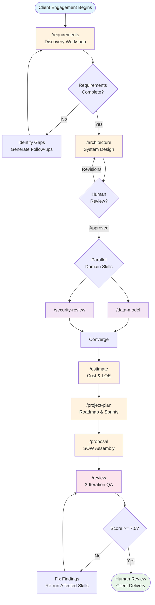
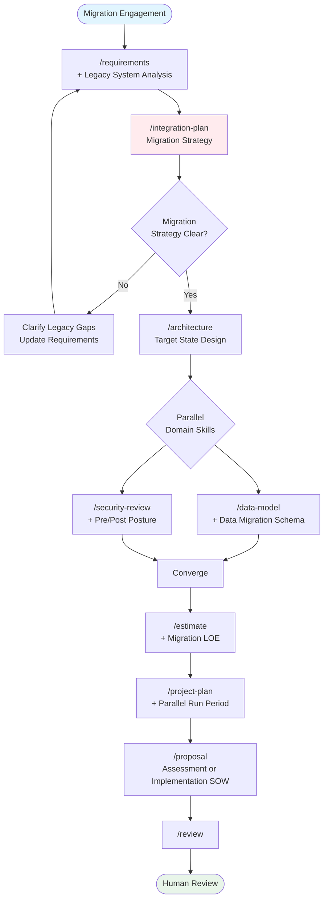
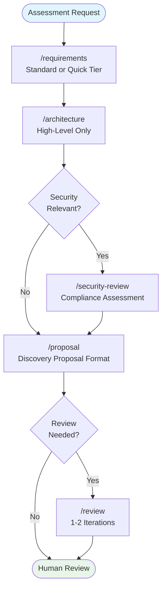
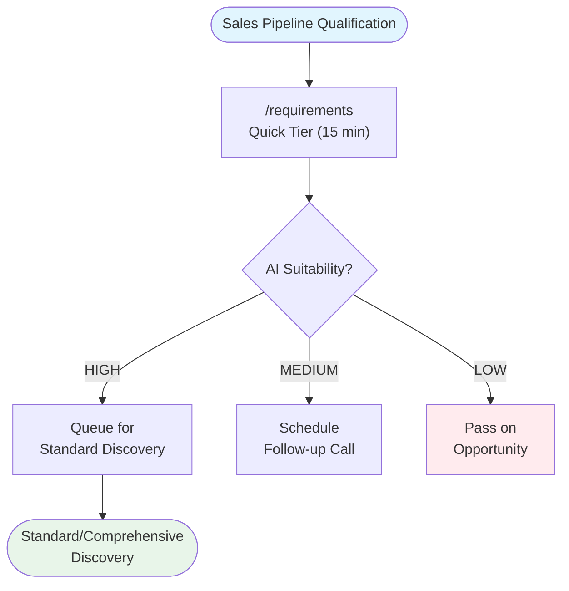
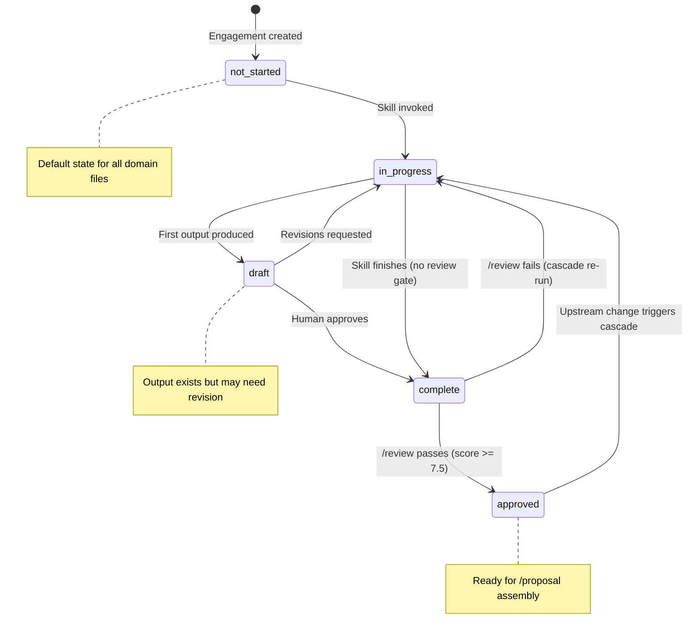
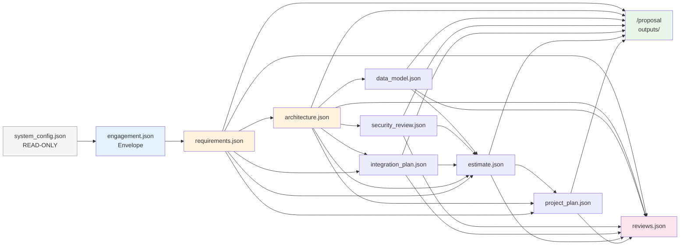
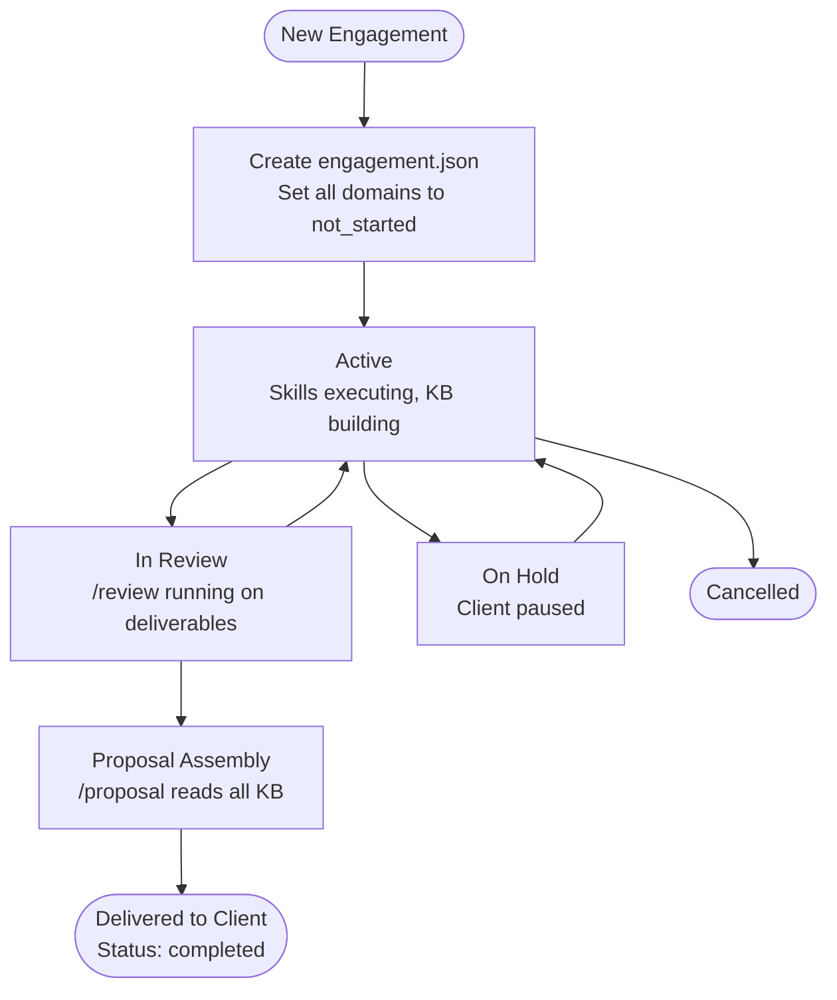
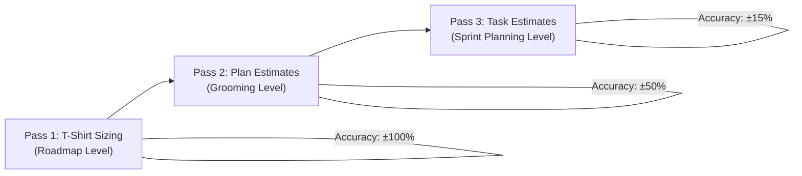

# Phase 2: Workflow Design

> Generated: 2026-03-15 | Phase: 2 of 9
> Inputs: requirements.md, master-plan.md, phase-1-results.md, pre-sales-lifecycle.md, SCHEMA_DESIGN.md

---

## 1. User Journey Maps

### 1.1 Greenfield (0-to-1 New Build)

The full SA lifecycle for building something new. All 9 skills, sequential with optional skips.



**Duration**: 2-8 hours SA time (across multiple sessions)
**Personas**: Priya (full), Marcus (may skip /data-model, /security-review), Aisha (may skip /security-review, /integration-plan)

### 1.2 Migration/Modernization

Migration adds /integration-plan early in the sequence and injects migration-specific content into all downstream skills.



**Key differences from greenfield**:
- `/integration-plan` runs before `/architecture` (target architecture depends on migration constraints)
- `/requirements` includes legacy system analysis (current state, pain drivers, migration constraints)
- `/data-model` includes data migration schema and ETL specifications
- `/security-review` compares pre-migration and post-migration security posture
- `/project-plan` includes parallel run period, feature parity milestones, rollback plan
- `/estimate` includes migration-specific LOE: assessment + execution + parallel run + cutover

### 1.3 Assessment-Only

A truncated flow for clients not ready to commit to implementation. Produces a discovery proposal (assessment SOW), not an implementation SOW.



**Skipped skills**: /data-model, /integration-plan, /estimate (detailed), /project-plan
**Output**: Discovery proposal ($5K-$25K range, 2-6 week assessment scope)
**Personas**: Marcus (primary), Priya (for enterprise assessments)

### 1.4 Quick Discovery (Pipeline Qualification)

Minimal flow for qualifying opportunities in sales pipeline. Single skill, multiple engagements.



**Duration**: 15-30 minutes per prospect
**Output**: Partial requirements.json with AI suitability score, pain points, gap listing
**Personas**: Marcus (primary), Aisha (self-qualifying)

---

## 2. Skill Invocation Sequences

### 2.1 Canonical Flows

| Flow | Sequence | When to Use |
|------|----------|-------------|
| **Full Greenfield** | req → arch → dm → sr → est → ppl → pro → rv | Complete 0-to-1 engagement |
| **Full Migration** | req → ip → arch → dm → sr → est → ppl → pro → rv | Complete migration engagement |
| **Streamlined** | req → arch → est → pro | Small projects, time-constrained |
| **Assessment** | req → arch → [sr] → pro | Discovery-only, pre-commitment |
| **Quick Qualify** | req (quick) | Pipeline qualification |
| **Review-Only** | rv (targeting any KB file) | Quality check on existing deliverable |

### 2.2 Phase-Skip Rules

| Rule | Condition | Behavior |
|------|-----------|----------|
| **Skip allowed** | KB file exists and status is "complete" or "approved" for the skipped skill | Downstream skill reads existing KB data; no re-run needed |
| **Skip with warning** | KB file exists but status is "draft" or "in_progress" | Warn user that upstream data is incomplete; offer to proceed or finish upstream first |
| **Skip blocked** | KB file does not exist for a required upstream dependency | Block execution; display which upstream skill(s) must run first |
| **Optional skip** | Skill is not on the critical path for the engagement type | Allow skip without warning (e.g., /data-model for simple CRUD apps) |

### 2.3 Prerequisite Validation

Before invoking any skill, the dispatch logic validates:

```
1. Read engagement.json → determine engagement_type
2. For target skill, look up $depends_on from SCHEMA_DESIGN
3. For each dependency:
   a. Check if file exists
   b. Check lifecycle_state status
   c. If status is "not_started" → BLOCK with message
   d. If status is "draft"/"in_progress" → WARN
   e. If status is "complete"/"approved" → PROCEED
4. If all prerequisites met → invoke skill
5. If blocked → list missing prerequisites, suggest skill sequence
```

---

## 3. Skill I/O Contracts

### 3.1 Per-Skill I/O

| Skill | KB Reads | KB Writes | User Inputs | Deliverable Outputs |
|-------|----------|-----------|-------------|-------------------|
| `/requirements` | `system_config.json` | `requirements.json`, `engagement.json` (creates/updates) | Client context, interview responses, meeting notes | requirements.json |
| `/architecture` | `requirements.json`, `integration_map.json` (if exists) | `architecture.json`, `engagement.json` (updates lifecycle) | Constraints, preferences | architecture.json, Mermaid diagrams |
| `/data-model` | `requirements.json`, `architecture.json` | `data_model.json`, `engagement.json` (updates lifecycle) | Data source details | data_model.json, ERDs |
| `/security-review` | `requirements.json`, `architecture.json`, `data_model.json` (if exists), `integration_map.json` (if exists) | `security_review.json`, `engagement.json` (updates lifecycle) | Compliance requirements, regulatory context | security_review.json, threat model |
| `/integration-plan` | `requirements.json`, `architecture.json` | `integration_plan.json`, `engagement.json` (updates lifecycle) | Legacy system docs, API specs | integration_plan.json |
| `/estimate` | `requirements.json`, `architecture.json`, `data_model.json` (if exists), `security_review.json` (if exists), `integration_map.json` (if exists) | `estimate.json`, `engagement.json` (updates lifecycle) | Budget constraints, team info, rate cards | estimate.json |
| `/project-plan` | `requirements.json`, `architecture.json`, `estimate.json` | `project_plan.json`, `engagement.json` (updates lifecycle) | Timeline constraints, team availability | project_plan.json, Gantt/timeline |
| `/proposal` | ALL KB files (read-only) | `outputs/{engagement_id}/` (NOT KB) | Proposal type, pricing parameters | SOW/proposal documents |
| `/review` | Target KB file + its schema | `reviews.json`, `engagement.json` (updates review_summary) | Target file selection, focus areas | reviews.json |

### 3.2 Data Flow Specifics

From SCHEMA_DESIGN.md Cross-Skill Data Flow Map:

| Downstream Skill | Reads From | Specific Sections Used |
|-----------------|------------|----------------------|
| `/architecture` | requirements.json | client_context, problem_statement, functional_requirements, non_functional_requirements, data_landscape, constraints |
| `/estimate` | requirements.json | constraints.budget_range, constraints.timeline_weeks, functional_requirements (count + complexity) |
| `/estimate` | architecture.json | tech_stack, component_design (count + cost_driver), well_architected_scores |
| `/data-model` | requirements.json | data_landscape, non_functional_requirements.security |
| `/data-model` | architecture.json | tech_stack.data_stores, component_design (data-related components) |
| `/security-review` | requirements.json | non_functional_requirements.security, non_functional_requirements.data_residency, constraints |
| `/security-review` | architecture.json | tech_stack.infrastructure, component_design, data_flows, well_architected_scores.security |
| `/integration-plan` | requirements.json | data_landscape.integration_points, non_functional_requirements.performance |
| `/integration-plan` | architecture.json | tech_stack, component_design, data_flows |
| `/project-plan` | requirements.json | constraints.timeline_weeks, stakeholders, assumptions |
| `/project-plan` | architecture.json | component_design (work breakdown), executive_summary |
| `/project-plan` | estimate.json | loe_breakdown, team_composition, cost_model |
| `/proposal` | ALL files | Full read access — assembles executive summary from all sources |
| `/review` | ANY single file | Full read of target file + its schema for validation |

---

## 4. KB State Flow

### 4.1 State Machine

Each KB domain file progresses through the following states:



### 4.2 Lifecycle State Tracking

`engagement.json` maintains a `lifecycle_state` object that tracks every domain file's status:

```json
{
  "lifecycle_state": {
    "requirements":     { "status": "approved",    "version": "1.2", "file": "requirements.json" },
    "architecture":     { "status": "complete",    "version": "0.3", "file": "architecture.json" },
    "data_model":       { "status": "in_progress", "version": "0.1", "file": "data_model.json" },
    "security_review":  { "status": "not_started", "version": null,  "file": "security_review.json" },
    "integration_plan": { "status": "not_started", "version": null,  "file": "integration_plan.json" },
    "estimate":         { "status": "not_started", "version": null,  "file": "estimate.json" },
    "project_plan":     { "status": "not_started", "version": null,  "file": "project_plan.json" }
  }
}
```

### 4.3 Data Flow Diagram



### 4.4 Version Control

- Each domain file uses `MAJOR.MINOR` versioning (e.g., "1.2")
- Major increments on structural changes (new sections, schema evolution)
- Minor increments on content updates within existing structure
- `engagement.json` tracks current version for each domain file
- `/review` records the `target_version` it reviewed, enabling version-aware re-review

---

## 5. Multi-Session Support

### 5.1 Persistence Model

All state persists to disk as JSON files in `knowledge_base/`. No in-memory session state required. This means:

- **Resume anywhere**: A new Claude Code session reads KB files from disk and continues from the last state
- **No session tokens**: Engagement state is in files, not conversation history
- **Cross-device**: If KB files are synced (e.g., via git), the engagement can continue on a different machine

### 5.2 Resume Points

When a new session starts:

```
1. Read engagement.json → determine current lifecycle state
2. Display status summary:
   "Engagement: [title] ([type])
    Requirements: complete (v1.2)
    Architecture: in_progress (v0.1)
    Data Model: not_started
    ..."
3. Suggest next action based on lifecycle state
4. User confirms or redirects
```

### 5.3 Partial Completion Handling

| Scenario | Detection | Recovery |
|----------|-----------|----------|
| Skill interrupted mid-execution | Domain file status is "in_progress", version exists | Offer to: (a) continue from draft, (b) re-run from scratch |
| Requirements incomplete | requirements.json `_metadata.completeness` is "partial" or "incomplete" | Display gaps, offer to continue discovery or proceed with caveats |
| Architecture needs revision | architecture.json status is "draft", review findings exist | Display review findings, offer to address specific findings |
| Engagement stale (>30 days since last update) | `last_updated` field check | Warn that context may be outdated, suggest re-running /requirements to validate |

### 5.4 Engagement Lifecycle



---

## 6. Error Handling

### 6.1 Missing Upstream Data

| Error | Detection | Response |
|-------|-----------|----------|
| Required KB file missing | `$depends_on` file not found on disk | "Cannot run /architecture: requirements.json not found. Run /requirements first, or provide requirements directly." |
| Required KB file incomplete | File exists but status is "not_started" or key required fields are null | "requirements.json exists but is incomplete (missing: functional_requirements, success_criteria). Run /requirements to complete, or provide missing data directly." |
| Upstream data outdated | Downstream file has newer `last_updated` than upstream | "Warning: requirements.json was last updated before architecture.json. Requirements may have changed. Re-validate?" |

### 6.2 Conflicting Requirements

| Error | Detection | Response |
|-------|-----------|----------|
| Budget vs scope mismatch | estimate.json total exceeds constraints.budget_range | "Estimated cost ($120K) exceeds budget range ($75K-$100K). Options: (a) reduce scope, (b) extend timeline, (c) adjust team composition. Which approach?" |
| Timeline vs complexity mismatch | project_plan total_duration_weeks exceeds constraints.timeline_weeks | "Estimated timeline (16 weeks) exceeds constraint (12 weeks). Options: (a) increase team size, (b) reduce scope to MVP, (c) accept higher risk with compressed timeline." |
| Technology constraint conflict | Architecture recommendation conflicts with constraints.technology_restrictions | "Recommended technology [X] conflicts with constraint '[restriction]'. Selecting alternative: [Y]. Rationale: [reason]." |

### 6.3 Low Confidence

| Error | Detection | Response |
|-------|-----------|----------|
| Estimate confidence LOW | confidence_level evaluates to LOW (<50%) | "Confidence is LOW for this estimate. Key uncertainty sources: [list]. Recommend: (a) gather more data via /requirements, (b) spike/prototype to reduce uncertainty, (c) present with wide range and explicit caveats." |
| AI suitability score LOW | ai_suitability_assessment.score < 4 | "AI suitability score is LOW (3/10). This use case may not benefit from AI. Recommendation: [rationale]. Consider non-AI alternatives." |
| Review score below threshold | overall score < 5.0 after 3 iterations | "Deliverable quality is below acceptable threshold after 3 review iterations. Fundamental issues: [list]. Recommend re-running upstream skills with revised inputs." |

### 6.4 Scope Violations

| Error | Detection | Response |
|-------|-----------|----------|
| Implementation request | User asks to generate code, deploy, write tests | "This agent designs and plans — it doesn't implement. I can provide: [relevant SA output]. For implementation, a future AI Engineering Agent will consume these designs." |
| Out-of-scope domain | Request doesn't map to any of 9 skills | "This request doesn't map to the SA lifecycle. Available skills: [list]. Could you clarify which aspect you need?" |

### 6.5 WebSearch Failures

| Error | Detection | Response |
|-------|-----------|----------|
| WebSearch unavailable | Tool returns error or timeout | "Unable to fetch latest [technology] information. Proceeding with general best practices. Recommendation: verify [specific claim] against current documentation before client delivery." |
| WebSearch returns stale data | Results clearly outdated (dates, deprecated features) | "Search results may be outdated. Flagging for human verification: [specific items]. Consider checking [vendor documentation URL]." |

### 6.6 KB Corruption or Schema Violation

| Error | Detection | Response |
|-------|-----------|----------|
| JSON parse error | File exists but is not valid JSON | "knowledge_base/[file].json contains invalid JSON. Cannot proceed. Please fix the file or delete it to re-generate." |
| Schema validation failure | File parses but fails schema validation | "knowledge_base/[file].json does not match schema. Violations: [list]. Attempting to read available data and note gaps." |
| ID conflicts | Duplicate IDs within a file (e.g., two FR-001) | "Duplicate ID [ID] found in [file]. Renumbering to resolve conflict." |

---

## 7. SOW Template Structure

The `/proposal` skill produces SOWs following this 12-section structure (from Hyperbloom consulting delivery model):

### 7.1 Section Definitions

| # | Section | KB Source | Content |
|---|---------|-----------|---------|
| 1 | **Engagement Description** | engagement.json, requirements.json | Executive summary of consulting services, engagement type, client context |
| 2 | **Business Objectives** | requirements.json → problem_statement, success_criteria | Justified by business value from stakeholder interviews. Measurable KPIs |
| 3 | **Technical Requirements** | requirements.json → functional_requirements, non_functional_requirements | MVP scope, technology constraints, WA targets |
| 4 | **Team Leads and Roles** | estimate.json → team_composition | Service provider roles (planned + on-request) + client roles required |
| 5 | **Project Scope** | project_plan.json → phases, estimate.json → loe_breakdown | Weekly deliverables table with estimated cost per week |
| 6 | **Services Out of Scope** | requirements.json → constraints | Explicit exclusions to manage expectations |
| 7 | **Change Order** | (template) | Scope changes require mutual execution; 10-day termination clause |
| 8 | **Anticipated Schedule** | project_plan.json → total_duration_weeks, phases, milestones | Start/end, hours/week, SDLC methodology, acceptance process |
| 9 | **Project Rate** | estimate.json → cost_model, team_composition | Blended hourly rate, total estimate, 5% down payment, overtime premium |
| 10 | **Payment Methods** | (template) | Monthly invoices, ACH/wire |
| 11 | **Assumptions** | requirements.json → assumptions | Flexibility, meetings, travel, client delay responsibility |
| 12 | **Signature Block** | engagement.json → client | Mutual execution by authorized representatives |

### 7.2 Proposal Type Variations

| Type | Sections Used | Audience | Typical Value |
|------|---------------|----------|---------------|
| **Discovery Proposal** | 1-3, 5-8, 11-12 (simplified) | Client decision-maker | $5K-$25K |
| **Implementation SOW** | All 12 sections (full detail) | Client legal + technical | $25K-$500K+ |
| **Internal Proposal** | 1-3, 5, 8-9 (with exec slides) | Internal leadership | Budget approval |
| **Pitch Deck** | 1-3 (narrative format, slides) | External prospect | Pre-contract |

---

## 8. Estimation Model

### 8.1 Three-Pass Integration

The estimation model uses three passes at increasing precision, aligned with engagement phases:



| Pass | When | Method | Accuracy | Output |
|------|------|--------|----------|--------|
| **T-Shirt** | After /requirements | Size comparison: S≤40pts, M≤100, L≤210, XL>210 | ±100% | Budget range for client go/no-go |
| **Plan** | After /architecture + /estimate | Bottom-up by component, 3-point weighted | ±50% | SOW pricing, team composition |
| **Task** | After /project-plan | Task-level breakdown (1-few days each) | ±15% | Sprint backlog, resource allocation |

### 8.2 Point System

| Unit | Definition |
|------|-----------|
| 1 point | Half a work day (4 hours) |
| 10 pts/week | Per team member capacity |
| 20 pts/sprint | Per team member per 2-week sprint |
| 60 pts/PSI | Per team member per Potentially Shippable Increment (2-3 sprints) |

### 8.3 Uncertainty Buffers

| Category | Buffer | When |
|----------|--------|------|
| Known Knowns | +0% | Standard features, familiar tech |
| Known Unknowns | +25-50% | Third-party API complexity, unfamiliar framework |
| Unknown Unknowns | +50-100% | Novel tech, regulatory uncertainty, first-of-kind |

### 8.4 Complexity Assessment (10-Point Checklist)

Each factor adds 1 point to complexity score:
1. Novel technology stack
2. Multiple integrations (3+)
3. High performance requirements
4. Data pipeline complexity
5. Unfamiliar tech stack for team
6. Evolving/unclear requirements
7. Critical external dependencies
8. Security/compliance requirements
9. Real-time processing
10. Complex business logic

| Score | Rating | Buffer |
|-------|--------|--------|
| 0-2 | Low | +0-15% |
| 3-5 | Medium | +25-40% |
| 6-8 | High | +50-75% |
| 9-10 | Very High | +75-100% |

---

## 9. Sprint Alignment

### 9.1 Sprint Methodology

| Parameter | Value |
|-----------|-------|
| Sprint duration | 2 weeks (10 working days, Friday to Thursday) |
| PSI | 2-3 sprints per Potentially Shippable Increment |
| Ceremonies | Sprint Planning, Daily Scrum (15 min), Sprint Review/Demo, Retrospective, Backlog Refinement |
| Confidence Gate | "Fist of Five" vote — minimum average 3 to proceed |

### 9.2 Work Item Hierarchy

```
Epic (too big for 1 sprint)
├── Story (smallest planning unit, fits in 1 sprint)
│   ├── Task (1-few days, broken during Sprint Planning)
│   ├── Task
│   └── Task
├── Story
│   ├── Task
│   └── Task
└── Story
```

### 9.3 Capacity Model

| Level | Capacity |
|-------|----------|
| Per member per week | 10 points |
| Per member per sprint | 20 points |
| Per member per PSI | 60 points |
| Team of 4 per sprint | 80 points |
| Team of 4 per PSI | 240 points |

### 9.4 How /project-plan Uses This

The `/project-plan` skill:
1. Reads `estimate.json` → `loe_breakdown.total_hours` and `team_composition`
2. Converts hours to points (1 point = 4 hours)
3. Calculates available capacity per sprint based on team size and allocation percentages
4. Distributes work across sprints respecting dependencies
5. Identifies sprint boundaries that align with PSI milestones
6. Generates decision gates at PSI boundaries

---

## 10. Dispatch Architecture

### 10.1 CLAUDE.md Dispatch

The agent's CLAUDE.md defines identity and dispatches to skills. When a user message arrives:

```
1. Parse user intent (natural language or slash command)
2. If slash command (/requirements, /architecture, etc.) → direct dispatch
3. If natural language:
   a. Classify across 5 dimensions:
      - User objective (what they want to accomplish)
      - Domain (requirements, architecture, security, etc.)
      - Current phase (what KB state exists)
      - Target skill (best match)
      - Context needed (which KB files to load)
   b. If unambiguous → dispatch to target skill
   c. If ambiguous → present 2-4 options mapped to skills, ask user to select
4. Before dispatch, validate prerequisites (Section 2.3)
5. Invoke skill
6. After completion, update engagement.json lifecycle_state
7. Present human checkpoint (Section 6 of requirements.md, CCR-005)
```

### 10.2 Context Tiers

Skills load context progressively to stay within token budgets:

| Tier | Content | When Loaded | Token Budget |
|------|---------|-------------|-------------|
| **Hot** | CLAUDE.md, guiding-principles.md, target skill SKILL.md | Always | ~2,000 tokens |
| **Warm** | Upstream KB files ($depends_on), engagement.json | On skill invocation | ~3,000-5,000 tokens per file |
| **Cold** | Reference documents, templates, other KB files | On-demand (skill requests specific data) | As needed |

### 10.3 Sub-Agent Usage

Per Anthropic's guidance, sub-agents (`context: fork`) are used for:

| Use Case | Agent Type | Why Sub-Agent |
|----------|-----------|---------------|
| Well-Architected pillar reviews | Parallel reviewer | 6 independent pillar reviews can run in parallel |
| Security threat enumeration | STRIDE analyzer | Each STRIDE category can be analyzed independently |
| Multi-scenario estimation | Estimator | Optimistic/likely/pessimistic can run in parallel |
| Review iterations | Quality judge | Each iteration is independent |

Sub-agents are NOT used for sequential reasoning tasks (single agent outperforms by 39-70% per Google/MIT research).

### 10.4 Skill Invocation Protocol

Every skill invocation follows this protocol:

```
PRE-INVOCATION:
1. Validate prerequisites (Section 2.3)
2. Load context tier: Hot + Warm (upstream KB files)
3. Check engagement.json for engagement_type (affects skill behavior)

EXECUTION:
4. Run skill logic per SKILL.md
5. Use WebSearch/WebFetch for dynamic technology references
6. Use ultrathink for deep reasoning skills (architecture, data-model, security-review, review)

POST-INVOCATION:
7. Write output to KB file (per I/O contract)
8. Update engagement.json lifecycle_state:
   - Set skill status to "complete" (or "draft" if human review needed)
   - Increment version
   - Set last_updated
9. Present human checkpoint:
   - "Phase complete: [skill name]"
   - Deliverables: [list with file paths]
   - Next recommended skill: [name]
   - "Ready to proceed, or review first?"
```

---

## Verification Checklist

- [x] 4 user journey maps with Mermaid diagrams (Section 1: greenfield, migration, assessment, quick discovery)
- [x] Skill I/O contracts consistent with SCHEMA_DESIGN.md (Section 3: reads/writes match schema $depends_on)
- [x] Multi-session support documented (Section 5: persistence model, resume points, partial completion)
- [x] 6 error/fallback modes defined (Section 6: missing upstream, conflicting requirements, low confidence, scope violations, WebSearch failures, KB corruption)
- [x] SOW 12-section template structure included (Section 7: all 12 sections with KB source mapping)
- [x] Three-pass estimation model integrated (Section 8: T-shirt → Plan → Task with accuracy targets)
- [x] Sprint methodology aligned (Section 9: 2-week sprints, PSI, work item hierarchy, capacity model)
- [x] Dispatch architecture documented (Section 10: CLAUDE.md dispatch, context tiers, sub-agent usage)
- [x] No external filesystem references
