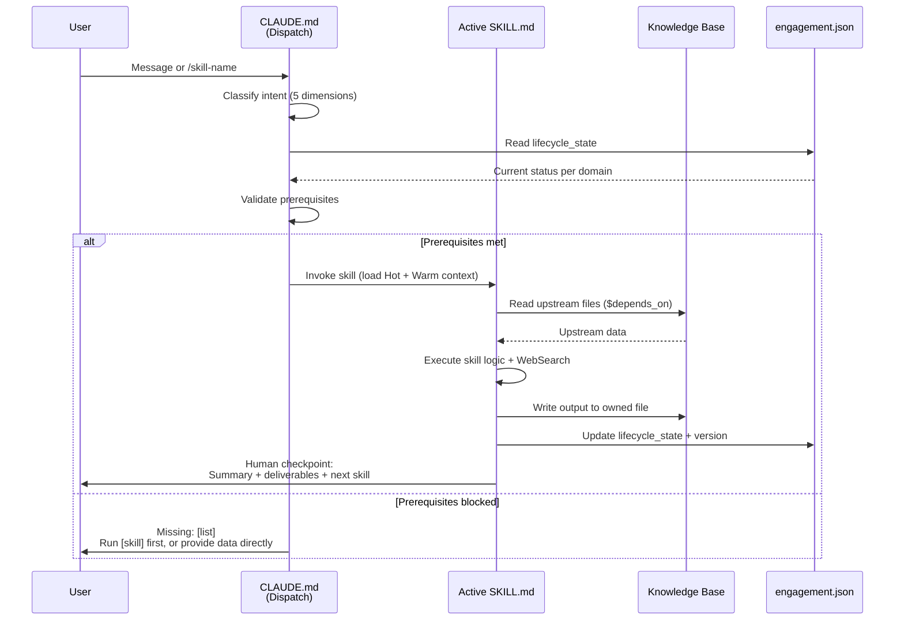
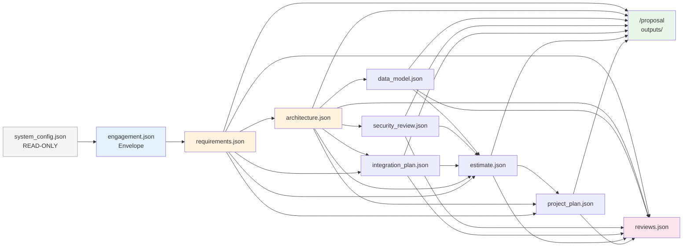
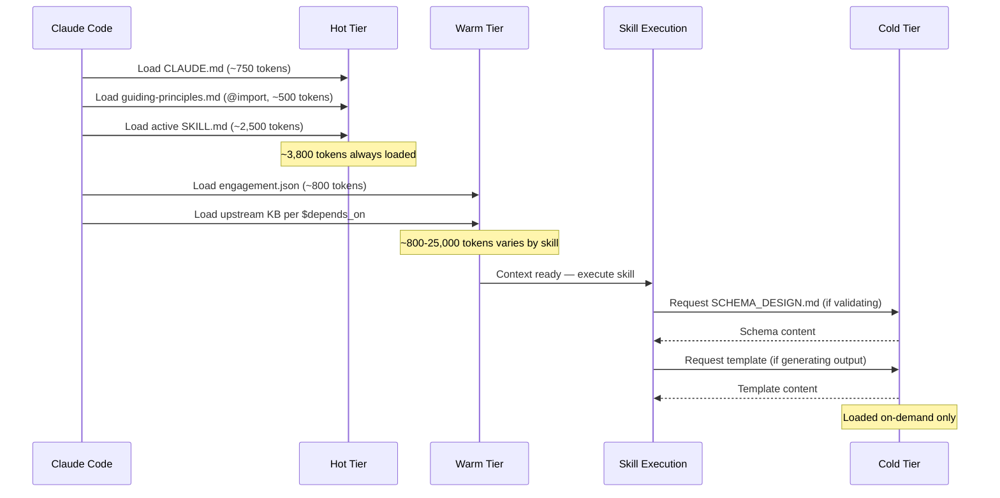
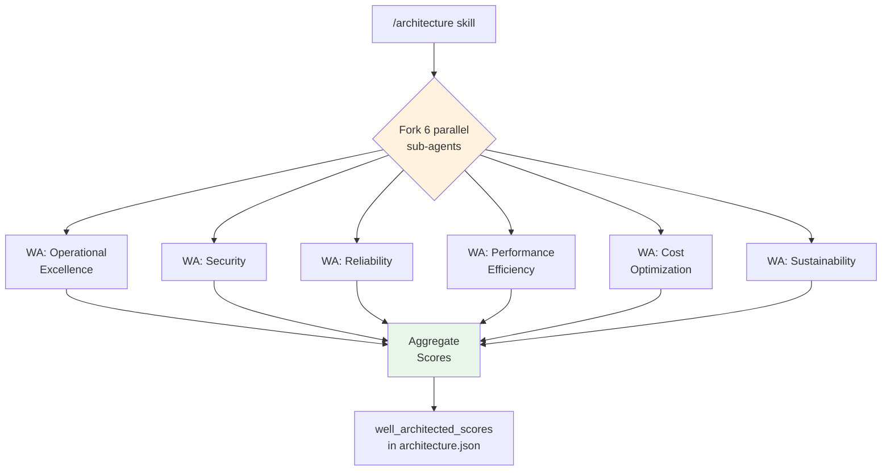

# System Architecture

**Version**: 1.1.0 | **Pattern**: Single agent with skills + sub-agents (see `.repo-metadata.json` for counts) | **Platform**: Claude Code plugin

---

## Design Decisions

**Single agent, not multi-agent.** One Claude Code agent with skills loaded on demand, rather than a supervisor routing between 23 agents. This eliminates inter-agent handoff failures, reduces context overhead, and lets each skill access full conversation history.

**Sub-agents only for parallelism.** Two sub-agents (`parallel-wa-reviewer`, `stride-analyzer`) exist solely to run 6 Well-Architected pillar reviews and STRIDE threat analysis in parallel via the Agent tool. They receive focused prompts and return structured scores — no orchestration role.

**Progressive context loading.** Skills use a 3-tier context model (Hot/Warm/Cold) to stay within token budgets. Hot context (~3,800 tokens) is always loaded; Warm context loads upstream KB files per `$depends_on`; Cold context (schemas, templates) loads on demand only.

**Blackboard knowledge base.** Skills communicate exclusively through JSON files in `knowledge_base/`, never directly. Each skill owns one file and writes only to it. `engagement.json` tracks lifecycle state across all domain files.

**Technology-agnostic recommendations.** The agent uses WebSearch to evaluate current technology options rather than defaulting to any specific vendor or stack.

---

## Plugin Structure

```mermaid
graph TD
    ROOT[solutions-architecture-agent/] --> CP[.claude-plugin/]
    ROOT --> SK[skills/]
    ROOT --> AG[agents/]
    ROOT --> HK[hooks/]
    ROOT --> KB[knowledge_base/]
    ROOT --> TM[templates/]
    ROOT --> CL[.claude/]
    ROOT --> CM[CLAUDE.md]

    CP --> PJ[plugin.json]

    SK --> S1[requirements/SKILL.md]
    SK --> S2[architecture/SKILL.md]
    SK --> S3[estimate/SKILL.md]
    SK --> S4[project-plan/SKILL.md]
    SK --> S5[proposal/SKILL.md]
    SK --> S6[data-model/SKILL.md]
    SK --> S7[security-review/SKILL.md]
    SK --> S8[integration-plan/SKILL.md]
    SK --> S9[review/SKILL.md]

    AG --> A1[parallel-wa-reviewer.md]
    AG --> A2[stride-analyzer.md]

    HK --> HJ[hooks.json]

    KB --> SC[system_config.json]
    KB --> ENG[engagement.json]
    KB --> RQ[requirements.json]
    KB --> AR[architecture.json]
    KB --> DM[data_model.json]
    KB --> SR[security_review.json]
    KB --> IP[integration_plan.json]
    KB --> ES[estimate.json]
    KB --> PP[project_plan.json]
    KB --> RV[reviews.json]
    KB --> SCH[schemas/]

    CL --> RU[rules/]
    RU --> GP[guiding-principles.md]
    RU --> SKR[skills.md]
    RU --> KBR[knowledge-base.md]
    RU --> SEC[security.md]
```

---

## Skill Dispatch Flow

When a user message arrives, `CLAUDE.md` dispatch rules:
1. **Slash command** → direct skill invocation
2. **Natural language** → classify across 5 dimensions (objective, domain, phase, target skill, context needed)
3. **Scope negotiation** → establish deliverable, audience, length, time budget → map to depth tier (QUICK/STANDARD/COMPREHENSIVE)
4. **Validate prerequisites** → check `engagement.json` lifecycle_state (skip for QUICK depth)
5. **Invoke skill** with depth tier → load SKILL.md, read upstream KB (STANDARD/COMPREHENSIVE) or skip (QUICK), execute
6. **MANDATORY STOP** → summarize output, list deliverables, wait for explicit human approval before next skill

---

## Knowledge Base Data Flow

### KB File Ownership

| Skill | Owns | Depends On |
|-------|------|-----------|
| Requirements | `requirements.json` | `system_config.json`, `engagement.json` |
| Architecture | `architecture.json` | `requirements.json` |
| Data Model | `data_model.json` | `requirements.json`, `architecture.json` |
| Security Review | `security_review.json` | `requirements.json`, `architecture.json` |
| Integration Plan | `integration_plan.json` | `requirements.json`, `architecture.json` (optional in migration flow) |
| Estimate | `estimate.json` | `requirements.json`, `architecture.json`, `data_model.json`, `security_review.json`, `integration_plan.json` |
| Project Plan | `project_plan.json` | `requirements.json`, `architecture.json`, `estimate.json` |
| Proposal | `outputs/` | All upstream KB files |
| Review | `reviews.json` | All upstream KB files (dynamic) |

**Note**: In the **migration flow**, `/integration-plan` runs before `/architecture` — the integration plan can depend on requirements alone when architecture hasn't been created yet.

---

## Context Loading

| Tier | Contents | Token Budget | Loaded When |
|------|----------|-------------|-------------|
| **Hot** | CLAUDE.md, guiding-principles.md, active SKILL.md | ~3,800 | Always |
| **Warm** | engagement.json + upstream KB files per `$depends_on` | 800-25,000 | At skill invocation |
| **Cold** | Schemas, templates, SCHEMA_DESIGN.md | Variable | On demand only |

---

## Sub-Agent Orchestration

Two sub-agents in `agents/`:

| Sub-Agent | Used By | Purpose |
|-----------|---------|---------|
| `parallel-wa-reviewer` | `/architecture` | Reviews architecture against AWS Well-Architected 6 pillars in parallel, returns scores 0-10 per pillar |
| `stride-analyzer` | `/security-review` | Performs STRIDE threat modeling in parallel across system components |

Sub-agents are invoked via the Claude Code Agent tool, receive focused prompts with relevant KB context, and return structured JSON that the parent skill incorporates into its output file.

**Depth-conditional**: Sub-agents are only invoked for STANDARD and COMPREHENSIVE depth tiers. QUICK depth performs inline scoring without sub-agents, eliminating 12-18 parallel invocations.

---

## Engagement Lifecycle

Eight canonical flows support different engagement types and depth tiers:

| Flow | Sequence | When |
|------|----------|------|
| **Greenfield** | req → arch → dm → sr → est → ppl → pro → rv | Complete 0-to-1 engagement |
| **Migration** | req → ip → arch → dm → sr → est → ppl → pro → rv | Migration/modernization |
| **Streamlined** | req → arch → est → pro | Small projects, time-constrained |
| **Assessment** | req → arch → [sr] → pro | Discovery-only, pre-commitment |
| **Quick Qualify** | req (quick tier) | Pipeline qualification |
| **Direct Delivery** | scope negotiation → single skill (QUICK) → output | Single-document tasks, interview prep |
| **Rapid Assessment** | req (QUICK) → arch (QUICK) → pro (QUICK) | Same-day turnaround |
| **Custom Document** | scope negotiation → selective skills (QUICK) → assembly | User-specified format and sections |

### Phase-Skip Rules

- **Skip allowed**: upstream KB file exists with status `complete` or `approved`
- **Skip with warning**: upstream KB file exists but status is `draft` or `in_progress`
- **Skip blocked**: required upstream KB file does not exist
- **Optional skip**: skill not on critical path for engagement type

---

## Security

- **Pre-commit hooks** (`hooks/hooks.json`) — validate KB schemas before commit
- **PII protection** — `private/` directory gitignored; security rules in `.claude/rules/security.md`
- **No external data transmission** — all processing is local within Claude Code
- **Least privilege** — skills read only their declared `$depends_on` upstream files
- **Human checkpoints** — every skill pauses for human review before proceeding

---

## Extensibility: Adding a New Skill

To add a 10th skill, see [CONTRIBUTING.md](CONTRIBUTING.md) for the complete guide. In brief:

1. Create `skills/<skill-name>/SKILL.md` with identity, workflow, output rules
2. Create `knowledge_base/schemas/<skill_name>.schema.json`
3. Register the skill in `CLAUDE.md` (skill table, engagement flows)
4. Update `.repo-metadata.json` counts
5. Validate: `python tests/validate_knowledge_base.py && python tests/validate_consistency.py`

---

## References

- **[CLAUDE.md](CLAUDE.md)** — Agent identity, dispatch rules, quality standards
- **[README.md](README.md)** — Quick start and overview
- **[CONTRIBUTING.md](CONTRIBUTING.md)** — Skill creation guide, PR process
- **[.claude/rules/guiding-principles.md](.claude/rules/guiding-principles.md)** — 42 governing principles
