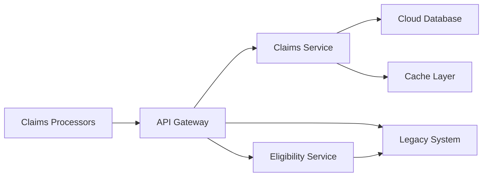

# Legacy Healthcare Claims Modernization — Solution Architecture

## Executive Summary

This document proposes a phased modernization approach for a legacy healthcare claims processing system currently running on an aging monolithic architecture. The recommended strategy uses the Strangler Fig pattern to incrementally replace legacy components with cloud-native microservices, preserving business continuity while enabling modern capabilities.

**Recommendation**: Proceed with Phase 1 (API Gateway + Claims Intake modernization) to validate the approach with minimal risk. Estimated 12-week Phase 1 timeline.

**Key Benefits**: 60% reduction in claims processing time, HIPAA-compliant cloud infrastructure, real-time eligibility verification, modern developer experience.

**Key Risks**: Data migration complexity (mitigated by parallel-run validation), regulatory compliance during transition (mitigated by phased approach with compliance gates).

## Proposed Architecture

## Technology Stack

| Layer | Recommendation | Rationale |
|-------|---------------|-----------|
| API Gateway | Kong or AWS API Gateway | Protocol translation, rate limiting, legacy routing |
| Backend | Go or Java (Spring Boot) | Healthcare industry standard, strong typing, performance |
| Database | PostgreSQL (primary) + Redis (cache) | ACID compliance for claims, sub-ms reads for eligibility |
| Infrastructure | AWS or GCP (HIPAA BAA) | Managed services reduce ops burden, compliance-ready |
| CI/CD | GitHub Actions + Terraform | IaC, immutable deployments, audit trail |

## Implementation Approach

**Phase 1 (Weeks 1-12)**: API Gateway + Claims Intake — route new claims through modern service, legacy handles existing claims.

**Phase 2 (Weeks 13-24)**: Eligibility + Benefits — real-time eligibility checks, benefits calculation modernization.

**Phase 3 (Weeks 25-36)**: Full cutover — migrate remaining legacy functions, parallel-run validation, decommission legacy.

## Security and Compliance

- HIPAA BAA with cloud provider (mandatory)
- Encryption at-rest (AES-256) and in-transit (TLS 1.3)
- PHI access logging and audit trails
- Role-based access control with least privilege
- Regular penetration testing and vulnerability scanning

## Recommendations and Next Steps

1. **Approve Phase 1 scope** — 12 weeks, focused on Claims Intake modernization
2. **Establish HIPAA compliance baseline** — cloud BAA, encryption, access controls
3. **Staff the team** — 1 Tech Lead, 2 Backend Engineers, 1 DevOps, 1 QA (part-time)
4. **Set up parallel-run infrastructure** — validate new system against legacy before cutover
