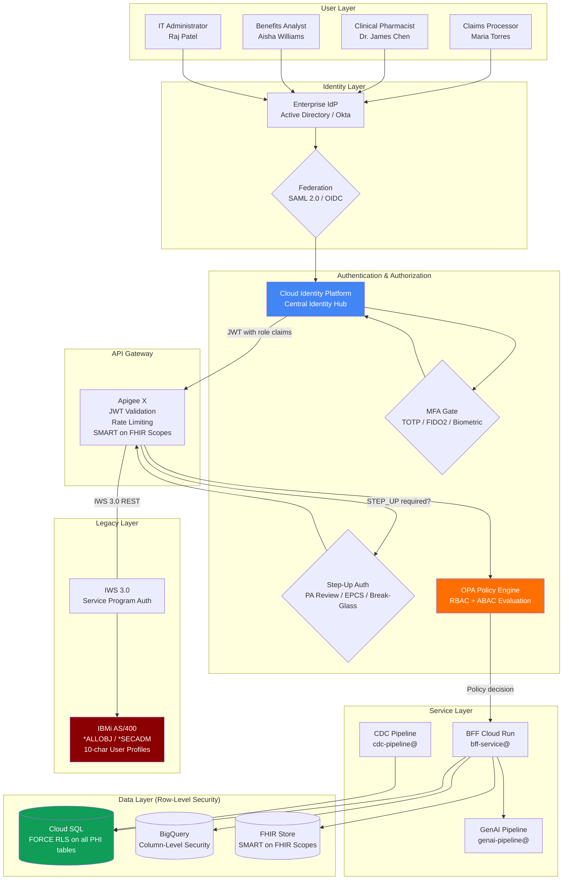
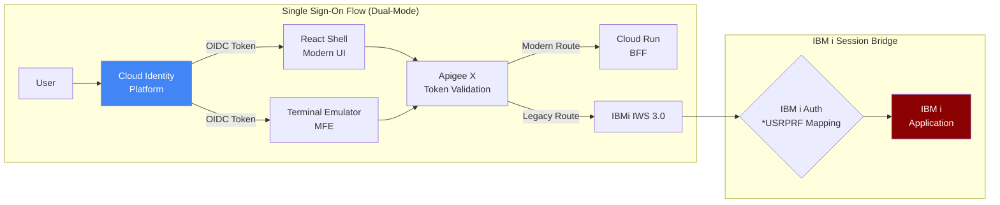
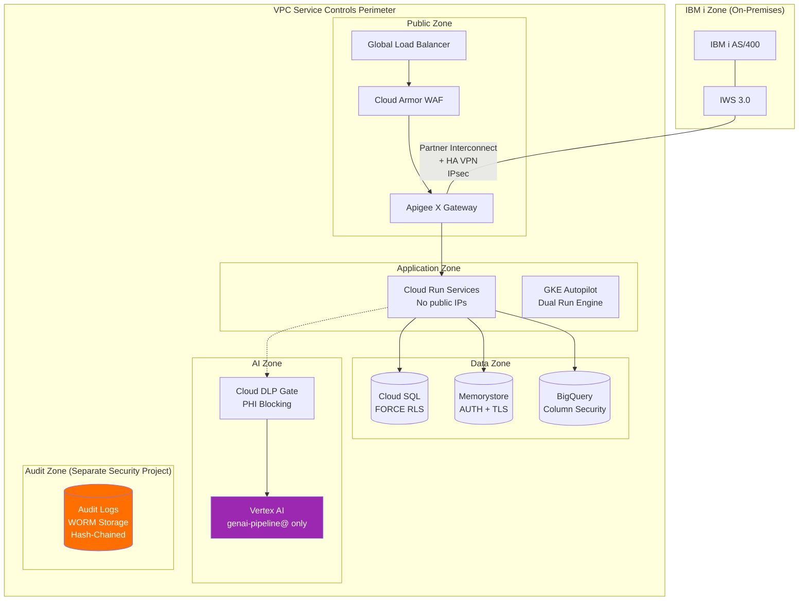
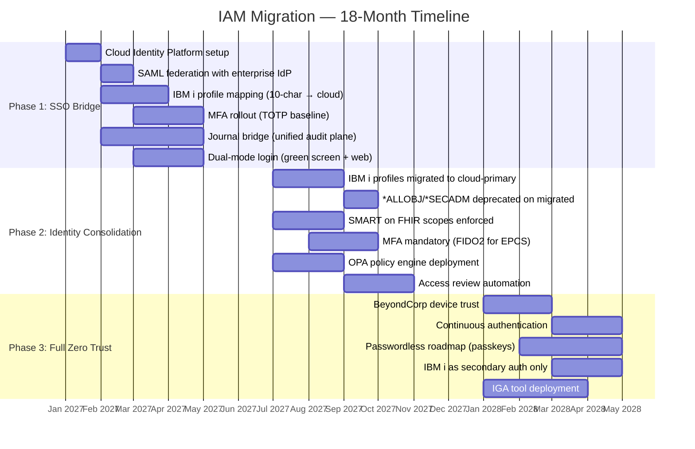

# IAM Strategy — CVS Health Legacy System Transformation

> **Engagement**: eng-2026-001 | CVS Health IBMi Green Screen UI/UX Modernization
> **Date**: 2026-03-16
> **Author**: Paul Pham, Solutions Architect — Modular Earth LLC
> **Status**: COMPLETE
> **Companion Artifact**: `knowledge_base/security_review.json` (STRIDE threat model, compliance mapping, defense-in-depth)

## Experience Framing

Having operated within enterprise IAM environments across three years as an AWS Solutions Architect (serving Fortune 500 clients with IAM architecture guidance), built HIPAA-compliant AI systems at Arine (serving 45+ health plans, 50M members) and Hyperbloom (clinical trials across 10K+ sites, 45 countries), and implemented production security controls including 7-layer defense-in-depth at Paloist and CSP/rate-limiting at paulprae.com, I designed this IAM strategy by synthesizing direct operational experience with authoritative frameworks: NIST SP 800-207 (Zero Trust Architecture), HIPAA Security Rule (45 CFR 164.312), DEA 21 CFR 1311 (Electronic Prescriptions for Controlled Substances), and SMART on FHIR (OAuth 2.0-based healthcare authorization). Where this document references GCP-specific services, those recommendations are based on research into CVS Health's March 2026 Google Cloud strategic partnership and the Health100 platform architecture.

---

## 1. IAM Architecture Overview

### 1.1 Identity Flow Architecture



### 1.2 Architecture Principles

| Principle | Description | Regulatory Basis |
|-----------|-------------|------------------|
| **Zero Trust** | Never trust, always verify. Every request authenticated, authorized, and encrypted regardless of network location. | NIST SP 800-207 |
| **Least Privilege** | Grant minimum permissions required for each function. Resource-level IAM bindings, never project-level. | HIPAA §164.312(a)(1), SOC 2 CC6.1 |
| **Defense in Depth** | Security controls at network, identity, application, and data layers. No single point of failure. | NIST CSF, AWS/GCP WAF |
| **Separation of Duties** | No single account combines administrative and clinical access. Break-glass requires justification. | DEA 21 CFR 1311.150, SOC 2 CC6.3 |
| **Assume Breach** | Design as if the perimeter is already compromised. Microsegmentation, monitoring, anomaly detection. | NIST SP 800-207 Tenet 6 |

### 1.3 IAM Across the Hybrid Boundary

The hybrid IBMi-to-cloud architecture creates a unique IAM challenge: two fundamentally different identity systems must coexist during an 18-month migration.

| Dimension | IBM i (Legacy) | Cloud (Target) | Bridge Strategy |
|-----------|---------------|----------------|-----------------|
| **Identity format** | 10-character user profiles (USRPRF) | Email-based cloud identities | Cloud Identity Platform maps profiles via custom attribute |
| **Authorization model** | Object-level authority (*USE, *CHANGE, *ALL) + special authorities (*ALLOBJ, *SECADM) | IAM roles + ABAC attributes + RLS policies | Authority-to-IAM translation matrix (see Section 4.4) |
| **Authentication** | Password-only (QSECURITY level 40/50) | MFA mandatory (TOTP/FIDO2/biometric) | SSO bridge federates both via Cloud Identity Platform |
| **Audit** | System journal (QAUDJRN) with T-AF, T-PW entries | Cloud Audit Logs + BigQuery | Precisely Connect journal bridge to unified BigQuery audit plane |
| **Session management** | Persistent 5250 sessions (no timeout in many configs) | 30-minute idle timeout, JWT-based | Dual-mode: legacy sessions via terminal emulator MFE, modern sessions via JWT |

### 1.4 Why IAM Is the Most Critical Non-Functional Requirement

IAM failure in this context means:
- **HIPAA §164.312 violation**: unauthorized PHI access affecting 50M+ members, penalties up to $2.1M per violation category per year
- **DEA 21 CFR 1311 violation**: unauthorized controlled substance prescriptions — criminal liability
- **PCI-DSS 4.0 violation**: unauthorized payment data access — card brand fines, loss of processing ability
- **Clinical safety risk**: incorrect access controls on GenAI PA recommendations could route unapproved AI decisions to patients
- **Operational disruption**: over-restrictive controls on the 500ms claims adjudication path halt pharmacy operations nationwide

Every other non-functional requirement (performance, availability, scalability) is irrelevant if IAM fails.

---

## 2. Identity Provider Strategy

### 2.1 Three-Option Comparison

| Capability | Option A: GCP-Native (Recommended) | Option B: AWS-Native | Option C: Modern Cloud |
|------------|-------------------------------------|---------------------|----------------------|
| **Central IdP** | Cloud Identity Platform | Amazon Cognito User Pools + IAM Identity Center | Supabase Auth |
| **Enterprise federation** | SAML 2.0 + OIDC federation with AD/Okta | SAML 2.0 federation via IAM Identity Center | SAML 2.0 SSO (Supabase Auth supports enterprise SSO) |
| **Healthcare identity** | SMART on FHIR scopes via Cloud Healthcare API | SMART on FHIR via HealthLake | HAPI FHIR server with custom SMART scopes |
| **MFA** | Built-in TOTP, WebAuthn/FIDO2, phone factor | Cognito MFA (TOTP, SMS, WebAuthn via custom challenge) | Supabase Auth MFA (TOTP, phone) |
| **Service accounts** | GCP IAM service accounts with Workload Identity Federation | IAM Roles with AssumeRole, Roles Anywhere for on-prem | Supabase service_role key + HashiCorp Vault |
| **IBM i bridge** | Cloud Identity Platform custom attributes for profile mapping | Cognito custom attributes | Supabase user metadata JSON field |
| **HIPAA BAA** | Yes (Cloud Identity Platform is HIPAA-eligible) | Yes (Cognito is HIPAA-eligible) | Yes (Supabase Team plan includes HIPAA BAA) |
| **Device trust** | BeyondCorp Enterprise (context-aware access) | Verified Access (device posture) | Cloudflare Access (device posture via WARP) |
| **Scale concern** | Proven at enterprise scale (Google's own infrastructure) | Proven at enterprise scale (AWS's largest healthcare customers) | Emerging at enterprise scale — no published PBM deployments |

### 2.2 GCP-Native Identity Architecture (Recommended — Deepest Treatment)

**Cloud Identity Platform** serves as the central identity hub, federating with CVS's enterprise directory (Active Directory and/or Okta) via SAML 2.0 and OIDC protocols.

**Federation flow**:
1. User accesses React frontend at `https://pbm.cvs.internal`
2. Frontend redirects to Cloud Identity Platform login page
3. Cloud Identity Platform redirects to CVS enterprise IdP (AD/Okta) via SAML 2.0
4. Enterprise IdP authenticates user, returns SAML assertion with group memberships and attributes
5. Cloud Identity Platform validates assertion, enforces MFA policy, maps SAML attributes to JWT claims
6. Cloud Identity Platform issues JWT access token (15-minute lifetime) with:
   - `sub`: unique user identifier
   - `roles`: RBAC role array (e.g., `["CLINICAL_PHARMACIST"]`)
   - `dea_certified`: boolean (sourced from HR system via SAML attribute)
   - `hipaa_training_current`: boolean (sourced from LMS via SAML attribute)
   - `department`: string
   - `location`: string
   - `fhir_scopes`: array (e.g., `["patient/*.read", "MedicationRequest/*.write"]`)
7. JWT validated at Apigee X gateway (RS256 signature verification, algorithm pinning, issuer/audience validation)
8. Subsequent service-to-service calls use Workload Identity Federation (no JSON keys)

**Why Cloud Identity Platform over Firebase Auth**: Cloud Identity Platform is the enterprise tier of Google's identity service. It supports SAML 2.0 federation, multi-tenancy, custom OIDC providers, and blocking functions for custom auth logic. Firebase Auth is the consumer-facing subset without SAML federation.

### 2.3 IBM i User Profile Migration

IBM i user profiles are fundamentally different from cloud identities. The migration must handle:

| IBM i Attribute | Cloud Mapping | Migration Action |
|----------------|---------------|------------------|
| **USRPRF (10-char)** | Cloud Identity Platform `custom:ibmi_profile` attribute | Map each profile to cloud identity; retain in custom attribute for legacy bridge |
| **\*ALLOBJ** | No direct equivalent — decomposes to specific IAM roles per resource | Audit all \*ALLOBJ holders; map to least-privilege cloud roles. Alert on any new \*ALLOBJ grants. |
| **\*SECADM** | `roles/iam.securityAdmin` scoped to specific projects | Restrict to dedicated security team members only |
| **\*SAVSYS** | `roles/storage.admin` scoped to backup resources only | Scope to backup Cloud Storage buckets |
| **\*JOBCTL** | `roles/run.admin` for Cloud Run management | Scope to operational management roles |
| **Object authority (*USE, *CHANGE, *ALL)** | Cloud SQL RLS policies + IAM resource-level bindings | Create authority-to-RLS translation matrix per entity |
| **Group profiles** | Cloud Identity Groups | Map IBM i group profiles to Cloud Identity groups; sync via journal bridge |
| **Adopted authority** (programs run under profile of program owner) | Service accounts with specific IAM bindings | Audit all IWS service programs for adopted authority; re-own to dedicated service profiles |

**Migration risk — T-001 and T-501**: STRIDE analysis identified that mapping \*ALLOBJ/\*SECADM directly to cloud IAM without downscoping is a critical threat (risk score 9/10). The authority-to-IAM translation matrix must be completed and reviewed by the security team before any production identity migration.

### 2.4 Service Account Management

Five dedicated service accounts, each with resource-level bindings following least privilege:

| Service Account | Purpose | IAM Bindings | Restrictions |
|----------------|---------|-------------|-------------|
| **bff-service@** | BFF Cloud Run — user-facing API requests | `roles/cloudsql.client` on claims-db, `roles/redis.editor` on session-cache, `roles/pubsub.publisher` on pa-events and claims-events | No Vertex AI, no Cloud Storage, no BigQuery |
| **genai-pipeline@** | GenAI PA recommendations — de-identified data only | `roles/aiplatform.user` on pa-recommendation endpoint, `roles/storage.objectViewer` on dlp-processed-output bucket, `roles/pubsub.subscriber` on de-identified-clinical topic | **NO Cloud SQL, NO FHIR Store, NO raw PHI access**. Enforced by VPC-SC perimeter. |
| **cdc-pipeline@** | CDC processing of IBM i journal entries | `roles/pubsub.publisher` on cdc-claims/cdc-formulary/cdc-member topics, `roles/dataflow.worker` on cdc-processing job | No direct Cloud SQL write, no Vertex AI |
| **apigee-runtime@** | Apigee X runtime operations | `roles/run.invoker` on specific Cloud Run services, `roles/iam.serviceAccountTokenCreator` for downstream identity | No data store access, no Vertex AI |
| **monitoring-sa@** | Read-only observability | `roles/monitoring.viewer`, `roles/logging.viewer` | **Viewer-only**. No admin, no write, no data store access. |

**Critical control — genai-pipeline@**: This service account has zero direct access to any PHI data store. The data access flow is: raw PHI in Cloud SQL/FHIR Store --> DLP gate service account reads PHI --> Cloud DLP de-identifies --> writes de-identified output to a separate bucket --> genai-pipeline@ reads only de-identified data. VPC Service Controls enforce this boundary at the network level (see Section 5.3).

**Key management**: All service accounts use Workload Identity Federation for authentication. The org policy constraint `iam.disableServiceAccountKeyCreation` is enabled to prevent JSON key export (mitigating threat T-005). Service account credentials rotate every 30 days automatically.

---

## 3. Authentication Architecture

### 3.1 Multi-Factor Authentication

| MFA Level | Method | When Required | User Population |
|-----------|--------|---------------|-----------------|
| **Baseline** | TOTP (time-based one-time password) | All PHI access | All 7 roles |
| **Enhanced** | FIDO2 hardware security keys | Controlled substance workflows (EPCS), break-glass access | PHARMACIST, CLINICAL_PHARMACIST, SYSTEM_ADMIN |
| **Convenient** | Phone MFA (SMS/push) | Non-PHI administrative functions | IT_ADMINISTRATOR, BENEFITS_ANALYST |
| **Biometric** | Device biometric (fingerprint/face) | Mobile workflows, quick re-auth | All roles with mobile access |

**DEA 21 CFR 1311 requirement**: Electronic prescriptions for controlled substances (EPCS) require two-factor authentication using two distinct factors: (1) something the user knows (password), (2) something the user has (FIDO2 key) or is (biometric). TOTP alone does not satisfy DEA requirements because it is a single-factor method (something you have — the device generating the code). FIDO2 hardware keys are mandatory for Schedule II-V controlled substance access.

**WCAG 2.2 AA 3.3.8 (Accessible Authentication)**: The login flow must not require cognitive function tests (CAPTCHAs, puzzles, pattern recall). CVS has 120+ accessibility professionals — accessible auth flows are table stakes, not differentiators. Our approach:
- No CAPTCHAs at any point in the authentication flow
- FIDO2 keys provide passwordless option (tap to authenticate — no cognitive load)
- Biometric authentication as an alternative to TOTP code entry
- Copy-paste allowed for all password fields
- No time-limited pattern entry requirements

### 3.2 Three-Option Authentication Comparison

| Capability | Option A: GCP-Native | Option B: AWS-Native | Option C: Modern Cloud |
|------------|---------------------|---------------------|----------------------|
| **SSO protocol** | SAML 2.0 + OIDC via Cloud Identity Platform | SAML 2.0 via IAM Identity Center + Cognito | SAML 2.0 SSO via Supabase Auth enterprise |
| **Token format** | JWT (RS256, 15-min access, 8-hr refresh) | JWT via Cognito (configurable lifetime) | JWT via Supabase Auth (configurable lifetime) |
| **MFA enforcement** | Cloud Identity Platform MFA policies per tenant | Cognito MFA settings per user pool | Supabase Auth MFA (TOTP, phone) |
| **FIDO2/WebAuthn** | Cloud Identity Platform WebAuthn support | Cognito custom auth challenge (Lambda trigger) | Supabase Auth WebAuthn (community plugin) |
| **Step-up auth** | Cloud Identity Platform blocking functions | Cognito Lambda triggers (pre-token-generation) | Supabase Auth hooks + edge functions |
| **Session store** | Memorystore Redis (AES-256 encrypted, 30-min TTL) | ElastiCache Redis (encrypted, timeout) | Supabase session management (database-backed) |
| **Passwordless roadmap** | Cloud Identity Platform passkey support | Cognito passkey support (preview) | Supabase passkey support (roadmap) |

### 3.3 Single Sign-On Across Legacy and Modern Interfaces

During the 18-month migration, users access both green screen (terminal emulator MFE) and modern React interfaces. SSO must span both:



**Key design decision**: The terminal emulator MFE (embedded green screen) authenticates via the same Cloud Identity Platform token as the modern UI. The Apigee X gateway maps the cloud identity to the corresponding IBM i user profile (via the `custom:ibmi_profile` attribute) and passes it to IWS 3.0 in the `X-IBMi-Profile` header. IWS service programs run under the mapped profile's authority.

### 3.4 Session Management

| Parameter | Value | Rationale |
|-----------|-------|-----------|
| **Access token lifetime** | 15 minutes | Limits exposure window for stolen tokens |
| **Refresh token lifetime** | 8 hours | Covers a full pharmacy shift without re-login |
| **Idle timeout** | 30 minutes | HIPAA §164.312(a)(2)(iii) automatic logoff |
| **PHI session cache TTL** | 15 minutes | Minimize PHI residence in Memorystore Redis |
| **Absolute session max** | 12 hours | Force re-authentication after maximum shift duration |
| **Cookie attributes** | `Secure; HttpOnly; SameSite=Strict; Path=/` | Prevent XSS token theft and CSRF attacks |
| **Token storage** | Memorystore Redis with AES-256 application-layer encryption | PHI may be cached in session — encrypted at rest even in memory store |

**Sliding window implementation**: The 30-minute idle timeout uses a sliding window — each authenticated API request resets the timer. Background polling (claims status WebSocket, CDC sync status) does not reset the idle timer to prevent sessions from staying alive indefinitely.

### 3.5 Step-Up Authentication

Certain high-risk actions require re-authentication even within an active session:

| Action | Step-Up Method | Timeout After Step-Up |
|--------|---------------|----------------------|
| PA review commit (approve/deny) | WebAuthn/FIDO2 tap or TOTP | 5 minutes |
| Formulary tier modification | WebAuthn/FIDO2 tap or TOTP | 5 minutes |
| Break-glass PHI access | FIDO2 + justification text + manager notification | 4 hours max |
| Controlled substance access (EPCS) | FIDO2 hardware key (DEA requirement) | Single transaction |
| IAM administrative changes | FIDO2 + approval workflow | 15 minutes |
| Bulk data export (>100 records) | TOTP re-verification | Single action |

**Digital signature on PA decisions**: When a pharmacist commits a PA decision (approve/deny), the system captures a digital signature using the pharmacist's credential. This creates a non-repudiable audit trail linking the decision to a specific identity at a specific time, satisfying HIPAA §164.312(d) person or entity authentication requirements.

### 3.6 Passwordless Authentication Roadmap

| Phase | Timeline | Capability |
|-------|----------|-----------|
| Phase 1 (Months 1-6) | SSO Bridge | Password + MFA via enterprise IdP. FIDO2 keys provisioned for pharmacists. |
| Phase 2 (Months 7-12) | Identity Consolidation | Passkey enrollment offered as alternative to password + TOTP. |
| Phase 3 (Months 13-18) | Full Zero Trust | Passkey-primary authentication. Password retained as fallback only. FIDO2 required for controlled substances. |

---

## 4. Authorization Model

### 4.1 Hybrid RBAC + ABAC Architecture

The authorization model uses Role-Based Access Control (RBAC) as the structural foundation, augmented by Attribute-Based Access Control (ABAC) for fine-grained, context-sensitive decisions.

**Why hybrid**: Pure RBAC cannot express pharmacy-specific access rules like "only DEA-certified pharmacists can access Schedule II controlled substance prescriptions during business hours at their assigned location." Pure ABAC is complex to audit. The hybrid model provides auditable role assignments (RBAC) with contextual constraints (ABAC).

### 4.2 RBAC Role Definitions

| Role | Code | Access Scope | PHI Access | Key Restrictions |
|------|------|-------------|-----------|------------------|
| **Claims Processor** | `CLAIMS_PROCESSOR` | Claims lookup, prescription status, basic member demographics | Read: member, claims, prescriptions | No PA decisions, no formulary changes, no controlled substance access |
| **Clinical Pharmacist** | `CLINICAL_PHARMACIST` | Senior PA review (low-confidence AI), clinical override, formulary input | Read/Write: PA, clinical notes, AI recommendations | Step-up auth for PA commit. DEA certification required for EPCS. |
| **Benefits Analyst** | `BENEFITS_ANALYST` | Plan configuration, benefit design, member eligibility | Read: member, plans; Write: benefit config | No clinical operations, no claims processing |
| **IT Administrator** | `IT_ADMINISTRATOR` | IAM management, infrastructure config, security controls | Metadata only — no direct PHI | Break-glass only for PHI. Unified IBMi + cloud dashboard. |
| **Pharmacy Technician** | `PHARMACY_TECH` | Prescription verification, inventory, basic member lookup | Read: member demographics, prescriptions | No PA decisions, no AI recommendation access |
| **Manager** | `MANAGER` | Team oversight, access review approval, operational reports | Aggregated/anonymized data | No direct PHI access. Access review attestation authority. |
| **System Service** | `SYSTEM_SERVICE` | Service-to-service communication (5 service accounts) | Per service account IAM bindings | No human login. Workload Identity Federation only. |

### 4.3 ABAC Attributes

| Attribute | Type | Source | Usage |
|-----------|------|--------|-------|
| `dea_certification_status` | Boolean | HR system (via SAML assertion) | Gate for controlled substance access (DEA 21 CFR 1311) |
| `hipaa_training_current` | Boolean | LMS (via SAML assertion) | Gate for all PHI access — training must be current |
| `department` | String | HR system | Restrict access to department-relevant data |
| `location` | String | HR system | Pharmacy location-based access restrictions |
| `time_of_access` | Derived (server-side) | Clock at evaluation time | Off-hours access triggers enhanced monitoring |

**Critical control**: All ABAC attributes are sourced server-side from authoritative systems (HR, LMS). The system never accepts client-supplied attribute claims. Attributes are embedded in non-malleable JWT claims signed by Cloud Identity Platform. This mitigates threat T-502 (ABAC attribute falsification, risk score 9/10).

### 4.4 Three-Option Authorization Comparison

| Capability | Option A: GCP-Native (Recommended) | Option B: AWS-Native | Option C: Modern Cloud |
|------------|-------------------------------------|---------------------|----------------------|
| **RBAC engine** | Cloud IAM roles + Cloud Identity groups | Cognito groups + IAM policies | Supabase RLS policies + app-level role checks |
| **ABAC engine** | OPA (Open Policy Agent) sidecar on Cloud Run | Amazon Verified Permissions (Cedar language) | Custom ABAC in Supabase Edge Functions |
| **Policy language** | OPA Rego + Cloud IAM conditions | Cedar (Amazon Verified Permissions) | PostgreSQL RLS policies (SQL-based) |
| **Database-level enforcement** | Cloud SQL Row-Level Security (FORCE RLS) | RDS PostgreSQL RLS + Lake Formation (for analytics) | Supabase PostgreSQL RLS (native, database-engine-level) |
| **Column-level security** | BigQuery column-level security (IAM policy tags) | Lake Formation column-level permissions | PostgreSQL column privileges + views |
| **Healthcare scopes** | SMART on FHIR via Cloud Healthcare API | SMART on FHIR via HealthLake | Custom SMART on FHIR via HAPI FHIR server |
| **Policy audit trail** | OPA decision logs → BigQuery | Verified Permissions decision logs → CloudTrail | PostgreSQL audit trigger logs |

**GCP deep dive — OPA integration**: Open Policy Agent runs as a sidecar container on each Cloud Run service instance. Every API request passes through OPA for policy evaluation before accessing data. OPA policies are stored in Cloud Storage and version-controlled in Git. Policy changes trigger automated re-deployment via CI/CD pipeline.

Example OPA policy for controlled substance access:

```rego
# Controlled substance access requires DEA certification + FIDO2 step-up
package cvs.pharmacy.controlled_substance

default allow = false

allow {
    input.user.roles[_] == "CLINICAL_PHARMACIST"
    input.user.dea_certification_status == true
    input.user.hipaa_training_current == true
    input.auth.step_up_method == "fido2"
    input.drug.schedule in {"II", "III", "IV", "V"}
}

# Dual authorization for Schedule II
allow_schedule_ii {
    allow
    input.drug.schedule == "II"
    input.approvals[_].role == "CLINICAL_PHARMACIST"
    input.approvals[_].user_id != input.user.id
    count(input.approvals) >= 2
}
```

### 4.5 Pharmacy-Specific Access Controls

**DEA Schedule II-V access controls (21 CFR 1311)**:

| Schedule | Access Requirements | Authorization Controls |
|----------|--------------------|-----------------------|
| **Schedule II** (oxycodone, fentanyl, Adderall) | DEA-certified pharmacist + FIDO2 + dual authorization | Two CLINICAL_PHARMACIST approvals required. Both must be DEA-certified. Neither can be the prescribing pharmacist. |
| **Schedule III** (testosterone, ketamine) | DEA-certified pharmacist + FIDO2 | Single CLINICAL_PHARMACIST approval. Step-up auth required. |
| **Schedule IV** (benzodiazepines, zolpidem) | DEA-certified pharmacist + MFA | CLINICAL_PHARMACIST or PHARMACIST with DEA certification. TOTP sufficient. |
| **Schedule V** (pregabalin, cough preparations) | Pharmacist + MFA | PHARMACIST or CLINICAL_PHARMACIST. Standard MFA. |

**Dual authorization implementation**: Schedule II controlled substance prescriptions require approval from two distinct, DEA-certified clinical pharmacists. The system enforces:
1. First approver commits with FIDO2 step-up
2. Second approver sees the pending approval, reviews independently, commits with FIDO2 step-up
3. System validates both approvers are distinct identities (not the same person with two sessions)
4. Hash-chained audit entry created per DEA 21 CFR 1311.150

### 4.6 Cross-System Authorization Consistency (IBM i to Cloud)

| IBM i Object Authority | Cloud Equivalent | Example |
|-----------------------|------------------|---------|
| `*USE` (read, execute) | `roles/cloudsql.viewer` + RLS read policy | Claims Processor reads claims data |
| `*CHANGE` (read, write, execute) | `roles/cloudsql.editor` + RLS read/write policy | Pharmacist updates PA decisions |
| `*ALL` (read, write, delete, manage) | `roles/cloudsql.admin` + RLS admin policy | Formulary Manager modifies drug tiers |
| `*EXCLUDE` (no access) | No IAM binding + DENY RLS policy | Pharmacy Tech excluded from controlled substances |
| `*OBJMGT` (manage object) | `roles/cloudsql.admin` scoped to specific tables | IT Admin manages schema migrations |

This translation matrix is maintained as a living document, reviewed by the security team quarterly, and enforced through automated reconciliation that compares IBM i profile authorities against cloud IAM grants daily. Any drift exceeding defined thresholds triggers an alert to the security team.

---

## 5. Zero Trust Implementation

### 5.1 Three-Option Comparison

| Capability | Option A: GCP-Native (Recommended) | Option B: AWS-Native | Option C: Modern Cloud |
|------------|-------------------------------------|---------------------|----------------------|
| **Zero Trust platform** | BeyondCorp Enterprise | AWS Verified Access + Security Hub | Cloudflare Access + Supabase RLS |
| **Context-aware access** | BeyondCorp context-aware access (device trust, user identity, IP, time) | Verified Access trust providers (IAM Identity Center, device trust) | Cloudflare Access policies (device posture via WARP, identity) |
| **Device trust** | BeyondCorp device trust (Chrome Verified Access for managed devices) | AWS Verified Access device posture (via CrowdStrike, Jamf) | Cloudflare WARP client (device posture checks) |
| **Microsegmentation** | VPC Service Controls + firewall rules | Security Groups + NACLs + AWS Firewall Manager | Cloudflare network policies + Supabase network restrictions |
| **Continuous verification** | BeyondCorp continuous evaluation (re-evaluate on every request) | Verified Access continuous evaluation | Cloudflare Access session re-evaluation |
| **Network identity** | Workload Identity Federation (no network-based trust) | IAM Roles (no network-based trust) | mTLS between services (certificate-based identity) |

### 5.2 GCP BeyondCorp Enterprise Implementation (Recommended)

BeyondCorp Enterprise is Google's zero trust platform, based on the internal BeyondCorp architecture that Google uses for its own employees. NIST SP 800-207 cites BeyondCorp as an industry reference implementation of zero trust architecture.

**Implementation layers**:

1. **Identity verification** (every request):
   - Cloud Identity Platform validates JWT token
   - ABAC attributes verified against server-side authoritative sources
   - Session health checked (not expired, not revoked)

2. **Device trust** (context-aware access):
   - Managed devices verified via Chrome Verified Access
   - Device OS version, patch level, encryption status evaluated
   - Unmanaged devices allowed for read-only access only (no PHI write operations)
   - Jailbroken/rooted device detection blocks access entirely

3. **Access level policies**:
   - `pharmacy-high-trust`: managed device + FIDO2 MFA + corporate network → full PHI access
   - `pharmacy-medium-trust`: managed device + TOTP MFA + any network → read-only PHI access
   - `pharmacy-low-trust`: unmanaged device + MFA → anonymized data only, no PHI
   - `pharmacy-blocked`: jailbroken device OR failed posture check → access denied

4. **Continuous evaluation**:
   - Every API request re-evaluated against current policy (not just at login)
   - Impossible travel detection (login from New York, then login from London 30 minutes later → block + alert)
   - Anomalous PHI access patterns (user suddenly accessing 10x normal volume → alert + throttle)
   - Session revocation propagated within 60 seconds via Pub/Sub event

### 5.3 Microsegmentation



**Network isolation rules**:
- **Firewall default**: deny-all with explicit allow per service-to-service path
- **No public IPs** on Cloud Run, Cloud SQL, or Memorystore instances
- **Dedicated VLANs** per traffic type: API traffic, CDC replication, management/monitoring
- **VPC Service Controls** create an API-level boundary around all HIPAA-regulated services — even if a service account is compromised, data cannot egress outside the perimeter
- **Partner Interconnect with IPsec** for all IBM i connectivity (<5ms encryption overhead)

### 5.4 NIST SP 800-207 Alignment

| NIST SP 800-207 Tenet | Implementation |
|-----------------------|----------------|
| **1. All data sources and computing services are resources** | Every GCP service, IBM i endpoint, and data store is a protected resource with explicit IAM bindings |
| **2. All communication is secured regardless of network location** | TLS 1.2+ for all cloud services, IPsec for hybrid connectivity, mTLS for cross-cloud |
| **3. Access to individual enterprise resources is granted on a per-session basis** | JWT tokens with 15-minute lifetime. No persistent sessions. Re-evaluation on every request. |
| **4. Access is determined by dynamic policy** | OPA policies evaluate RBAC + ABAC + device trust + location + time at each request |
| **5. Enterprise monitors and measures integrity and security posture** | Cloud Security Command Center Premium, VPC Flow Logs, anomaly detection, SIEM integration |
| **6. All resource authentication and authorization is dynamic and strictly enforced** | Cloud Identity Platform + BeyondCorp context-aware access policies. No static allow-lists. |
| **7. Enterprise collects as much information as possible about the current state** | Full observability: Cloud Monitoring + Logging + Trace + OpenTelemetry. BigQuery analytics on access patterns. |

---

## 6. Privileged Access Management (PAM)

### 6.1 Three-Option Comparison

| Capability | Option A: GCP-Native (Recommended) | Option B: AWS-Native | Option C: Modern Cloud |
|------------|-------------------------------------|---------------------|----------------------|
| **JIT access** | GCP Privileged Access Manager (PAM) | IAM Roles Anywhere + AssumeRole with session policies | HashiCorp Vault dynamic secrets |
| **Break-glass** | PAM with justification workflow + auto-expiry | IAM temporary credentials + CloudTrail audit | Vault emergency policies + audit log |
| **Privileged session monitoring** | Cloud Audit Logs + BigQuery analytics | CloudTrail + AWS Config + Security Hub | Vault audit logs + custom monitoring |
| **On-premises integration** | Workload Identity Federation for hybrid | IAM Roles Anywhere for on-premises servers | Vault agent on IBM i (agent-based) |
| **Approval workflow** | PAM with Pub/Sub notification to approvers | SSO multi-account permissions with approval | Vault Sentinel policies with approval |

### 6.2 GCP PAM Implementation (Recommended)

**Just-In-Time (JIT) Access**:

GCP Privileged Access Manager enables temporary elevation of IAM privileges with justification and approval workflows.

```
Standard Flow:
  1. IT Admin requests elevated access via PAM console
  2. PAM logs request with justification text
  3. Pub/Sub notification sent to security team
  4. Security team approves (or auto-approved for pre-defined low-risk elevations)
  5. PAM grants temporary IAM binding (configurable duration)
  6. All actions during elevated session logged to Cloud Audit Logs
  7. PAM automatically revokes binding at expiration
  8. Post-session audit report generated
```

**Maximum elevation durations**:

| Elevation Type | Max Duration | Approval Required | Audit Level |
|---------------|-------------|-------------------|-------------|
| Infrastructure debugging | 2 hours | Auto-approve (pre-defined scope) | Standard audit |
| PHI access (break-glass) | 4 hours | Two-person approval | Enhanced audit + real-time monitoring |
| Security incident response | 8 hours | Security team lead approval | Full session recording |
| IAM administrative changes | 1 hour | Two-person approval + CISO notification | Full session recording |

### 6.3 Break-Glass for Pharmacy Systems

Emergency PHI access scenario: a pharmacy system failure requires an IT administrator to access PHI data directly to restore service.

**Break-glass procedure**:
1. IT Admin initiates break-glass request via PAM console or emergency CLI
2. System requires: FIDO2 hardware key authentication + justification text
3. Automated notification to: (a) security team, (b) IT manager, (c) compliance officer
4. PAM grants temporary `roles/cloudsql.viewer` on the specific Cloud SQL instance (not project-level)
5. All queries during break-glass session logged with enhanced detail (full SQL statement capture)
6. Session automatically expires after 4 hours maximum
7. Post-incident review within 24 hours — justification validated against actual actions
8. Break-glass event added to quarterly access review report

**HIPAA §164.312(a)(2)(ii) compliance**: The break-glass procedure satisfies the HIPAA "Emergency Access Procedure" requirement by providing a documented, auditable mechanism for emergency PHI access.

### 6.4 IBM i Elevated Authority Management During Transition

| Phase | \*ALLOBJ Management | \*SECADM Management |
|-------|--------------------|--------------------|
| Phase 1 (SSO Bridge) | Audit all \*ALLOBJ holders. No new grants. Map to cloud equivalents. | \*SECADM retained for IBM i security admin. Cloud IAM administered separately. |
| Phase 2 (Identity Consolidation) | \*ALLOBJ deprecated on migrated accounts. Cloud-primary admin roles. | \*SECADM restricted to IBM i-only operations. Cloud security admin via GCP IAM. |
| Phase 3 (Full Zero Trust) | \*ALLOBJ removed on all migrated profiles. IBM i as secondary auth only. | \*SECADM retained only for IBM i escape hatch. All primary security via cloud. |

### 6.5 Dual Authorization for Sensitive Operations

| Operation | Requirement | Implementation |
|-----------|------------|----------------|
| Formulary tier modification | Two FORMULARY_MANAGER approvals | Event sourcing with immutable append-only log. Both approvers authenticated via step-up. |
| Controlled substance access (Schedule II) | Two DEA-certified CLINICAL_PHARMACIST approvals | DEA 21 CFR 1311 compliance. FIDO2 required for both approvers. |
| Break-glass PHI access | IT_ADMINISTRATOR request + security team approval | PAM workflow with justification and auto-expiry. |
| Service account IAM binding changes | Two SYSTEM_ADMIN approvals | Git-based IaC with PR review. No console-based IAM changes in production. |
| Data export >1000 records | MANAGER approval + automated DLP scan | Export request logged. DLP scans output for PHI before release. |

---

## 7. AI/ML Pipeline Access Control

### 7.1 GenAI Pipeline Service Account Isolation

The GenAI pipeline operates under a strict isolation model: the genai-pipeline@ service account has **zero direct access** to any PHI data store. This is the most important IAM design decision in the architecture.

```mermaid
flowchart LR
    subgraph "PHI Zone (Restricted)"
        CSQL3[(Cloud SQL<br/>Raw PHI)]
        FHIR3[(FHIR Store<br/>Raw PHI)]
    end

    subgraph "DLP Gate Service"
        DLP_SA[dlp-gate-service@<br/>reads raw PHI]
        DLP2[Cloud DLP<br/>De-Identification]
    end

    subgraph "De-Identified Zone"
        BUCKET[(Cloud Storage<br/>dlp-processed-output<br/>De-identified only)]
    end

    subgraph "AI Zone (VPC-SC Isolated)"
        GENAI_SA[genai-pipeline@<br/>NO PHI access]
        VAI3[Vertex AI<br/>Gemini / MedGemma]
    end

    subgraph "Output Zone"
        RECS[(ai_recommendations<br/>Cloud SQL)]
        AUDIT2[(BigQuery<br/>AI Decision Audit)]
    end

    CSQL3 & FHIR3 --> DLP_SA
    DLP_SA --> DLP2
    DLP2 --> BUCKET
    BUCKET --> GENAI_SA
    GENAI_SA --> VAI3
    VAI3 --> RECS & AUDIT2

    style CSQL3 fill:#D32F2F,color:#fff
    style FHIR3 fill:#D32F2F,color:#fff
    style GENAI_SA fill:#9C27B0,color:#fff
    style DLP2 fill:#FF6F00,color:#fff
```

**Why this isolation matters**: If the GenAI pipeline is compromised (prompt injection, model manipulation, supply chain attack), the attacker gains access to de-identified clinical topics only — never raw PHI. This is a defense-in-depth control that limits the blast radius of any AI-specific attack.

### 7.2 Data Access Flow

| Step | Actor | Data State | IAM Control |
|------|-------|-----------|-------------|
| 1. PA request received | bff-service@ | Raw PHI (member name, DOB, clinical notes) | `roles/cloudsql.client` on claims-db |
| 2. Clinical notes extracted | dlp-gate-service@ | Raw PHI (clinical text) | `roles/cloudsql.viewer` on pa_requests table |
| 3. Cloud DLP de-identification | Cloud DLP service | PHI detected and removed/replaced | DLP API called with info type detectors |
| 4. De-identified output stored | dlp-gate-service@ | De-identified clinical topics | `roles/storage.objectCreator` on dlp-processed-output bucket |
| 5. GenAI inference | genai-pipeline@ | **De-identified only** — no names, DOBs, SSNs | `roles/storage.objectViewer` on dlp-processed-output bucket only |
| 6. Model generates recommendation | Vertex AI endpoint | Structured JSON output (approve/deny/needs_info) | `roles/aiplatform.user` on specific endpoint |
| 7. Output DLP scan | Cloud DLP service | Validate no PHI leaked into model output | DLP API post-inference scan |
| 8. Recommendation stored | genai-pipeline@ | Recommendation linked back to PA by ID (not PHI) | `roles/pubsub.publisher` on pa-recommendations topic |
| 9. Pharmacist reviews | Human (CLINICAL_PHARMACIST) | Full PHI context restored in review UI | RBAC role + step-up auth for commit |

### 7.3 Model Artifact Access Control

- Model artifacts (weights, configs, evaluation data) encrypted with CMEK using the `ai_artifacts_key_ring`
- Model Registry access restricted to ML engineers with `roles/aiplatform.modelAdmin`
- Model deployment (endpoint creation, traffic splitting) requires `roles/aiplatform.deployer` — separate from model development
- Production model access locked after deployment — no ad-hoc model modifications

### 7.4 AI Recommendation Output Access

| Recommendation State | Who Can See | Access Control |
|---------------------|-------------|---------------|
| AI-generated, pre-review | CLINICAL_PHARMACIST only | RBAC + RLS policy on ai_recommendations table |
| Under pharmacist review | Assigned CLINICAL_PHARMACIST + MANAGER (oversight) | RLS policy with `assigned_reviewer_id` match |
| Reviewed and approved | CLINICAL_PHARMACIST + CLAIMS_PROCESSOR + PHARMACY_TECH | Status-based RLS (`status = 'approved'`) |
| Denied or needs-info | CLINICAL_PHARMACIST + requesting provider | Status-based RLS with notification |

### 7.5 RLHF Feedback Loop Access

Reinforcement Learning from Human Feedback (RLHF) is restricted to credentialed pharmacists:
- Only users with `CLINICAL_PHARMACIST` role AND `dea_certification_status = true` can submit RLHF feedback
- MFA required for every feedback submission (prevents unauthorized model steering)
- Feedback data stored in BigQuery with 3-year retention for model governance audit
- Feedback does not directly modify model weights — it feeds into the next model evaluation cycle

### 7.6 OWASP LLM Top 10 Controls

| OWASP LLM Risk | Control | Implementation |
|----------------|---------|----------------|
| **LLM01: Prompt Injection** | Structured output enforcement + input sanitization | Gemini controlled generation (JSON schema output). User-supplied clinical notes wrapped in XML delimiters with security instructions. Pre-inference DLP scan. |
| **LLM02: Insecure Output Handling** | Post-inference validation + DLP scan | Cloud DLP scan on model output. Structured JSON schema enforcement — no free-text fields. |
| **LLM03: Training Data Poisoning** | No PHI in training data | Vertex AI walled garden. Evaluation uses synthetic clinical data only. |
| **LLM04: Model Denial of Service** | Rate limiting + resource quotas | Apigee rate limit: 50 req/s for GPU-bound endpoints. Vertex AI auto-scaling with spending caps. |
| **LLM05: Supply Chain** | Model provenance tracking | Vertex AI Model Registry with version control. Only approved models deployed via CI/CD. |
| **LLM06: Sensitive Information Disclosure** | DLP gate + VPC-SC isolation | genai-pipeline@ has zero PHI access. De-identification mandatory before inference. |
| **LLM07: Insecure Plugin Design** | No plugins / tool use in clinical pipeline | GenAI pipeline does not use tool calling or plugins — stateless inference only. |
| **LLM08: Excessive Agency** | HITL mandatory | No autonomous AI actions. All recommendations require pharmacist review and commit. |
| **LLM09: Overreliance** | Confidence scoring + human override | Confidence <0.8 routes to senior review. UI clearly labels AI recommendations as "AI-Assisted." |
| **LLM10: Model Theft** | CMEK + VPC-SC + no model export | Model artifacts encrypted with ai_artifacts_key_ring. VPC Service Controls prevent data egress. |

---

## 8. Migration Strategy (3 Phases)

### 8.1 IAM Migration Timeline



### 8.2 Phase 1: SSO Bridge (Months 1-6)

**Objective**: Establish Cloud Identity Platform as the central identity hub while preserving IBM i access for all users. Single sign-on across legacy and modern interfaces.

| Deliverable | Description | Exit Criteria |
|------------|-------------|---------------|
| Cloud Identity Platform deployment | SAML 2.0 federation with CVS enterprise IdP (AD/Okta) | Successful SAML assertion flow for test users |
| IBM i profile mapping | Map all active IBM i user profiles to cloud identities. Store `custom:ibmi_profile` attribute. | 100% of active profiles mapped |
| TOTP MFA enrollment | Baseline MFA for all users accessing PHI | 95% MFA adoption rate |
| FIDO2 key provisioning | Hardware keys for pharmacists and IT admins | 100% of CLINICAL_PHARMACIST and IT_ADMINISTRATOR roles |
| Dual-mode login | Users authenticate via Cloud Identity Platform, access both React UI and terminal emulator MFE | Single authentication grants access to both modes |
| Journal bridge (audit) | Precisely Connect audit stream normalizes IBM i journal entries to BigQuery | Unified audit queries span both systems |

**Rollback**: If Cloud Identity Platform federation fails, revert to direct IBM i authentication. Apigee routing switches between federated and direct auth via configuration. Users retain IBM i passwords during Phase 1.

### 8.3 Phase 2: Identity Consolidation (Months 7-12)

**Objective**: Migrate IBM i profiles to cloud-primary authentication. Deprecate legacy authority model. Enforce SMART on FHIR scopes for healthcare data access.

| Deliverable | Description | Exit Criteria |
|------------|-------------|---------------|
| Cloud-primary identity | IBM i profiles reference cloud identity as source of truth. Profile changes propagate cloud → IBM i (not reverse). | All identity changes flow from cloud |
| \*ALLOBJ deprecation | \*ALLOBJ removed from migrated accounts. Replaced with specific cloud IAM roles per resource. | Zero active \*ALLOBJ on migrated accounts |
| SMART on FHIR scopes | Clinical data access governed by FHIR scopes (patient/*.read, MedicationRequest/*.write) | FHIR Store access requires valid scope |
| MFA mandatory | MFA required for all PHI access. FIDO2 required for EPCS. | 100% MFA adoption. FIDO2 on all EPCS-eligible users. |
| OPA policy engine | RBAC + ABAC policies enforced via OPA on all Cloud Run services | All API requests pass OPA evaluation |
| Access review automation | Quarterly access review workflow: manager attestation, automated deprovisioning on HR termination | First access review cycle completed |

**Rollback**: Cloud-primary identity switch is reversible via Apigee routing + Unleash feature flags. IBM i profiles remain functional throughout Phase 2. If SMART on FHIR scope enforcement causes access issues, individual scopes can be relaxed per user via Cloud Identity Platform custom claims.

### 8.4 Phase 3: Full Zero Trust (Months 13-18)

**Objective**: Complete BeyondCorp device trust deployment. Enable continuous authentication. Begin passwordless transition. IBM i becomes secondary auth (green screen escape hatch only).

| Deliverable | Description | Exit Criteria |
|------------|-------------|---------------|
| BeyondCorp device trust | Context-aware access policies evaluate device posture on every request | Managed device verification on 100% of requests |
| Continuous authentication | Real-time session evaluation: impossible travel, anomaly detection, session revocation | Anomaly detection active with <60s response time |
| Passkey enrollment | Passwordless authentication offered as primary option | Passkey enrollment offered to 100% of users |
| IBM i secondary auth | IBM i authentication used only for green screen escape hatch | <5% of authentications via IBM i directly |
| IGA tool deployment | Identity Governance and Administration for lifecycle management | Automated provisioning/deprovisioning from HR system |

**Rollback**: Each Phase 3 feature is independently toggleable via Unleash feature flags. BeyondCorp device trust can be relaxed to allow unmanaged devices. Continuous authentication anomaly thresholds are configurable. IBM i remains as full fallback authentication path.

### 8.5 Phase Independence and Rollback

**Critical design principle**: Each migration phase is independently reversible.

| Rollback Scenario | Mechanism | Impact |
|-------------------|-----------|--------|
| Cloud Identity Platform failure | Apigee routes to direct IBM i auth. Feature flag disables federation. | Users authenticate directly to IBM i. Modern UI still accessible via IWS 3.0 passthrough. |
| MFA causing login failures | MFA requirement relaxed per user via Cloud Identity Platform exception policy. | Affected users temporarily exempted. Security team notified for root cause. |
| OPA policy blocking valid access | OPA sidecar bypassed via Apigee routing. BFF falls back to JWT claim-based checks. | Reduced authorization granularity but no access denial. |
| BeyondCorp blocking unmanaged devices | Context-aware policy relaxed to allow unmanaged devices for read access. | Broader access allowed temporarily. Risk accepted. |

---

## 9. Audit and Compliance

### 9.1 Comprehensive Audit Logging Architecture

The audit architecture implements a dual-sink pattern: Cloud Logging provides infrastructure-level immutability (Google-managed, tamper-resistant), while BigQuery provides queryable, append-only storage for compliance reporting and investigation.

| Audit Source | Destination | Retention | Purpose |
|-------------|-------------|-----------|---------|
| Cloud Audit Logs (Admin Activity) | Cloud Logging → BigQuery | 6 years | IAM changes, service configuration |
| Cloud Audit Logs (Data Access) | Cloud Logging → BigQuery | 6 years | PHI access, database queries |
| Authentication events | Cloud Identity Platform → BigQuery | 6 years | Login, MFA, step-up, session events |
| OPA policy decisions | OPA decision log → BigQuery | 6 years | Authorization allow/deny with reason |
| IBM i journal entries | Precisely Connect → Pub/Sub → BigQuery | 6 years | Legacy system access, profile changes |
| Controlled substance audit | Hash-chained log → Cloud Storage (WORM) + BigQuery | 7 years | DEA 21 CFR 1311.150 compliance |
| GenAI decision audit | Vertex AI prediction log → BigQuery | 3 years | Model input/output, version, confidence |
| Break-glass events | PAM audit log → BigQuery + PagerDuty | 6 years | Emergency access with justification |

### 9.2 Audit Log Entity Design (E-010)

The audit_log entity in the data model is designed for 10B+ rows with 6-year retention:

| Field | Purpose |
|-------|---------|
| `event_id` | UUID primary key |
| `event_type` | Enum: AUTH_LOGIN, AUTH_MFA, AUTH_STEP_UP, DATA_ACCESS, DATA_MODIFY, ADMIN_ACTION, BREAK_GLASS, AI_DECISION, CONTROLLED_SUBSTANCE |
| `user_id` | Cloud identity (email or service account) |
| `ibmi_profile` | Corresponding IBM i profile (during migration) |
| `resource_type` | What was accessed (table, API, model endpoint) |
| `resource_id` | Specific resource identifier |
| `action` | CRUD operation performed |
| `result` | SUCCESS, DENIED, ERROR |
| `policy_decision` | OPA policy evaluation result (allow/deny + reason) |
| `ip_address` | Source IP |
| `device_trust_level` | BeyondCorp trust level at time of access |
| `correlation_id` | X-Correlation-ID for cross-system trace |
| `previous_hash` | SHA-256 hash of previous entry (controlled substances only) |
| `timestamp` | UTC timestamp with nanosecond precision |

### 9.3 Access Review and Recertification

| Review Type | Cadence | Responsible | Process |
|------------|---------|-------------|---------|
| **User access recertification** | Quarterly | Direct manager | Manager reviews all direct reports' role assignments. Attest or revoke. |
| **Privileged access review** | Monthly | Security team | Review all break-glass events, JIT access grants, service account usage patterns. |
| **Service account audit** | Quarterly | Platform team | IAM Recommender identifies over-provisioned accounts. Unused bindings removed. |
| **DEA controlled substance audit** | Biennial (every 2 years) | Third-party auditor | DEA 21 CFR 1311.150 requires third-party audit. Hash-chain integrity validated. |
| **HR termination deprovisioning** | Real-time | Automated | HR system termination event → Cloud Identity Platform deprovisioning → IBM i profile disable. Target: <1 hour. |

**Automated deprovisioning**: When HR marks an employee as terminated, an event flows through Pub/Sub to trigger:
1. Cloud Identity Platform account suspension (immediate — blocks all cloud access)
2. Active session revocation via session store invalidation (within 60 seconds)
3. IBM i profile status set to `*DISABLED` via IWS 3.0 admin API (within 15 minutes)
4. Quarterly audit verifies no orphaned accounts exist

### 9.4 HIPAA Audit Controls (§164.312(b))

HIPAA §164.312(b) requires covered entities to "implement hardware, software, and/or procedural mechanisms that record and examine activity in information systems that contain or use electronic protected health information."

| HIPAA Requirement | Implementation | Evidence |
|-------------------|----------------|----------|
| **Record all access** | Cloud Audit Logs (Data Access) enabled on all PHI-containing services | Every Cloud SQL query, FHIR Store access, BigQuery query logged |
| **Activity review** | BigQuery dashboards for access pattern analysis. Monthly review by security team. | Automated anomaly detection + manual review |
| **6-year retention** | BigQuery table expiration set to 2190 days. Cloud Logging organization-level sink. | Retention policies enforced via infrastructure configuration |
| **Tamper evidence** | Dual-sink (Cloud Logging immutable + BigQuery append-only). Hash-chaining for controlled substances. | Cloud Logging is infrastructure-managed — users cannot delete |

### 9.5 DEA Controlled Substance Audit (21 CFR 1311.150)

DEA regulations require pharmacies handling electronic prescriptions for controlled substances to maintain a tamper-evident audit trail and undergo third-party auditing.

**Hash chain implementation**:
```
Entry N: {event_data, hash(Entry N-1), timestamp, pharmacist_id}
  → SHA-256 hash → stored as previous_hash in Entry N+1
```

Any modification to a historical entry breaks the hash chain, providing tamper evidence. The hash chain is validated:
- Daily automated check (Cloud Function scans chain integrity)
- Quarterly manual audit (security team)
- Biennially by third-party auditor (DEA 21 CFR 1311.150 requirement)

**WORM storage**: Controlled substance audit logs stored in Cloud Storage with bucket lock (retention policy lock), providing Write Once Read Many (WORM) behavior with a minimum 3-year retention period.

### 9.6 SOC 2 CC6 Alignment

| SOC 2 Trust Service Criteria | Implementation | Status |
|------------------------------|----------------|--------|
| **CC6.1** Logical and physical access controls | Cloud IAM + VPC-SC + firewall deny-all + Workload Identity Federation | Compliant |
| **CC6.2** Prior to issuing system credentials | Identity governance provisioning workflow (IGA tool selection pending — SailPoint, Saviynt, ConductorOne evaluation) | Partial (F-008) |
| **CC6.3** Role-based access | 7 RBAC roles + 5 ABAC attributes enforced at Apigee, Cloud Run, and Cloud SQL layers | Compliant |
| **CC6.6** Restriction of external access | VPC-SC perimeter, no public IPs on internal services, Cloud Armor WAF on external endpoints | Compliant |
| **CC6.7** Restrict access modifications to authorized individuals | IAM admin changes via IaC (Git PR review). No console-based IAM changes in production. | Compliant |
| **CC6.8** Prevent or detect unauthorized software | Container image scanning via Artifact Registry. Binary authorization for GKE deployments. | Compliant |

### 9.7 Compliance Reporting Automation

Automated dashboards in BigQuery/Looker for OCR (HHS Office for Civil Rights) audits:

| Dashboard | Content | Audience |
|-----------|---------|----------|
| **PHI Access Summary** | Who accessed PHI, when, from where, what action | Compliance team, OCR auditors |
| **MFA Adoption** | MFA method breakdown, non-compliant users, enforcement exceptions | Security team, CISO |
| **Privileged Access** | Break-glass events, JIT access grants, duration, justification | Security team, audit committee |
| **Controlled Substance** | EPCS access log, dual authorization events, hash chain integrity | Pharmacy compliance, DEA auditors |
| **AI Decision Audit** | Model invocations, recommendations, pharmacist overrides, confidence distribution | AI governance committee |
| **Access Review** | Recertification completion rate, revocations, orphaned accounts | HR, compliance team |
| **IBM i Migration** | Profile migration status, dual-auth usage, legacy-only access trends | Migration team, PMO |

---

## 10. Metrics and KPIs

### 10.1 IAM Operational Metrics

| Metric | Target | Measurement Method | Alert Threshold |
|--------|--------|-------------------|----------------|
| **Mean time to provision** | <4 hours | HR event → first successful login timestamp | >8 hours |
| **Mean time to deprovision** | <1 hour | HR termination → account suspension timestamp | >2 hours |
| **MFA adoption rate** | 100% for PHI access | Cloud Identity Platform MFA report | <98% |
| **FIDO2 adoption (EPCS users)** | 100% for controlled substance access | FIDO2 key registration count vs. EPCS-eligible users | <100% |
| **Failed authentication rate** | <2% of total attempts | Cloud Identity Platform auth events | >5% (potential brute force) |
| **Authentication latency (P95)** | <500ms | Cloud Identity Platform + Apigee metrics | >1000ms |
| **Privileged access frequency** | <5 break-glass events/month | PAM audit log count | >10/month (indicates access model gap) |
| **JIT access average duration** | <2 hours | PAM session duration analytics | >4 hours (indicates over-granted access) |
| **Access review completion rate** | 100% quarterly | IGA tool completion tracking | <95% |
| **PHI access anomaly detection response** | <15 minutes (alert-to-acknowledge) | SIEM alert timestamp → acknowledgment timestamp | >30 minutes |
| **IBM i profile migration completion** | Phase-gated (see Section 8) | Profile migration tracking table | Behind phase schedule |
| **Compliance audit pass rate** | 100% for critical controls | Audit finding categorization | Any critical finding = immediate remediation |

### 10.2 Trends and Health Indicators

| Indicator | Healthy State | Concern State | Action |
|-----------|--------------|---------------|--------|
| Break-glass frequency trending up | Stable or declining | Rising month-over-month | Investigate whether access model has gaps that force break-glass |
| Failed auth from single IP | Isolated incidents | >10 attempts from same IP in 5 minutes | Auto-block IP via Cloud Armor. Security investigation. |
| Off-hours PHI access | Low and consistent | Spike without corresponding shift schedule | Alert + manager notification. May indicate compromised account. |
| Service account anomaly | Consistent API call patterns | Sudden volume increase or new resource access | VPC-SC logs anomaly. Investigate immediately. |
| Orphaned accounts | Zero orphaned accounts | Any account without HR record match | Auto-disable + security review |

### 10.3 Three-Option Metrics Tooling

| Metric Collection | Option A: GCP-Native | Option B: AWS-Native | Option C: Modern Cloud |
|-------------------|---------------------|---------------------|----------------------|
| **Auth metrics** | Cloud Identity Platform analytics + BigQuery | Cognito advanced security analytics + CloudWatch | Supabase Auth logs + custom analytics |
| **Access metrics** | Cloud Audit Logs + BigQuery | CloudTrail + Athena | PostgreSQL audit tables + Grafana |
| **Anomaly detection** | Cloud Security Command Center + custom BigQuery ML | Security Hub + GuardDuty | Custom alerting + Cloudflare analytics |
| **Compliance dashboards** | BigQuery + Looker | Athena + QuickSight | PostgreSQL + Metabase/Grafana |
| **SIEM integration** | Pub/Sub export to Splunk/Chronicle | CloudWatch Logs export to Splunk | Webhook export to Splunk |

---

## Appendix A: Answering the Interview Question

> "What approach will you take to implement a robust IAM system that secures user access while maintaining compliance?"

**Structured response framework**:

1. **Start with the regulatory landscape**: HIPAA §164.312 defines five technical safeguard categories (access control, audit controls, integrity, authentication, transmission security). DEA 21 CFR 1311 adds controlled substance-specific requirements (identity proofing, two-factor, tamper-evident audit). These are not optional — they are the floor.

2. **Layer the architecture**: Zero trust (NIST SP 800-207) as the overarching model. Cloud Identity Platform as the central identity hub federating with enterprise IdP. Hybrid RBAC + ABAC for authorization — RBAC for auditable role structure, ABAC for pharmacy-specific contextual decisions (DEA certification, time-of-day, location).

3. **Address the hybrid challenge**: The IBM i migration creates a dual-identity problem. Our SSO bridge maps 10-character profiles to cloud identities, enabling single sign-on across legacy and modern interfaces. The authority-to-IAM translation matrix prevents privilege escalation during migration.

4. **Protect the AI pipeline**: The GenAI service account has zero direct PHI access. Cloud DLP creates a de-identification boundary between PHI data stores and the AI inference layer. This is defense-in-depth specific to AI — even if the model is compromised via prompt injection, it cannot access raw patient data.

5. **Make it measurable**: Mean time to provision <4 hours, deprovision <1 hour. 100% MFA for PHI access. Quarterly access reviews with manager attestation. These are not aspirational — they are SLA commitments backed by automated enforcement.

---

## Appendix B: Open Findings Requiring Resolution

| ID | Severity | Finding | Recommendation | Owner |
|----|----------|---------|----------------|-------|
| F-002 | Critical | Break-glass procedure designed but not yet implemented in Cloud Identity Platform | Implement GCP PAM workflow with JIT access before go-live | Security Team |
| F-003 | High | EPCS verification service needs DEA-approved CSP integration (Imprivata, Exostar) | Contract with CSP and integrate in Phase 1 | Identity Team |
| F-005 | High | IBM i IWS service programs not yet audited for adopted authority exposure | Run SECTOOLS audit on all IWS-exposed programs | IBM i Team |
| F-008 | Medium | Identity Governance and Administration (IGA) tool selection pending | Evaluate SailPoint, Saviynt, ConductorOne; select before Phase 1 go-live | Security Team |

---

## Appendix C: Regulatory Cross-Reference

| Regulation | Section | Topic | Document Section |
|------------|---------|-------|-----------------|
| HIPAA | §164.312(a)(1) | Access Control | Section 4 (Authorization Model) |
| HIPAA | §164.312(a)(2)(i) | Unique User Identification | Section 2 (Identity Provider Strategy) |
| HIPAA | §164.312(a)(2)(ii) | Emergency Access Procedure | Section 6.3 (Break-Glass) |
| HIPAA | §164.312(a)(2)(iii) | Automatic Logoff | Section 3.4 (Session Management) |
| HIPAA | §164.312(a)(2)(iv) | Encryption and Decryption | Section 5.3 (Microsegmentation — CMEK) |
| HIPAA | §164.312(b) | Audit Controls | Section 9.4 (HIPAA Audit Controls) |
| HIPAA | §164.312(c)(1) | Integrity Controls | Section 9.5 (Hash Chain) |
| HIPAA | §164.312(d) | Person or Entity Authentication | Section 3.5 (Step-Up Auth) |
| HIPAA | §164.312(e)(1) | Transmission Security | Section 5.3 (TLS 1.2+, IPsec) |
| HIPAA | §164.530(j) | Documentation Retention | Section 9.1 (6-Year Retention) |
| DEA | 21 CFR 1311.115 | Identity Proofing | Section 2.2 (CSP Integration — F-003) |
| DEA | 21 CFR 1311.120 | Electronic Prescription Security | Section 4.5 (Dual Authorization) |
| DEA | 21 CFR 1311.150 | Audit Requirements | Section 9.5 (Hash Chain + WORM) |
| NIST | SP 800-207 | Zero Trust Architecture | Section 5.4 (NIST Alignment Table) |
| PCI-DSS | 4.0 Req. 3 | Protect Stored Account Data | Section 9.6 (Tokenization) |
| PCI-DSS | 4.0 Req. 8 | Identify Users and Authenticate | Section 3.1 (MFA) |
| SOC 2 | CC6.1 | Logical Access Controls | Section 5.3 (VPC-SC + IAM) |
| SOC 2 | CC6.3 | Role-Based Access | Section 4.2 (7 RBAC Roles) |
| SOC 2 | CC7.2 | Monitor for Anomalies | Section 5.2 (BeyondCorp Continuous Evaluation) |
| WCAG | 2.2 AA 3.3.8 | Accessible Authentication | Section 3.1 (No CAPTCHAs) |
