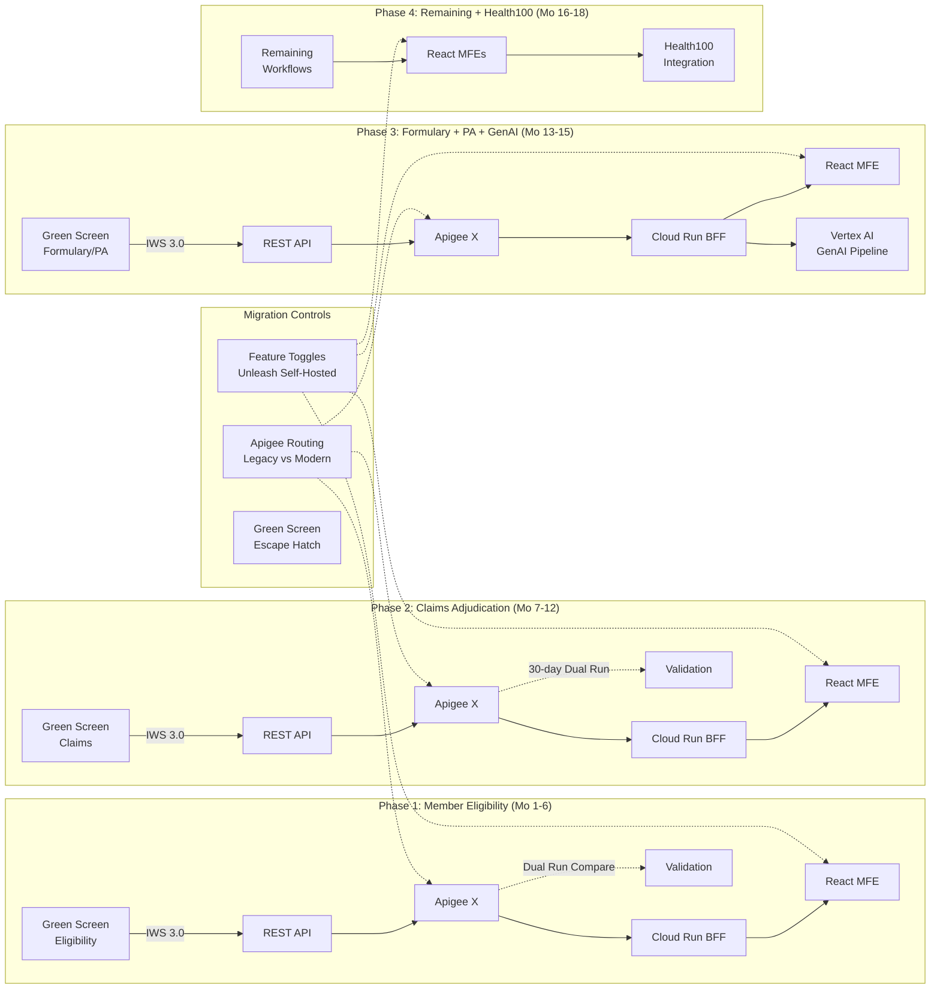
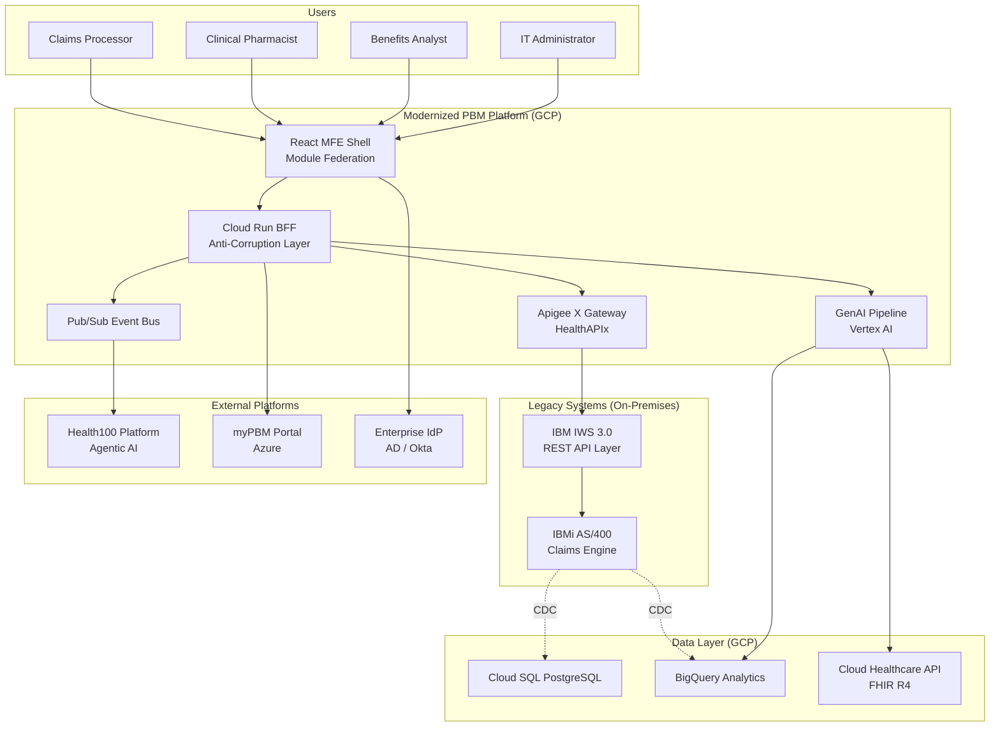
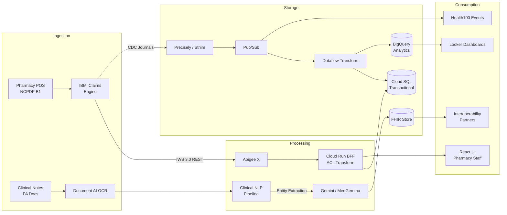
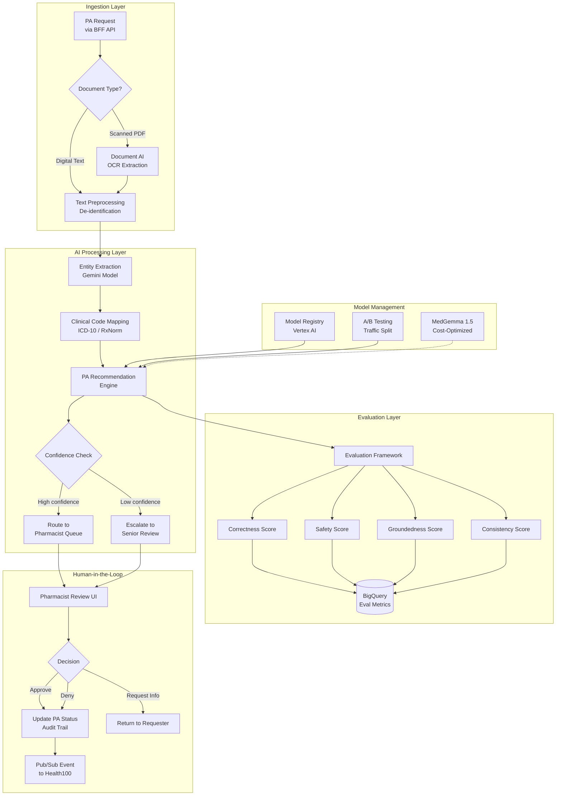
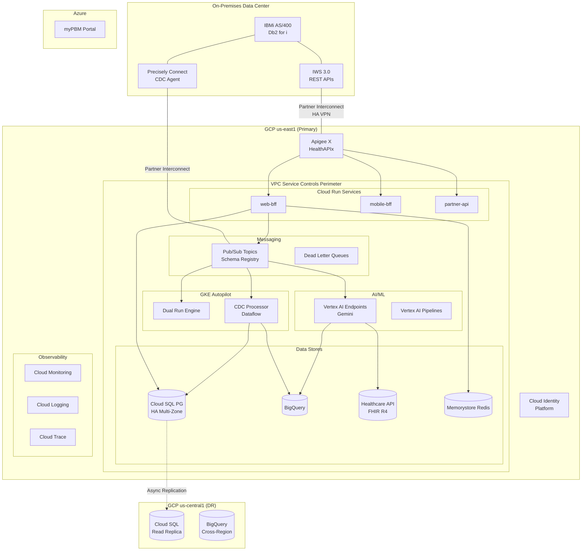
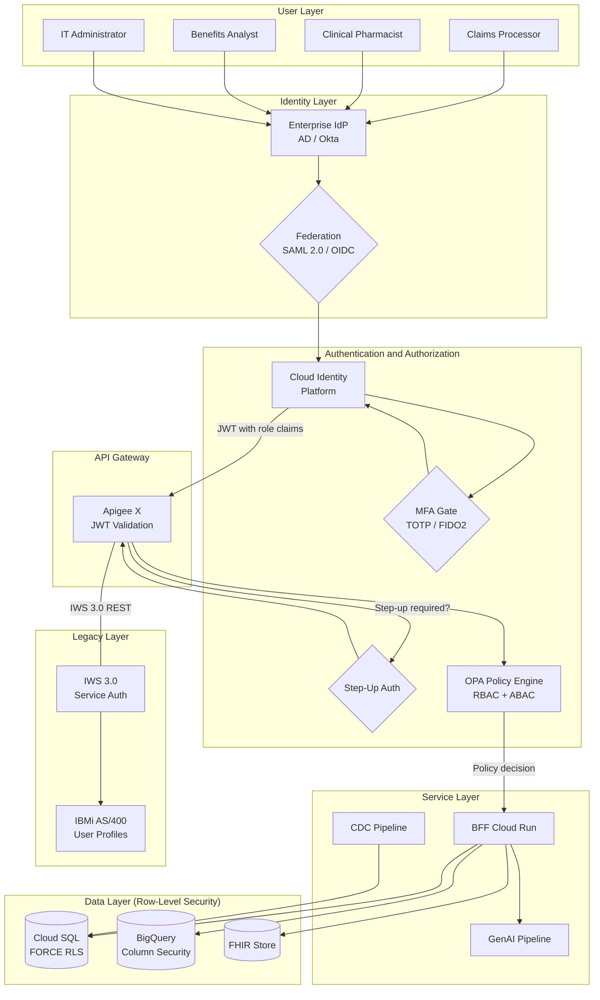
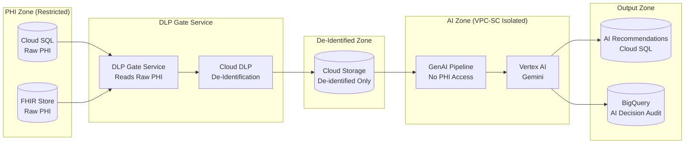

# Legacy System Transformation: IBMi Green Screen Modernization

## Solution Architecture Document — CVS Health

**Author:** Paul Prae — Modular Earth LLC
**Date:** March 2026
**Engagement:** eng-2026-001

---

## Reading Guide

| Section | Key Consideration | Suggested Interview Focus |
|---------|------------------|--------------------------|
| §1 Legacy System Integration | KC #1 — IBMi modernization | Strangler fig pattern, IWS API layer, CDC strategy |
| §2 Human-Centered Design | KC #3 — HCD principles | Cognitive science foundation, dual-mode interface, personas |
| §3 Solution Architecture | KC #4 — Tech stack selection | 3-option comparison, GCP recommendation, GenAI pipeline |
| §4 Identity & Access Management | KC #2 — IAM + Security | Zero trust, RBAC/ABAC, STRIDE threats, compliance |
| §5 Change Management | KC #5 — Organizational change | ADKAR framework, champion network, adoption metrics |
| §6 Implementation Roadmap | Timeline & investment | 4 phases, decision gates, team composition, cost range |
| §7 AI-Assisted Methodology | How this was produced | Human-AI collaboration model, quality process |

---

## Executive Summary

CVS Health operates critical pharmacy benefits applications on IBMi (AS/400) green screen interfaces — systems that adjudicate 99%+ of pharmacy claims electronically at sub-second latency. These systems are functionally robust but present significant challenges: 6-8 week onboarding for new staff, 40% higher data entry error rates than modern UIs, inability to connect with cloud services or meet WCAG accessibility standards, and a shrinking RPG/CL developer pool (average age ~70 per ASNA). With CVS's March 2026 Google Cloud strategic partnership launching the Health100 agentic AI platform, the gap between legacy green screens and modern cloud capabilities has become a strategic impediment.

I recommend an **API-First Strangler Fig migration** that preserves decades of pharmacy business logic on IBMi while incrementally replacing green screen interfaces with a modern React-based UI. This approach avoids the 50-70% failure rate associated with big-bang rewrites (DitsTek, Programmers.io, Gartner) by migrating one workflow at a time with parallel validation at every step.

### Three Architecture Options

| Dimension | Option A: GCP-Native (Recommended) | Option B: AWS-Native | Option C: Modern Cloud |
|-----------|-------------------------------------|---------------------|----------------------|
| **Strategic alignment** | CVS Health100 partnership (Gemini, BigQuery, Cloud Healthcare API) | Largest HIPAA-eligible catalog (166+ services) | Maximum developer velocity (Vercel + Supabase) |
| **GenAI** | Vertex AI + Gemini/MedGemma | Bedrock + HealthLake + Comprehend Medical | Vercel AI SDK 6 (model-agnostic, 24+ providers) |
| **FHIR** | Cloud Healthcare API (native FHIR R4) | HealthLake (FHIR R4 + built-in NLP) | HAPI FHIR on PostgreSQL |
| **API gateway** | Apigee X + HealthAPIx | API Gateway (pay-per-request) | Next.js API routes |
| **CDC tooling** | Precisely Connect → Pub/Sub → Dataflow | Precisely + AWS Mainframe Modernization | Precisely Connect → Supabase PostgreSQL |
| **Enterprise maturity** | Google's own infrastructure at scale | Largest enterprise healthcare adoption | Emerging — no PBM deployments at CVS scale |
| **Paul's depth** | Research-backed via AWS→GCP translation | 3 years as AWS Enterprise SA (deep) | Production architectures (Paloist, paulprae.com) |

**Recommendation: Option A (GCP-Native)** — strategic alignment with Health100 outweighs AWS familiarity. Building PBM modernization on AWS would create cross-cloud integration complexity and duplicate FHIR infrastructure. I present GCP through my AWS lens: "I've architected equivalent solutions on AWS, and here's how they map to GCP services."

### Key Differentiators

This solution demonstrates both **principal architect** and **GenAI team leadership** capabilities:

- **Architecture depth**: 12 components, 7 data flows, 7 Mermaid diagrams, Well-Architected scoring (7.7/10 overall)
- **GenAI pipeline**: Tiered inference (Gemini for complex cases, MedGemma for routine), confidence-based routing, human-in-the-loop for all PA decisions, OWASP LLM Top 10 alignment
- **Security rigor**: 30 STRIDE threats analyzed, 6 compliance frameworks mapped (HIPAA, HITECH, PCI-DSS 4.0, DEA 21 CFR 1311, SOC 2, NIST SP 800-207)
- **Human-centered design**: Grounded in my Cognitive Science BA — dual-mode interface serving both green screen experts and new hires simultaneously

### Investment Range

| Confidence Level | Total Investment | Basis |
|-----------------|-----------------|-------|
| P10 (Optimistic) | $8.5M | Fast ramp, AI tools highly effective |
| **P50 (Expected)** | **$11.7M** | Three-point PERT estimate |
| P90 (Pessimistic) | $16.5M | RPG/CL delays, compliance extensions |

*78 weeks, 4 phases, 4 decision gates, ~15 peak FTE + CVS internal product team*

---

## 1. Legacy System Integration

### The Challenge

CVS Health's pharmacy benefits engine runs on IBMi (AS/400), processing millions of claims daily through RPG/CL programs on Db2 for i. The green screen interface is text-only — 80 columns by 24 rows, keyboard-driven, no mouse interaction. These systems work. The business logic is proven. The challenge is not replacing them — it's wrapping them in modern interfaces while preserving every bit of that logic.

### Migration Pattern: API-First Strangler Fig

The strangler fig pattern migrates one workflow at a time, with the legacy system remaining fully operational throughout. Each workflow follows the same sequence:

1. **Expose** existing RPG/CL service programs as REST APIs via IBM IWS 3.0
2. **Route** traffic through Apigee X API gateway (legacy vs. modern based on migration status)
3. **Build** modern React micro-frontend consuming the same API
4. **Validate** via parallel production — both systems process requests simultaneously, results compared in BigQuery
5. **Switch** traffic to modern path when validation reaches ≥99.9% accuracy over 30 days
6. **Retain** green screen escape hatch until adoption metrics confirm safe decommissioning

This avoids the 50-70% failure rate of big-bang migrations by making every step independently reversible via Apigee route configuration — no code deployment required to roll back.

### IBM IWS 3.0 API Layer

IBM Integrated Web Services 3.0 (Jakarta EE) exposes existing RPG service programs as REST APIs without rewriting business logic. This is the critical bridge between decades of pharmacy logic and modern cloud services.

| API | Latency SLA | Criticality | Notes |
|-----|-------------|-------------|-------|
| Claims Adjudication (INT-001) | P95 ≤ 500ms | Critical | NCPDP B1 transactions; non-negotiable latency |
| Member Eligibility (INT-002) | P95 ≤ 200ms | Critical | First strangler fig candidate — read-only, highest frequency |
| Formulary Management (INT-003) | P95 ≤ 300ms | High | Clinical audit trail required for all changes |
| Prior Authorization (INT-004) | P95 ≤ 1,000ms | High | GenAI pipeline integration target |

**Performance strategy**: IWS 3.0 provides 20% improvement over IWS 2.6. For hot paths (claims adjudication), the YAJL library handles high-throughput JSON. MAX ACT in *BASE pool tuned to ≥1,000. DB connections kept open, VARCHAR preferred over CHAR.

### Change Data Capture: Db2 for i → GCP

**Critical constraint**: Neither Google Datastream nor AWS DMS supports Db2 for i natively. CDC requires third-party tooling.

The CDC pipeline uses **Precisely Connect** (or Striim as contingency) to read IBM i journal entries (PT/UP/DL) without triggers or table scans:

```
IBM i Journals → Precisely Connect → Pub/Sub → Dataflow → Cloud SQL + BigQuery
```

Dataflow transforms handle the encoding boundary: EBCDIC → UTF-8, packed decimal → numeric, IBM dates → ISO 8601. Latency target: < 5 seconds for continuous synchronization across 14 data entities.

### Strangler Fig Migration Sequence



### Coexistence Strategy

During the 18-month migration, three environments coexist:

| Environment | Platform | Purpose |
|-------------|----------|---------|
| IBMi (on-premises) | RPG/CL + Db2 for i | System of record — all business logic runs here until migrated |
| GCP (primary cloud) | Cloud Run, BigQuery, Vertex AI | Modernized services, GenAI pipeline, Health100 integration |
| Azure (existing) | myPBM portal (130+ APIs) | Client management — API-to-API integration, not legacy bridging |

Hybrid connectivity via **Partner Interconnect** (1-2 Gbps) with HA VPN (IPsec) backup. Network latency target: <10ms GCP↔IBMi. VPC Service Controls create a security perimeter around all HIPAA-regulated GCP services.

---

## 2. Human-Centered Design

### Design Philosophy

This design approach is grounded in my academic training in **Cognitive Science with a focused foundation in Artificial Intelligence** (University of Georgia) and formal **Human-Computer Interaction (HCI) coursework**, combined with 6+ UX projects spanning healthcare, conversational AI, and enterprise applications.

The central insight from cognitive science: **users don't adapt to interfaces — interfaces must adapt to users' existing mental models.** For CVS Health's green screen transformation, this means we cannot simply replace 5250 terminal screens with web forms. We must understand how pharmacy benefits staff have built expertise around the green screen paradigm — memorized screen codes, F-key sequences, spatial memory of data layouts — and create a modern UI that preserves their expertise while eliminating their pain points.

This is not an interface replacement. It is a **cognitive bridge**.

### User Personas

| Persona | Role | Green Screen Exp. | Change Resistance | Key Design Need |
|---------|------|-------------------|-------------------|-----------------|
| **Maria Torres** | Claims Processor | 12 years, 200+ claims/shift | HIGH — "I'm faster on green screen" | Speed parity day one, keyboard shortcuts, split-pane views |
| **Dr. James Chen** | Clinical Pharmacist | 8 years, DUR/PA review | MODERATE — open if tools are better | GenAI recommendation panel, severity-coded alerts |
| **Angela Washington** | Benefits Analyst | 5 years, myPBM + green screen | LOW — already uses modern tools | Visual dashboards, plan comparison, wizard flows |
| **Raj Patel** | IT Administrator | 7 years, IAM + monitoring | LOW — wants modernization | Unified IAM dashboard, automated provisioning |
| **Sofia Martinez** | New Hire Trainee | Zero green screen experience | NONE — represents future workforce | Guided workflows, contextual help, learn by doing |

### Design Principles

Six principles grounded in cognitive science theory:

| # | Principle | Cognitive Science Basis | Application |
|---|-----------|------------------------|-------------|
| 1 | **Cognitive Load Reduction** | Hick's Law (decision time ∝ log options), Miller's Law (7±2 working memory) | Progressive disclosure: summary → detail on demand. Sensible defaults. Visual hierarchy. |
| 2 | **Efficiency Preservation** | Fitts's Law (keyboard shortcuts = zero distance) | Keyboard shortcuts for every action. Command palette (Ctrl+K). Tab-order mirrors workflow. |
| 3 | **Recognition Over Recall** | Nielsen's heuristic #6, schema theory | Visual navigation replaces memorized screen codes. Autocomplete replaces exact NDC entry. |
| 4 | **Error Prevention** | Reason's taxonomy (slips vs. mistakes) | Real-time inline validation. Confirmation for high-impact actions. Plain-language errors. |
| 5 | **Dual-Mode Interface** | Dreyfus model of skill acquisition (novice → expert) | Mouse-discovery for learners + keyboard-power for experts. Both modes always active — no toggle. |
| 6 | **Consistent Mental Models** | Johnson-Laird mental model theory | Screen code → URL mapping (SC04 → `/members/{id}`). F-key → shortcut mapping. Terminology preserved. |

### Command Palette as Bridge Pattern

The command palette (Ctrl+K) is the single most important UX decision in this modernization. Green screen users think in "type a code → get a result" terms. The command palette is this exact mental model in modern form.

| Green Screen Command | Command Palette Equivalent |
|---------------------|---------------------------|
| `SC04` | Type "SC04" or "member" or "eligibility" |
| `F5` (refresh) | Type "refresh" or press F5 |
| `F3` (exit) | Press Escape or type "back" |
| `WRKACTJOB` | Type "active jobs" or "system status" |

Fuzzy matching, grouped results (Navigation, Actions, Recent, Bookmarks), and keyboard shortcut display alongside each result enable progressive discovery.

### Transition Strategy

Maria Torres (claims processor, 12 years on green screen, highest change resistance) follows this journey:

- **Week 1-2**: Mouse-discovery mode. Guided workflows with tooltips. 20-30 claims/day. "This is more intuitive than green screen training."
- **Week 3-4**: Hybrid mode. Discovers keyboard shortcuts shown alongside UI elements. 50-80 claims/day.
- **Month 1-3**: Keyboard-power mode. Command palette as primary navigation. 100-150 claims/day. "The split-pane view is a game-changer."
- **Month 3-6+**: Full mastery. 200+ claims/day. Trains new hires. "I helped someone get up to speed in a week. On the old system, that took two months."

Green screen escape hatch available throughout — if adoption metrics show >30% escape hatch usage after 4 weeks, that's a trigger for dedicated floor support and 1-on-1 coaching.

### Accessibility

Target: **WCAG 2.2 AA** conformance, building on CVS Health's existing accessibility foundation (120+ accessibility professionals, W3C membership, open-source Accessibility Annotations Kit).

Key requirements for this modernization:

| WCAG Criterion | Relevance |
|----------------|-----------|
| 2.4.11 Focus Not Obscured | Side panels and overlays must not obscure focused element |
| 2.5.7 Dragging Movements | Split-pane resizing needs keyboard alternative |
| 2.5.8 Target Size (Minimum) | All interactive targets ≥ 24×24 CSS pixels |
| 3.3.7 Redundant Entry | Auto-populate previously entered data |
| 3.3.8 Accessible Authentication | No CAPTCHAs — aligns with IAM strategy (§4) |

---

## 3. Solution Architecture

### System Context



### Three-Option Comparison

| Dimension | Option A: GCP-Native (Rec.) | Option B: AWS-Native | Option C: Modern Cloud |
|-----------|----------------------------|---------------------|----------------------|
| **Compute** | Cloud Run + GKE Autopilot | ECS Fargate | Vercel Fluid Compute + Cloud Run |
| **Database** | Cloud SQL PG + BigQuery | RDS PG + Redshift Serverless | Supabase PG (RLS) |
| **AI/ML** | Vertex AI (Gemini, MedGemma) | Bedrock (Claude, Nova) + Comprehend Medical | Vercel AI SDK 6 (model-agnostic) |
| **Healthcare** | Cloud Healthcare API (FHIR R4) | HealthLake (FHIR + NLP) | HAPI FHIR on PostgreSQL |
| **API management** | Apigee X Enterprise + HealthAPIx | API Gateway | Next.js API routes |
| **Zero trust** | BeyondCorp Enterprise | Verified Access | Cloudflare Access |
| **Hybrid connectivity** | Partner Interconnect + HA VPN | Direct Connect + VPN | VPN / public TLS |
| **CDN** | Cloud CDN | CloudFront | Vercel Edge Network |
| **Why not primary** | **Recommended** | Misaligns with Health100 (GCP) | No PBM deployments at CVS scale |

**Why GCP**: CVS's March 2026 Google Cloud partnership means Health100 runs on Gemini, BigQuery, and Cloud Healthcare API. Building PBM modernization on AWS would duplicate FHIR infrastructure (HealthLake vs. Cloud Healthcare API) and add cross-cloud integration complexity for event-driven Health100 integration. Option B remains a strong fallback if the GCP partnership scope is narrower than assumed.

**Why not Option C**: Vercel + Supabase delivers fastest time-to-value and demonstrates my modern architecture practice. But Supabase has no published PBM deployments at CVS's scale (9,000+ retail locations, millions of daily claims). Edge Function CPU limits (200ms) may constrain clinical NLP. For a smaller-scope greenfield project, Option C would be my first choice.

### Recommended Technology Stack (GCP-Native)

| Layer | Technology | Rationale |
|-------|-----------|-----------|
| **Frontend** | React 19 + Module Federation + Next.js SSR | Micro-frontends enable screen-by-screen migration. RSC keeps PHI server-side. |
| **BFF** | Cloud Run (TypeScript/Python) | Anti-corruption layer: EBCDIC → UTF-8, packed decimal → numeric. Auto-scales 0-100 instances. |
| **API Gateway** | Apigee X Enterprise + HealthAPIx | Routes traffic to legacy (IWS) or modern (Cloud Run) based on migration status. SMART on FHIR support. |
| **Database** | Cloud SQL PG (transactional) + BigQuery (analytics) | HA multi-zone PG. BigQuery serverless, partitioned by date_of_service. |
| **FHIR** | Cloud Healthcare API (FHIR R4) | Native FHIR R4 with SMART on FHIR scopes. Supports Health100 integration. |
| **AI/ML** | Vertex AI (Gemini + MedGemma 1.5) | Tiered inference: Gemini for complex PA, MedGemma (4B, 89.6% EHRQA) for routine. |
| **Messaging** | Pub/Sub + Eventarc + Schema Registry | Event-driven backbone. 31-day retention. Dead letter queues. Kafka bridge for existing producers. |
| **Caching** | Memorystore Redis | Session cache, formulary/eligibility cache. Reduces IBMi load during migration. |
| **Observability** | Cloud Monitoring + Logging + Trace + OpenTelemetry | Distributed tracing across IBMi → BFF → frontend. 6-year HIPAA audit log retention. |
| **Security** | Cloud Identity Platform, Cloud KMS (CMEK), Cloud Armor (WAF), Cloud DLP | Zero trust. CMEK encryption. WAF with Adaptive Protection ML. PHI detection before AI inference. |

### Data Architecture



### GenAI Pipeline — Prior Authorization Automation

This pipeline demonstrates the dual competency the role requires: I architect the infrastructure AND understand the ML layer.



**Why tiered inference**: Gemini for complex PA cases requiring multi-document reasoning. MedGemma 1.5 (4B parameters, 128K context, 89.6% EHRQA accuracy) for routine cases — 40-60% cost reduction on the most volatile cost layer. This mirrors the three-tier AI pipeline pattern I've built in production.

**Why HITL is mandatory**: The system architect could build an autonomous pipeline, but the AI practitioner knows that healthcare GenAI outputs require clinical validation. Not because the model is unreliable — because accountability requires a human decision-maker for patient-affecting actions.

**AI security controls**:
- Cloud DLP as synchronous blocking gate — inference cannot execute until DLP returns clean
- Structured output enforcement via Gemini controlled generation (JSON schema, no free-text)
- `genai-pipeline@` service account has zero direct PHI access — enforced by VPC-SC and IAM deny policies
- OWASP LLM Top 10 aligned (prompt injection, data poisoning, model theft controls)

### Deployment Architecture



### Well-Architected Scoring

| Pillar | Score | Strengths | Gaps |
|--------|-------|-----------|------|
| Operational Excellence | 8/10 | Comprehensive observability, CI/CD with canary, IaC, parallel validation | IBMi ops separate from GCP ops — unified runbook needed |
| Security | 8/10 | Zero trust, VPC-SC, CMEK, HIPAA BAA, AI guardrails | IBMi profile mapping needs detailed design |
| Reliability | 8/10 | Multi-zone HA, cross-region DR (RTO 15 min, RPO 1 min), circuit breakers | IBMi as single point of failure during migration |
| Performance | 7/10 | Auto-scaling, caching, SSR (LCP 1.28s), performance budgets | IWS performance under peak load uncertain |
| Cost Optimization | 7/10 | Scale-to-zero, tiered AI inference, Interconnect egress discount | Apigee Enterprise ~$100K/yr fixed; Precisely licensing |
| Sustainability | 8/10 | Serverless-first, GCP carbon-neutral, no idle compute | Dual Run doubles compute temporarily |
| **Overall** | **7.7/10** | | |

---

## 4. Identity and Access Management

### Architecture Principles

Having operated within enterprise IAM environments across three years as an AWS Solutions Architect, built HIPAA-compliant AI systems at Arine (45+ health plans, 50M members) and Hyperbloom (10K+ sites, 45 countries), I designed this IAM strategy by synthesizing direct experience with authoritative frameworks: NIST SP 800-207 (Zero Trust), HIPAA Security Rule, DEA 21 CFR 1311, and SMART on FHIR.

| Principle | Description | Regulatory Basis |
|-----------|-------------|------------------|
| **Zero Trust** | Never trust, always verify. Every request authenticated, authorized, encrypted. | NIST SP 800-207 |
| **Least Privilege** | Minimum permissions per function. Resource-level IAM bindings, never project-level. | HIPAA §164.312(a)(1) |
| **Defense in Depth** | Controls at network, identity, application, and data layers. | NIST CSF |
| **Separation of Duties** | No single account combines admin and clinical access. | DEA 21 CFR 1311.150 |
| **Assume Breach** | Design as if the perimeter is already compromised. | NIST SP 800-207 Tenet 6 |

### Identity Flow



### Authorization Model: Hybrid RBAC + ABAC

Pure RBAC cannot express "only DEA-certified pharmacists can access Schedule II controlled substances during business hours at their assigned location." Pure ABAC is complex to audit. The hybrid model provides auditable role assignments (RBAC) with contextual constraints (ABAC).

**Roles:**

| Role | PHI Access | Key Restrictions |
|------|-----------|------------------|
| CLAIMS_PROCESSOR | Read: member, claims, prescriptions | No PA decisions, no formulary changes |
| CLINICAL_PHARMACIST | Read/Write: PA, clinical notes, AI recommendations | Step-up auth for PA commit; DEA for EPCS |
| BENEFITS_ANALYST | Read: member, plans; Write: benefit config | No clinical operations |
| IT_ADMINISTRATOR | Metadata only | Break-glass only for PHI |
| PHARMACY_TECH | Read: member demographics, prescriptions | No PA decisions, no AI access |
| MANAGER | Aggregated/anonymized data | No direct PHI access |
| SYSTEM_SERVICE | Per service account IAM bindings | No human login |

**ABAC attributes** (all sourced server-side from HR/LMS — never client-supplied):
- `dea_certification_status` — gate for controlled substance access
- `hipaa_training_current` — gate for all PHI access
- `department`, `location` — restrict access to department-relevant data
- `time_of_access` — off-hours triggers enhanced monitoring

### Session Management

| Parameter | Value | Rationale |
|-----------|-------|-----------|
| Access token lifetime | 15 minutes | Limits exposure window for stolen tokens |
| Refresh token lifetime | 8 hours | Covers a full pharmacy shift without re-login |
| Idle timeout | 30 minutes | HIPAA §164.312(a)(2)(iii) automatic logoff |
| Absolute session max | 12 hours | Force re-authentication after maximum shift |

**Break-glass procedure**: Emergency PHI access requires FIDO2 hardware key + justification text. Automated notification to security team, IT manager, and compliance officer. Maximum 4-hour session with full SQL statement audit logging. Post-incident review within 24 hours. Satisfies HIPAA §164.312(a)(2)(ii) Emergency Access Procedure.

### IBM i to Cloud Bridge

Two fundamentally different identity systems must coexist during migration:

| IBM i | Cloud | Bridge Strategy |
|-------|-------|-----------------|
| 10-char USRPRF | Email-based cloud identity | Custom attribute mapping in Cloud Identity Platform |
| *ALLOBJ/*SECADM | Decomposes to specific IAM roles per resource | Authority-to-IAM translation matrix (T-001, risk score 9/10) |
| Password-only (QSECURITY 40/50) | MFA mandatory | SSO bridge federates both via Cloud Identity Platform |
| Persistent 5250 sessions | 30-minute idle timeout (HIPAA) | Dual-mode: legacy via terminal emulator MFE, modern via JWT |
| QAUDJRN journal | Cloud Audit Logs + BigQuery | Precisely Connect journal bridge to unified audit plane |

### GenAI Pipeline Access Control

The most important IAM design decision: `genai-pipeline@` has **zero direct access to any PHI data store**.



If the GenAI pipeline is compromised (prompt injection, model manipulation, supply chain attack), the attacker gains access to de-identified clinical topics only — never raw PHI. Defense-in-depth at the architecture level.

### STRIDE Threat Summary

30 threats identified across 6 STRIDE categories:

| Category | Count | Critical | High | Top Threat |
|----------|-------|----------|------|------------|
| Spoofing | 5 | 4 | 1 | T-001: *ALLOBJ mapped to cloud IAM without downscoping (risk 9/10) |
| Tampering | 5 | 5 | 0 | T-102: Claims pricing manipulation (risk 9/10) |
| Repudiation | 5 | 4 | 1 | T-201: Siloed IBM i / cloud audit logs (risk 9/10) |
| Information Disclosure | 5 | 2 | 3 | T-301: PHI entering GenAI pipeline before DLP gate (risk 9/10) |
| Denial of Service | 5 | 3 | 2 | T-401: DDoS against claims API (risk 10/10) |
| Elevation of Privilege | 5 | 4 | 1 | T-501: *ALLOBJ cloud over-provisioning (risk 9/10) |

**8 open findings** requiring implementation before go-live (transparent, not hidden):
- Journal bridge for unified audit (T-201)
- GenAI decision audit trail (T-202)
- Claims correlation ID across hybrid boundary (T-203)
- *ALLOBJ/*SECADM cloud mapping (T-501)
- And 4 additional identified-status threats

### Compliance Mapping

| Framework | Key Requirements | Implementation |
|-----------|-----------------|----------------|
| **HIPAA** §164.312 | Access control, audit, integrity, authentication, transmission security | Cloud Identity Platform, FORCE RLS, 6-year audit logs, CMEK, TLS 1.2+ |
| **HITECH** | Breach notification, increased penalties | Dual-sink logging, SIEM integration, incident response procedure |
| **PCI-DSS 4.0** | Payment card tokenization, strong access control | Tokenization at ingestion, least privilege, network segmentation |
| **DEA 21 CFR 1311** | EPCS two-factor authentication, audit trails | FIDO2 hardware keys for Schedule II-V, hash-chained audit logs |
| **SOC 2 Type II** | Logical access, monitoring, change management | Cloud IAM, Cloud Monitoring, IaC-based change control |
| **NIST SP 800-207** | Zero trust — 7 tenets | BeyondCorp Enterprise, continuous evaluation, per-session access |

### Defense-in-Depth Layers

| Layer | Controls |
|-------|----------|
| **Network** | VPC-SC perimeter, Partner Interconnect + IPsec, Cloud Armor WAF (OWASP Top 10 + ML DDoS), deny-all firewall default, no public IPs on services |
| **Identity** | Cloud Identity Platform, OAuth 2.0 + OIDC, SMART on FHIR, MFA (TOTP/FIDO2/biometric), step-up auth, Workload Identity Federation |
| **Application** | Apigee JSON Threat Protection, OpenAPI schema validation, CSP headers, JWT validation centralized at gateway, OWASP Top 10 for web + LLMs |
| **Data** | CMEK (AES-256, separate key rings per classification), TLS 1.2+ in transit, Cloud DLP, BigQuery column-level security, Cloud SQL FORCE RLS, SHA-256 hash-only for SSN |
| **Monitoring** | Cloud Monitoring + Logging + Trace + OpenTelemetry, VPC Flow Logs, HIPAA audit (6-year retention), SIEM integration, anomaly detection, hash-chained controlled substance logs |

---

## 5. Change Management

### Why This Matters More Than Technology

Drawing on my experience coaching executives at Mento (100% leadership improvement, 93% performance improvement) and training 100 engineers at Arine on AI-first development practices, I approach change management as the critical path — not an afterthought.

85% of digital transformation failures are people and process issues, not technology (BCG). This is a human transformation with a technology component — not the other way around. The budget allocation reflects this: **15% of program costs** directed to change management per Gartner's recommendation, because projects with excellent change management are **7x more likely to meet objectives** (Prosci Best Practices, 12th Ed., n=2,600).

### ADKAR Framework Applied to Pharmacy Context

I apply Prosci's ADKAR model (Awareness → Desire → Knowledge → Ability → Reinforcement) because it focuses on individual transitions, not organizational theory. Each pharmacy staff member goes through these stages:

| ADKAR Stage | Timeline | Activities | Persona Focus |
|-------------|----------|------------|---------------|
| **Awareness** | Phase 1 (Mo 1-3) | Sponsor coalition (VP PBM Ops, CISO). Town halls explaining *why* — not just "new system" but "faster onboarding, fewer errors, modern tools." | Maria (high resistance): "Show me why this is worth my time." |
| **Desire** | Phase 2 (Mo 4-6) | Pilot with volunteer super-users. Live demos showing split-pane views and command palette. Early wins shared broadly. | Maria: "That split-pane view solves my biggest pain point." |
| **Knowledge** | Phase 3 (Mo 7-12) | Role-based training curriculum. Training sandbox environment. Keyboard shortcut cheat sheets. LMS modules. | Sofia (new hire): completes onboarding in <10 days vs. 6-8 weeks. |
| **Ability** | Phase 3-4 (Mo 10-15) | Floor support from champion network. Escape hatch available. Coaching for users struggling with transition. | Maria: hits 100+ claims/day on modern UI by month 3. |
| **Reinforcement** | Phase 4 (Mo 16-18) | Adoption metrics dashboards. Recognition for champions. Escape hatch sunset. Performance management integration. | All: adoption >80%, NPS ≥7. |

### Champion Network

Champions are volunteer super-users who bridge the gap between the project team and the pharmacy floor:

| Metric | Target | Basis |
|--------|--------|-------|
| Champion ratio | 1:7 to 1:10 (champions : users) | Yuan et al., 2015 — optimal adoption ratio |
| Phase 2 champions | 5-10 pilot super-users | Pilot locations |
| Phase 3 champions | 100+ super-users | Full training rollout |
| Champion role | Floor support, feedback collection, peer coaching | Not management — peer advocates |

### Persona-to-Resistance Mapping

| Persona | Resistance Level | Root Cause | Mitigation Strategy |
|---------|-----------------|------------|---------------------|
| Maria Torres (Claims) | HIGH | "I'm faster on green screen" — identity tied to expertise | Speed parity demo. Command palette maps her mental model. Involve her in design. |
| Dr. James Chen (Pharmacist) | MODERATE | Will adopt if tools are genuinely better | GenAI recommendation panel as concrete value. Side-by-side clinical data. |
| Angela Washington (Benefits) | LOW | Already uses modern tools (myPBM) | Design consistency with myPBM. Quick win. |
| Raj Patel (IT Admin) | LOW | Actively wants modernization | Unified IAM dashboard. Automated provisioning. |
| Sofia Martinez (New Hire) | NONE | Never used green screen | The "canary in the coal mine" — if she can't onboard in 10 days, the UX needs work. |

### Adoption Metrics

| Metric | Target | Trigger for Intervention |
|--------|--------|--------------------------|
| Escape hatch usage | <20% by month 6, <10% by month 12 | >30% after 4 weeks in any module |
| User adoption rate | >80% within 6 months (SC-004) | <60% at month 4 |
| Claims per hour (Maria) | ≥ pre-transition baseline | Any sustained decrease |
| New hire onboarding | <10 days to independent operation (SC-001) | >15 days average |
| NPS score | ≥7/10 within 6 months (SC-008) | <5 at month 4 |
| Error rate reduction | 40% fewer data entry errors (SC-002) | <20% reduction at month 6 |

### Training Program

| Audience | Format | Duration | Content |
|----------|--------|----------|---------|
| Expert green screen users | Hands-on workshop + floor coaching | 2 days + 4 weeks support | Command palette, keyboard shortcuts, split-pane, escape hatch |
| Clinical pharmacists | Role-specific workshop | 1 day + GenAI training | GenAI recommendation panel, PA workflow, HITL review |
| Benefits analysts | Self-paced LMS + workshop | 1 day | Dashboard navigation, plan wizard, myPBM consistency |
| IT administrators | Technical training | 2 days | IAM dashboard, provisioning, monitoring, break-glass |
| New hires | Integrated onboarding | <10 days | Guided workflows, contextual help, progressive discovery |

---

## 6. Implementation Roadmap

### Four-Phase Overview

| Phase | Timeline | Focus | Team Size | Decision Gate |
|-------|----------|-------|-----------|---------------|
| 1. Foundation | Weeks 1-13 | GCP infrastructure, IWS first API, SSO, CDC POC, React shell | ~9 FTE | DG-001: Go/No-Go for Pilot |
| 2. Pilot | Weeks 14-26 | Member eligibility MFE, parallel validation, CDC full sync, training sandbox | ~14 FTE | DG-002: Go/No-Go for Expansion |
| 3. Expansion | Weeks 27-52 | Claims + formulary + PA + GenAI pipeline, 30-day Dual Run, security remediation | ~15 FTE | DG-003: Go/No-Go for Completion |
| 4. Completion | Weeks 53-78 | Remaining workflows, Health100 integration, compliance audits, go-live | ~10 FTE | DG-004: Go-Live Approval |

### Decision Gates

Each gate has measurable go/no-go criteria — not opinions:

| Gate | Week | Key Criteria |
|------|------|-------------|
| **DG-001** | 13 | Interconnect operational, IWS API returning JSON, SSO working, CDC replicating, CI/CD deploying |
| **DG-002** | 26 | Parallel validation ≥99.9%, eligibility P95 ≤200ms, escape hatch <20%, zero PHI incidents |
| **DG-003** | 52 | Claims Dual Run ≥99.95%, claims P95 ≤500ms, GenAI PA ≥80% agreement, 8 security findings closed |
| **DG-004** | 78 | 100% screens migrated, adoption >80%, NPS >7, pen test clean, SOC 2 initiated, DEA EPCS passed |

### Team Composition

| Role | Count | Duration | Key Responsibility |
|------|-------|----------|-------------------|
| Solutions Architect | 1 | 78 weeks | Architecture governance, decision gates |
| Tech Lead (Full-Stack) | 1 | 72 weeks | Technical leadership, Module Federation |
| Senior Frontend (React/TS) | 2 | 52 weeks | Micro-frontends, dual-mode UI, WCAG 2.2 AA |
| Senior Backend (Python/TS) | 2 | 52 weeks | BFF services, anti-corruption layer, FHIR |
| IBM RPG/CL ILE Developer | 2 | 60 weeks | IWS 3.0 APIs, YAJL, journal config, CVE patching |
| ML/AI Engineer (Vertex AI) | 1 | 48 weeks | GenAI PA pipeline, NLP pipeline, evaluation |
| Platform/DevOps Engineer | 1 | 60 weeks | Terraform, CI/CD, VPC-SC, Interconnect |
| Data Engineer (CDC/BigQuery) | 1 | 48 weeks | Precisely Connect, Dataflow transforms, BigQuery |
| Security Engineer (HIPAA) | 1 | 40 weeks | IAM implementation, security findings, SOC 2 |
| QA/Test Engineer | 1 | 48 weeks | Parallel validation, load testing, HIPAA testing |
| Change Management Lead | 1 | 66 weeks | ADKAR implementation, champion network, training |
| Project Manager | 1 | 78 weeks | Program planning, stakeholder coordination |

**Total: ~15 peak FTE** (external) + CVS internal product team (product owner, clinical SMEs, pharmacy ops liaison — estimated 6-10 people per CVS job data).

**GenAI team highlight**: ML Lead (1) + ML/AI Engineer maps to the GenAI Data Scientist JD responsibilities: LLM workflow development, evaluation/guardrails, GCP pipeline deployment (BigQuery, Vertex AI, Cloud Storage), production reliability.

### Investment Range

| Component | Cost |
|-----------|------|
| Development (contractors) | $4,878,800 |
| Training & change management | $200,000 |
| GCP infrastructure (Year 1) | $273,636 |
| Third-party licensing (Year 1) | $90,000 |
| **Year 1 Total** | **$6,405,426** |
| Year 2 (operations) | $1,600,000 |
| Year 3 (operations) | $1,500,000 |
| **3-Year TCO** | **$9,505,426** |

Three-point estimates:

| Confidence | Investment | Scenario |
|-----------|-----------|----------|
| P10 (Optimistic) | $8.5M | AI tools highly effective, fast team ramp |
| **P50 (Expected)** | **$11.7M** | PERT: ($8.5M + 4×$11.7M + $16.5M) / 6 |
| P90 (Pessimistic) | $16.5M | RPG/CL delays, IBMi performance issues, compliance extensions |

**ROI**: Annual operational savings ~$6.5M (training reduction, 40% error reduction, PA automation, reduced RPG/CL dependency). 3-year ROI: 71%. Payback period: ~12 months post-go-live. This represents 0.32% of CVS's annual ~$2B technology budget.

**Benchmark**: Kyndryl 2025 survey (n=500) reports average IBMi modernization at $7.2M. The $6.4M Year 1 estimate is 11% below average — justified by AI-assisted productivity gains on coding tasks.

### Top 5 Risks

| Risk | Likelihood | Impact | Mitigation |
|------|-----------|--------|------------|
| **RPG/CL developer sourcing** | High | High | 60-90 day lead time. IBM i staffing firms. Only 2 needed (realistic for scarcity). |
| **IBMi IWS performance at peak** | Medium | High | YAJL for hot paths. Profile in Phase 1. Fallback: cached Cloud SQL queries. |
| **Expert user resistance** | High | Medium | Champion network (1:7 ratio). Speed parity demo. Command palette. Floor coaching. |
| **Precisely Connect CDC integration** | Medium | High | POC in Phase 1. Striim as contingency. Precisely professional services. |
| **HIPAA compliance during parallel ops** | Medium | High | VPC-SC perimeter. Dual-sink audit logging. Cloud DLP on cross-boundary flows. |

### Critical Path

The binding constraints are NOT software development — they are:
1. **Partner Interconnect provisioning** (carrier lead time, weeks 1-6)
2. **IWS 3.0 API development** (legacy RPG/CL, 0% AI acceleration per METR study)
3. **Decision gates** (stakeholder alignment, human-speed)
4. **30-day Dual Run validation** (wall-clock time, cannot be compressed)
5. **Compliance audits** (SOC 2, pen testing, DEA EPCS — regulatory timelines)

AI accelerates coding phases by 20-45% (McKinsey) but does NOT accelerate integration with legacy systems, compliance processes, change management, or stakeholder decisions.

---

## 7. AI-Assisted Methodology

This solution architecture was produced through a structured human-AI collaboration where I directed the engagement and an AI assistant executed research, drafting, and structured analysis under my continuous review.

**My role**: Defined scope and phasing. Made every architecture decision (three-option structure, GCP recommendation, strangler fig pattern, tiered inference). Authored the experience honesty map. Reviewed every artifact at phase gates. Owned the narrative voice.

**AI role**: Executed web research across 54 sources. Generated structured JSON artifacts conforming to predefined schemas. Ran parallel analysis (6 STRIDE categories, 6 WA pillars). Produced draft prose for my review and refinement.

**The model is directive, not generative.** I don't ask AI to "design an architecture." I define the constraints, make the decisions, and use AI to execute research and drafting at a pace that would be impossible solo.

### Quality Process

| Phase | Review | Score | Key Finding |
|-------|--------|-------|-------------|
| Requirements | R-001 | 8.3/10 | RTO/RPO not specified (addressed in Phase 2) |
| Integration Plan | R-002 | 8.3/10 | Integration architecture sound |
| Architecture | R-003 | 8.1/10 | Three options genuinely viable |
| Data Model | R-004 | 8.2/10 | PBM domain ontology well-structured |
| Security Review | R-005 | 8.2/10 | STRIDE comprehensive; 8 open findings transparent |
| Estimate | R-006 | 8.2/10 | Three-point methodology sound |
| Project Plan | R-007 | 8.4/10 | Decision gates well-defined |

**Average: 8.2/10 | All PASS (threshold: 7.5/10) | 0 blockers**

The AI productivity research that informed this methodology — BCG x Harvard (AI within capability frontier: +12.2% tasks, +25.1% faster, >40% higher quality; outside frontier: 19% less accurate), METR RCT (experienced developers 19% slower with AI on existing codebases), Faros AI (individual gains neutralized by review bottlenecks) — is the same evidence base I draw from when advising on AI adoption strategy.

---

## Appendices

### Appendix A: Glossary

| Term | Definition |
|------|-----------|
| **ADKAR** | Awareness, Desire, Knowledge, Ability, Reinforcement — Prosci change management model |
| **BFF** | Backend for Frontend — API aggregation layer optimized for specific client needs |
| **CDC** | Change Data Capture — continuous replication of database changes |
| **CMEK** | Customer-Managed Encryption Keys — encryption keys controlled by the customer, not cloud provider |
| **DUR** | Drug Utilization Review — automated screening for drug interactions and clinical issues |
| **EBCDIC** | Extended Binary Coded Decimal Interchange Code — IBM character encoding |
| **EPCS** | Electronic Prescriptions for Controlled Substances (DEA 21 CFR 1311) |
| **FHIR** | Fast Healthcare Interoperability Resources — HL7 standard for healthcare data exchange |
| **HIPAA** | Health Insurance Portability and Accountability Act |
| **HITL** | Human-in-the-Loop — requiring human review of AI-generated outputs |
| **IBMi** | IBM i (formerly AS/400) — midrange server platform running RPG/CL programs |
| **IWS** | IBM Integrated Web Services — native REST API exposure for IBM i |
| **MFE** | Micro-Frontend — independently deployable frontend module |
| **NCPDP** | National Council for Prescription Drug Programs — pharmacy claims standard |
| **PA** | Prior Authorization — process requiring approval before dispensing certain medications |
| **PBM** | Pharmacy Benefits Manager — company administering prescription drug benefits |
| **PHI** | Protected Health Information (HIPAA) |
| **RLS** | Row-Level Security — database-enforced access control per row |
| **RPG/CL** | Report Program Generator / Control Language — IBM i programming languages |
| **SMART on FHIR** | OAuth 2.0-based authorization framework for healthcare applications |
| **STRIDE** | Spoofing, Tampering, Repudiation, Information Disclosure, DoS, Elevation of Privilege |
| **VPC-SC** | VPC Service Controls — Google Cloud API-level security perimeter |
| **WCAG** | Web Content Accessibility Guidelines |

### Appendix B: LLM Attribution

**Tools**: Anthropic Claude via Claude Code CLI + Solutions Architecture Agent plugin (v1.0.0)

| Document Section | Attribution |
|-----------------|-------------|
| Executive Summary | Human-directed, AI-drafted |
| Legacy System Integration | Human-decided, AI-researched (11 IBMi sources) |
| Human-Centered Design | **Human-authored** (Cognitive Science grounding), AI-assisted |
| Solution Architecture | Human-decided (3-option pivot), AI-executed |
| IAM Strategy | Human-designed, AI-researched (SMART on FHIR, NIST 800-207) |
| Change Management | Human-designed (ADKAR application), AI-researched |
| Implementation Roadmap | Human-directed, AI-calculated (PERT estimation) |
| AI Methodology | **Human-authored** |
| Honesty Map | **Human-authored** (no AI judgment) |
| Mermaid Diagrams | Human-directed, AI-generated syntax |

**No section was AI-generated without human review.** All architecture decisions, experience assessments, quality judgments, and narrative framing are mine. The AI amplified my capacity to gather evidence and produce structured artifacts — it did not replace my judgment.

### Appendix C: About the Author

**Paul Prae** — Solutions Architect, Modular Earth LLC

15 years building AI and data systems in healthcare, life science, and enterprise technology. BA in Cognitive Science (AI focus) and BS in Computer Science from the University of Georgia.

| Claim | Evidence |
|-------|----------|
| 15+ ML projects | NeuroLex, Decooda, Slalom, AWS (SA for ML customers), TReNDS, Hyperbloom, Booz Allen, Arine, Modular Earth |
| 3 healthcare AI roles | Arine (Staff AI DataOps), Booz Allen (Chief AI Architect), NeuroLex (Senior AI Engineer) |
| AWS SA for 3 years | Amazon Web Services, Enterprise AI/ML SA (SageMaker/Bedrock specialization) |
| Autonomous pharmacist agent | Arine — observability pipeline for autonomous pharmacist AI agent, trained 100 engineers |
| Executive AI coaching | Mento — 100% leadership improvement, 93% performance improvement |
| Fortune 500 clients | AWS (Cox, Equifax, NCR), Microsoft (Chevron, Shell, Walmart, Disney, BoA), Slalom |
| Zero GCP experience | Transparent — no GCP role in career history |
| Zero IBMi experience | Transparent — no IBMi role in career history |

**No claim in this document exceeds what my career data supports.** Where I relied on research rather than experience, it's labeled. Where I have genuine gaps, they're acknowledged.

---

> **AI Disclosure**: Produced with AI assistance (Anthropic Claude via Claude Code). Architecture decisions, experience claims, and quality assessments are the author's. See §7 and Appendix B for full methodology and attribution.
