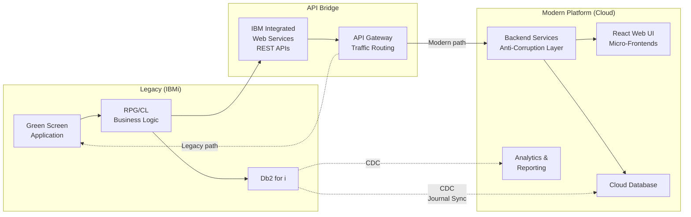
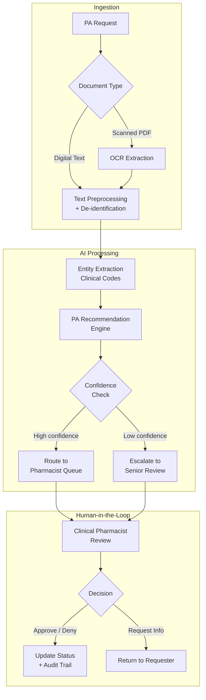

# Legacy System Transformation: IBMi Green Screen Modernization

## Solution Architecture — CVS Health

**Author:** Paul Prae — Modular Earth LLC
**Date:** March 2026

---

## Reading Guide

| Section | Key Consideration | Focus |
|---------|------------------|-------|
| §1 Legacy System Integration | KC #1 | Strangler fig pattern, API-first migration |
| §2 Human-Centered Design | KC #3 | Cognitive science principles, dual-mode interface |
| §3 Technology Stack | KC #4 | 3-option comparison, GenAI pipeline |
| §4 IAM Strategy | KC #2 | Zero trust, defense-in-depth |
| §5 Change Management | KC #5 | ADKAR framework, adoption techniques |
| §6 High-Level Roadmap | Timeline | 4 phases, key milestones |
| §7 Questions & Open Items | — | Assumptions, clarifications for panel |

---

## Executive Summary

CVS Health operates critical pharmacy benefits applications on IBMi green screen interfaces — systems that are functionally robust but create challenges around onboarding time, accessibility, and integration with modern cloud services. With the March 2026 Google Cloud strategic partnership launching the Health100 platform, the gap between legacy green screens and cloud capabilities has become a strategic priority.

I recommend an **API-first strangler fig migration** that preserves existing pharmacy business logic on IBMi while incrementally replacing green screen interfaces with a modern web UI. This approach avoids the high failure rates associated with big-bang rewrites by migrating one workflow at a time, with parallel validation and rollback capability at every step.

**Three architecture options considered:**

| Option | Summary | Best For |
|--------|---------|----------|
| **A: GCP-Native (Recommended)** | Aligns with Health100 partnership | Strategic alignment, unified FHIR |
| B: AWS-Native | Largest HIPAA-eligible catalog | Fallback if GCP scope is narrow |
| C: Modern Cloud (Vercel + Supabase) | Fastest developer velocity | Smaller-scope greenfield projects |

---

## 1. Legacy System Integration

### Approach: API-First Strangler Fig

The [strangler fig pattern](https://martinfowler.com/bliki/StranglerFigApplication.html) migrates one workflow at a time, with the legacy system remaining fully operational throughout. Each workflow follows the same sequence:

1. **Expose** existing RPG/CL service programs as REST APIs via IBM Integrated Web Services
2. **Route** traffic through an API gateway that directs requests to legacy or modern paths based on migration status
3. **Build** a modern frontend consuming the same API
4. **Validate** via parallel production — both systems process requests, results compared
5. **Switch** traffic to the modern path when validation confirms accuracy
6. **Retain** a green screen escape hatch until adoption metrics confirm safe decommissioning

Every step is independently reversible via API gateway route configuration — no code deployment required to roll back.

**Why not big-bang?** Large-scale legacy rewrites carry high failure rates because they attempt to replace decades of business logic in a single cutover. The strangler fig pattern eliminates this risk by making the migration incremental and reversible.

**Change data capture (CDC)** synchronizes IBMi data to cloud datastores in near real-time by reading IBM i journal entries — no triggers, no table scans, no impact on production performance. Third-party CDC tooling is required because neither Google Datastream nor AWS DMS supports Db2 for i natively.

---

## 2. Human-Centered Design

### Design Philosophy

The central insight from cognitive science: **users don't adapt to interfaces — interfaces must adapt to users' existing mental models.** For this transformation, we cannot simply replace terminal screens with web forms. Pharmacy staff have built expertise around the green screen paradigm — memorized screen codes, function-key sequences, spatial memory of data layouts. A successful modern UI must preserve that expertise while eliminating pain points. This is not an interface replacement; it is a cognitive bridge.

### Key Personas

| Persona | Role | Change Resistance | Primary Design Need |
|---------|------|-------------------|---------------------|
| Expert Claims Processor | 10+ years on green screen, processes 200+ claims/shift | HIGH — speed is identity | Keyboard shortcuts, command palette, split-pane views |
| Clinical Pharmacist | Reviews drug utilization and prior auth | MODERATE — open if tools help | AI recommendation panel, side-by-side clinical data |
| New Hire / Trainee | Zero green screen experience | NONE — represents future workforce | Guided workflows, contextual help, progressive discovery |

### Dual-Mode Interface

Both mouse-driven discovery (for learners) and keyboard-driven power use (for experts) are always active simultaneously — no toggle, no mode switch. Experts get full speed from day one; new hires get guided onboarding. The interface adapts to the user's skill level, not the other way around.

### Command Palette as Bridge Pattern

The command palette (Ctrl+K) maps directly to how green screen users think: "type a code, get a result." Existing screen codes work as search terms alongside natural language — type "SC04" or "member eligibility" and get the same result. This preserves muscle memory while enabling discovery.

### Conversational Interfaces

Beyond the command palette, conversational AI offers a complementary input method — particularly for complex queries like "show me all pending prior auths for member X." Natural language interfaces lower the barrier for infrequent tasks while the command palette handles high-frequency workflows.

### Accessibility

Target WCAG 2.2 AA conformance, building on CVS Health's existing accessibility foundation. The keyboard-first design philosophy inherently supports screen readers and alternative input devices.

---

## 3. Technology Stack

### Three-Option Comparison

| Dimension | A: GCP-Native (Rec.) | B: AWS-Native | C: Modern Cloud |
|-----------|-----------------------|---------------|-----------------|
| **Strategic fit** | Health100 partnership (Gemini, BigQuery, Cloud Healthcare API) | Largest HIPAA-eligible service catalog | Maximum developer velocity |
| **Compute** | Cloud Run + GKE Autopilot | ECS Fargate | Vercel + Cloud Run |
| **Database** | Cloud SQL PostgreSQL + BigQuery | RDS PostgreSQL + Redshift | Supabase PostgreSQL |
| **AI/ML** | Vertex AI (Gemini) | Bedrock (Claude, Nova) + Comprehend Medical | Vercel AI SDK (model-agnostic) |
| **Healthcare data** | Cloud Healthcare API (FHIR R4) | HealthLake (FHIR R4 + NLP) | HAPI FHIR on PostgreSQL |
| **API management** | Apigee X | API Gateway | API routes |
| **Zero trust** | BeyondCorp Enterprise | Verified Access | Cloudflare Access |
| **Hybrid connectivity** | Partner Interconnect + VPN | Direct Connect + VPN | VPN / TLS |
| **Why not primary** | **Recommended** | Cross-cloud complexity with Health100 | Unproven at PBM scale |

**Why GCP:** CVS's Google Cloud partnership means Health100 runs on Gemini, BigQuery, and Cloud Healthcare API. Building PBM modernization on a different cloud would duplicate FHIR infrastructure and add cross-cloud integration complexity. Option B remains a strong fallback if the GCP partnership scope is narrower than assumed.

**Why not Option C:** Fastest time-to-value and the most modern developer experience, but lacks published deployments at CVS's scale (9,000+ retail locations). For a smaller-scope greenfield project, this would be my first choice.

### Recommended Stack (GCP-Native)

| Layer | Approach | Rationale |
|-------|----------|-----------|
| **Frontend** | React micro-frontends | Screen-by-screen migration; server rendering keeps PHI server-side |
| **Backend** | Cloud Run services | Anti-corruption layer between legacy and modern; auto-scales to zero |
| **API Gateway** | Apigee X | Routes traffic to legacy or modern path; FHIR support |
| **Database** | Cloud SQL (transactional) + BigQuery (analytics) | Operational and analytical workloads separated |
| **Healthcare data** | Cloud Healthcare API (FHIR R4) | Native FHIR; supports Health100 integration |
| **AI/ML** | Vertex AI | Tiered inference for GenAI pipeline |
| **Messaging** | Pub/Sub | Event-driven backbone for async workflows and Health100 events |
| **Observability** | Cloud Monitoring + OpenTelemetry | Distributed tracing across legacy and modern systems |

### GenAI Pipeline — Prior Authorization Automation

The prior authorization (PA) workflow is the strongest candidate for GenAI augmentation: it involves document review, clinical code extraction, and formulary matching — all tasks where large language models add measurable value.

**Key design decisions:**

- **Human-in-the-loop is mandatory.** AI recommends; a clinical pharmacist decides. Healthcare GenAI outputs require clinical validation — not because models are unreliable, but because accountability requires a human decision-maker for patient-affecting actions.
- **Tiered inference.** A larger model handles complex cases requiring multi-document reasoning. A smaller, cost-optimized model handles routine cases — reducing cost on the most volatile cost layer.
- **De-identification before inference.** A data loss prevention gate runs before any clinical text reaches the AI model. If the GenAI pipeline is compromised, the attacker accesses de-identified data only — never raw PHI.

---

## 4. IAM Strategy

### Zero Trust Approach

Following [NIST SP 800-207](https://csrc.nist.gov/pubs/sp/800-207/final) principles: never trust, always verify. Every request is authenticated, authorized, and encrypted regardless of network location. Key principles:

- **Least privilege** — minimum permissions per function; resource-level access bindings, never broad grants
- **Separation of duties** — no single account combines administrative and clinical access
- **Assume breach** — design as if the perimeter is already compromised

### Access Model

Role-based access control (RBAC) provides auditable role assignments. Contextual attributes (department, location, certification status) add constraints that pure RBAC cannot express — for example, restricting controlled substance access to DEA-certified pharmacists.

Users authenticate through the enterprise identity provider (Active Directory / Okta) via federation (SAML 2.0 / OIDC), with multi-factor authentication required for all access. Step-up authentication applies to high-impact actions like prior authorization commits.

### Defense-in-Depth

Security controls operate at every layer — no single layer's failure exposes the system:

- **Network:** VPC perimeter controls, encrypted interconnect to on-premises, web application firewall, default-deny firewall rules
- **Identity:** Federated SSO, MFA, step-up authentication for sensitive operations, workload identity for service-to-service calls
- **Application:** API gateway validation, schema enforcement, content security policies
- **Data:** Encryption at rest (customer-managed keys) and in transit (TLS), data loss prevention scanning, row-level security on PHI tables, column-level security on analytics
- **Monitoring:** Centralized audit logging with long-term retention for HIPAA compliance, anomaly detection, distributed tracing across hybrid boundary

### AI-Specific Security

The GenAI pipeline service account has **zero direct access to any PHI data store.** All clinical text passes through a de-identification gate before reaching the AI layer. Structured output enforcement prevents free-text generation. This architecture-level isolation means a compromised AI pipeline cannot access raw patient data.

### Compliance

The architecture is designed to support HIPAA/HITECH requirements for access control, audit trails, and transmission security. PCI-DSS applies to any payment card handling. Specific compliance controls would be validated with CVS's security and compliance teams during implementation.

---

## 5. Change Management

### ADKAR Framework

I apply Prosci's [ADKAR model](https://www.prosci.com/methodology/adkar) — **A**wareness, **D**esire, **K**nowledge, **A**bility, **R**einforcement — because it focuses on individual transitions rather than abstract organizational theory. Each staff member moves through these stages at their own pace.

### Concrete Techniques

- **Champion network:** Volunteer super-users who bridge the gap between the project team and the pharmacy floor. Champions provide peer coaching, collect feedback, and serve as advocates — not management proxies.
- **Green screen escape hatch:** The legacy interface remains available throughout the migration. If users struggle, they can fall back immediately. Escape hatch usage is tracked as an adoption signal — high usage in any module triggers targeted floor support.
- **Speed parity demonstration:** For expert users whose identity is tied to green screen speed, the most effective change lever is proving the modern UI matches their throughput. Command palette + keyboard shortcuts target this directly.
- **Role-based training:** Training tailored to each persona's actual workflows — not generic "here's the new system" sessions. Expert users learn keyboard shortcuts and the command palette first. New hires follow guided onboarding workflows.

### Measuring Adoption

Track escape hatch usage, user adoption rates, task completion time vs. baseline, and qualitative feedback through the champion network. If adoption lags in any module, that's a signal to invest in floor support and UX refinement for that specific workflow — not to push harder.

---

## 6. High-Level Roadmap

| Phase | Duration | Key Milestone |
|-------|----------|---------------|
| **1. Foundation** | ~3 months | Cloud infrastructure, first API exposed from IBMi, SSO integration, CDC proof of concept |
| **2. Pilot** | ~3 months | First workflow migrated (member eligibility), parallel validation running, training sandbox live |
| **3. Expansion** | ~6 months | Core workflows migrated (claims, formulary, PA), GenAI pipeline operational, broader user rollout |
| **4. Completion** | ~6 months | Remaining workflows, Health100 integration, compliance audits, full go-live |

Each phase ends with a decision gate — measurable go/no-go criteria, not opinions. Details on team composition, decision gate criteria, and investment are available for discussion.

---

## Questions & Open Items

These are genuine questions — the answers would significantly shape the architecture:

1. **IBMi API readiness:** How many RPG/CL service programs are already exposed as REST APIs via IWS? If none, the Phase 1 timeline depends heavily on RPG/CL developer availability and IBM i team capacity.

2. **Health100 integration scope:** What is the expected integration surface between PBM modernization and Health100? Event-driven (Pub/Sub) vs. synchronous API calls changes the architecture significantly.

3. **Existing identity infrastructure:** Is CVS currently using Active Directory, Okta, or another identity provider? Is there an existing MFA deployment? This determines whether IAM is greenfield or integration.

4. **CDC tooling:** Is Precisely Connect (or similar) already licensed for IBM i journal-based CDC, or would this be new procurement? CDC is on the critical path for Phase 1.

5. **myPBM coexistence:** The existing myPBM portal runs on Azure with 130+ APIs. Is the expectation that modernized PBM workflows eventually consolidate with myPBM, or do they remain separate experiences?

6. **Compliance timeline:** Are there specific compliance milestones (SOC 2 audit dates, HIPAA assessment cycles) that the roadmap should align to?

7. **User population:** How many total users interact with green screen applications today, and across how many distinct workflows? This directly impacts the champion network sizing and rollout sequencing.

8. **GenAI appetite:** What is CVS's current comfort level with GenAI in clinical workflows? Is the PA automation pipeline exciting or premature for this initiative?

---

*Produced with AI assistance (Anthropic Claude, GitHub Copilot). Architecture decisions and quality assessments are the author's.*
