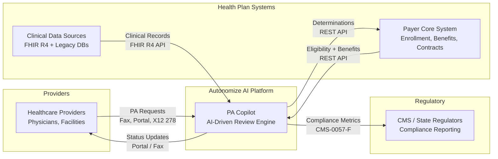
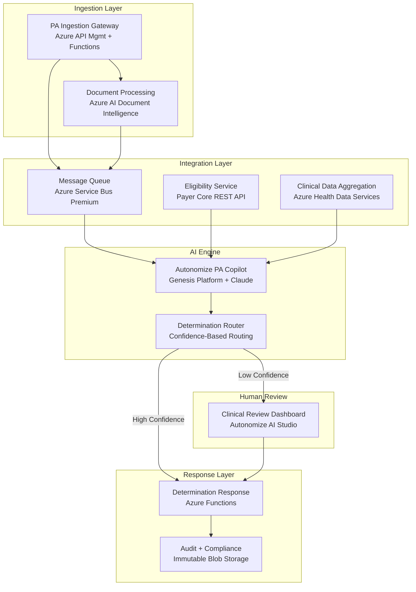
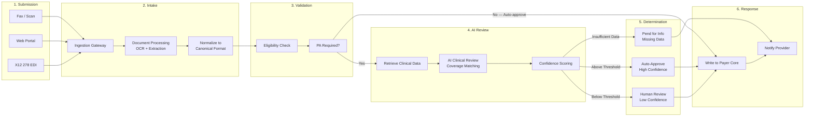

# AI-Driven Prior Authorization — Solution Architecture
## Autonomize AI | Paul Prae | www.paulprae.com

> **11 slides** | Priority-tiered for conversational format | Under 30 minutes
>
> **Tier A** (Must Present, ~15 min): Slides 1-6
> **Tier B** (If Time, ~5-8 min): Slides 7-9
> **Tier C** (Appendix/On-Demand): Slides 10-11

---

## Table of Contents

| # | Slide | Tier | Assignment Section |
|---|-------|------|--------------------|
| 1 | [Title & Introduction](#slide-1-title--introduction) | A | — |
| 2 | [Executive Summary](#slide-2-executive-summary) | A | Part 2.1 |
| 3 | [High-Level Architecture](#slide-3-high-level-architecture) | A | Part 1.1 |
| 4 | [System Architecture Detail](#slide-4-system-architecture-detail) | A | Part 1.1 |
| 5 | [PA Processing Flow](#slide-5-pa-processing-flow) | A | Part 1.2 |
| 6 | [Security & Zero Trust](#slide-6-security--zero-trust) | A | Part 1.3 |
| 7 | [Clinical Data Integration](#slide-7-clinical-data-integration) | B | Part 1.2 |
| 8 | [LLMOps Pipeline](#slide-8-llmops-pipeline) | B | Part 3.1 |
| 9 | [Implementation Roadmap](#slide-9-implementation-roadmap) | B | Part 2.2 |
| 10 | [Future State & Scaling](#slide-10-future-state--scaling) | C | Part 3.2 |
| 11 | [Discussion Starters](#slide-11-discussion-starters) | C | — |

---

## Slide 1: Title & Introduction
**TIER A**

# AI-Driven Prior Authorization
### Solution Architecture for a Large US Health Plan

**Paul Prae** | Principal AI Engineer & Architect
www.paulprae.com

Speaker Notes

"I'm Paul Prae — I've spent 15 years building AI systems in healthcare. Most recently at Arine serving 50 million members across 45 health plans, and before that as an ML Solutions Architect at AWS. I'm excited about the PA automation space because it's where AI can genuinely reduce clinical burden and improve patient access to care."

---

## Slide 2: Executive Summary
**TIER A** | Part 2, Section 1

### Why This Architecture

**The Problem:** Manual PA processing costs **$10.97 per provider transaction** ([CAQH 2024](https://www.caqh.org/hubfs/Index/2024%20Index%20Report/CAQH_IndexReport_2024_FINAL.pdf)), takes days, and burns out clinical staff — **93% of physicians** say PA delays patient care ([AMA 2024](https://www.ama-assn.org/system/files/prior-authorization-survey.pdf)).

**The Opportunity — Altais + Autonomize AI** ([BusinessWire Feb 2026](https://www.businesswire.com/news/home/20260224376992/en/Altais-Cuts-Prior-Authorization-Review-Time-by-45-and-Reduces-Manual-Errors-by-54-with-Autonomize-AI)):
- **45%** reduction in PA review time
- **54%** reduction in manual errors
- **50%** auto-determination rate

**This Architecture Delivers:**
- AI-driven clinical review with human oversight
- Configurable confidence thresholds
- CMS-0057-F compliance readiness
- Azure-native deployment

Speaker Notes

"The business case is straightforward — manual PA is expensive and slow. Altais proved that Autonomize's platform cuts review time by 45% and errors by 54%. My architecture integrates that capability into the health plan's systems with the right safety controls."

For Kris: This answers "why should I care?" — business outcomes, not technology.

---

## Slide 3: High-Level Architecture
**TIER A** | Part 1, Section 1

### System Context

| Actor | Role | Integration |
|-------|------|-------------|
| Healthcare Providers | Submit PA requests | Fax, Portal, X12 278 |
| Autonomize AI Platform | AI-driven clinical review | PA Copilot on Genesis |
| Health Plan Systems | Eligibility, benefits, clinical data | REST API, FHIR R4 |
| Regulators (CMS) | Compliance reporting | CMS-0057-F metrics |

Speaker Notes

"This is the business stakeholder view — four actors, one AI platform in the middle. Providers submit PA requests through existing channels. Autonomize's PA Copilot reviews them against clinical data and coverage criteria. Determinations flow back to the health plan's core system."

---

## Slide 4: System Architecture Detail
**TIER A** | Part 1, Section 1 (detail)

### Component Architecture

| Component | Azure Service | Purpose |
|-----------|--------------|---------|
| Ingestion Gateway | API Management + Functions | Receives all PA channels |
| Document Processing | AI Document Intelligence | OCR for faxes |
| Eligibility Service | Payer Core REST API | Member validation |
| Clinical Data Aggregation | Health Data Services | Unified clinical context |
| PA Copilot | Genesis Platform + Claude | AI clinical review |
| Determination Router | Functions + Rules | Confidence-based routing |
| Clinical Review Dashboard | AI Studio | Human reviewer interface |
| Audit & Compliance | Immutable Blob Storage | Tamper-proof audit trail |

Speaker Notes

"Here's the component view with Azure service labels. Ten components, each with a clear responsibility. The AI engine is Autonomize's PA Copilot — I'm integrating it, not rebuilding it. Every Azure service here has an AWS equivalent — the patterns are identical."

---

## Slide 5: PA Processing Flow
**TIER A** | Part 1, Section 2

### PA Request Lifecycle

Speaker Notes

"Six steps, following the standard PA process defined by AMA and CAQH. The innovation is in steps 4 and 5 — AI review with confidence-based routing. Auto-denial is not enabled in Phase 1 — every denial goes to a human reviewer."

---

## Slide 6: Security & Zero Trust
**TIER A** | Part 1, Section 3

### Top 3 Security Risks & Mitigations

| # | Risk | Mitigation |
|---|------|------------|
| 1 | **PHI exposure through AI pipeline** | PHI tokenization before LLM — AI sees clinical facts without patient identity. Enterprise deployment (data not used for training). |
| 2 | **Prompt injection via clinical documents** | Document sanitization + system prompt isolation + output validation requiring evidence citations. |
| 3 | **Untraceable AI decisions** | Tamper-proof audit trail: model version, input hash, reasoning, evidence, confidence. Immutable 7-year retention. |

**Additional:** Entra ID RBAC, AES-256, TLS 1.2+, private endpoints, no auto-deny without human review.

Speaker Notes

"Three risks, three architectural mitigations. I led with AI-specific controls — prompt injection and PHI in the model pipeline are the novel attack surfaces. The third — auditability — is critical for healthcare compliance and regulatory defense."

---

## Slide 7: Clinical Data Integration
**TIER B** | Part 1, Section 2

### How AI Accesses Clinical Data

| Source | Protocol | Auth |
|--------|----------|------|
| Modern EMRs | FHIR R4 REST API | OAuth 2.0 / SMART on FHIR |
| Legacy Systems | DB connector / HL7 v2 | Service account + VNet |

**FHIR R4:** Interoperability standard. Modern sources expose it natively. Legacy data normalized to FHIR-compatible format. Deep FHIR implementation is a discovery-phase activity.

Speaker Notes

"Clinical data comes from two worlds — modern FHIR R4 and legacy databases. The aggregation service presents unified clinical context to the AI engine. I kept FHIR at the label level because the deep implementation details are discovery-phase work with clinical informaticists."

---

## Slide 8: LLMOps Pipeline
**TIER B** | Part 3, Section 1

### AI Model Monitoring & Feedback

**Detect drift:** Outcome monitoring (overturn rate), automated evals (golden test cases), confidence distribution shifts

**Feedback loop:**
1. Human reviewer corrections → updated eval dataset
2. Benchmark new model versions vs current
3. If improved → staged blue-green rollout
4. Guardrails always active: input filtering, output validation, clinical safety

Speaker Notes

"This is LLMOps, not traditional MLOps. We're monitoring LLM output quality — evals, guardrails, human feedback — not retraining custom models. Drift here means coverage criteria changed, data quality shifted, or new procedure types entered the pipeline."

---

## Slide 9: Implementation Roadmap
**TIER B** | Part 2, Section 2

### Progressive Delivery

| Phase | Focus | Key Deliverable |
|-------|-------|-----------------|
| **Phase 0: Demo** | Prove the concept | Working AI PA review |
| **Phase 1: MVP** | Single LOB, single channel | Production PA processing |
| **Phase 2: Scale** | Multi-channel, multi-LOB | Fax OCR, LOB config |
| **Phase 3: Enterprise** | Full scale, compliance | All channels, 20 LOBs |

Each phase produces a deployable, demonstrable system. Decision gates between phases use real performance data to scope the next phase.

Speaker Notes

"Four phases, each producing something real. AI features are front-loaded — PA Copilot integrates in Phase 1, not Phase 3. Actual durations depend on discovery findings and team composition."

---

## Slide 10: Future State & Scaling
**TIER C** | Part 3, Section 2

### Scaling to 20 LOBs

| Approach | Cost | Isolation | Complexity |
|----------|------|-----------|------------|
| **Multi-tenant** | Lower | Logical | Lower |
| **Multi-instance** | Higher | Physical | Higher |

**Recommendation:** Start multi-tenant with per-LOB configuration. Deploy separate instances only where regulation requires physical isolation.

Speaker Notes

"Multi-tenant with per-LOB configuration is the starting point — Autonomize's platform already supports it. The right answer depends on actual LOB rule complexity and regulatory requirements — both are discovery questions."

---

## Slide 11: Discussion Starters
**TIER C**

### Questions for the Panel

**Business Strategy:**
- How does the ServiceNow partnership change the payer integration strategy?
- What is the target auto-determination rate for Phase 1?

**Technical Depth:**
- How does the Genesis Platform handle coverage criteria updates?
- What's the Azure AI Foundry Agent Service integration status?

**Implementation:**
- Which LOB is the ideal Phase 1 candidate?
- What's been the biggest integration challenge with existing payer deployments?

Speaker Notes

"These are the questions I'd ask in a real discovery engagement. I'd love to explore any of these with you."

