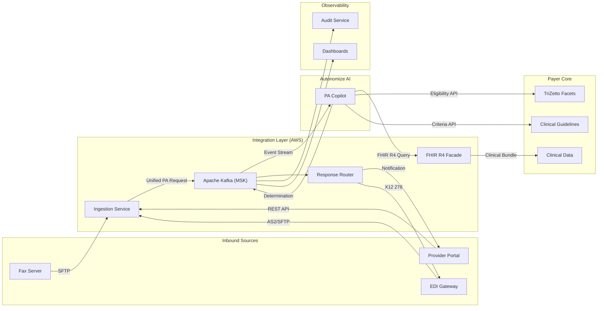
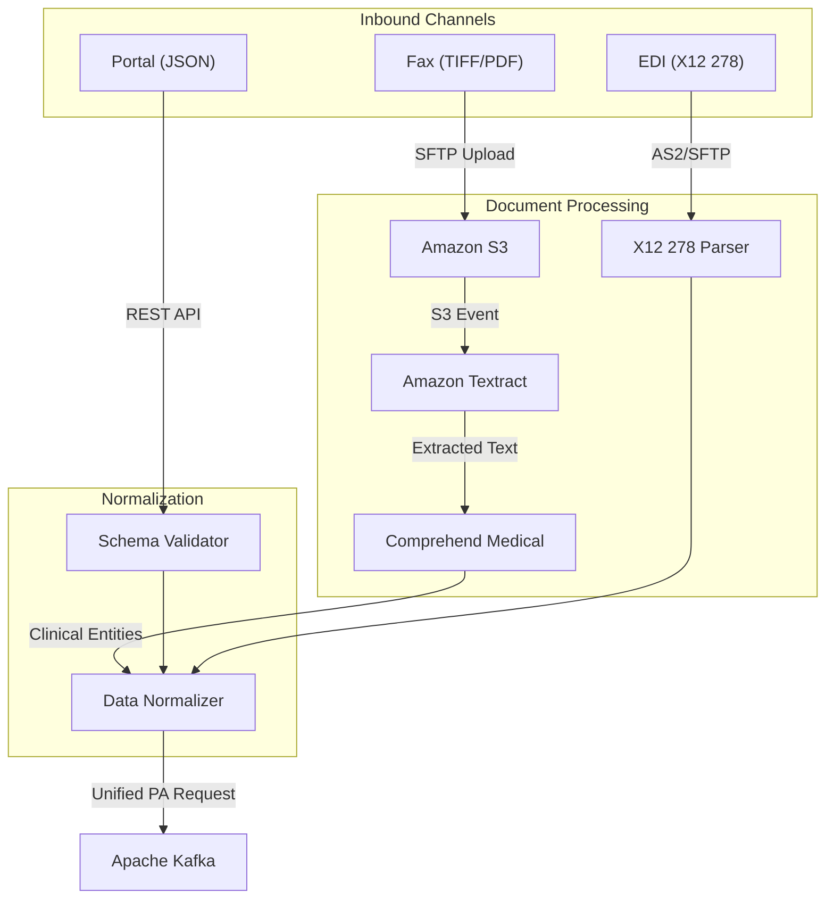
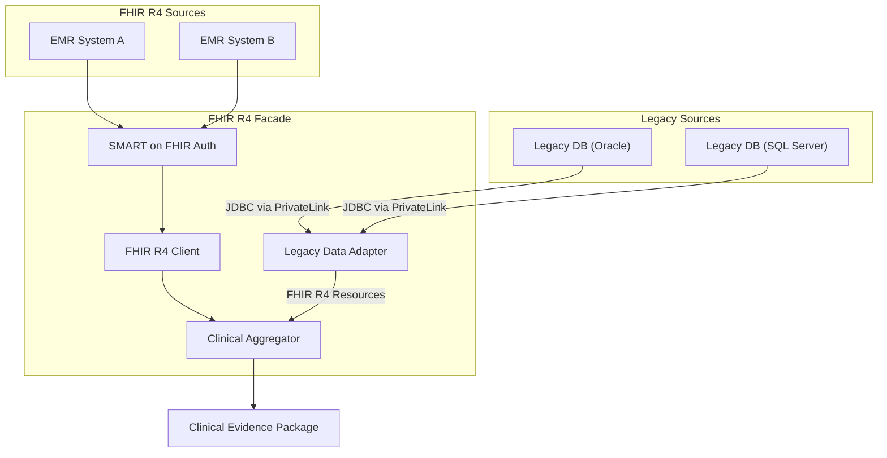
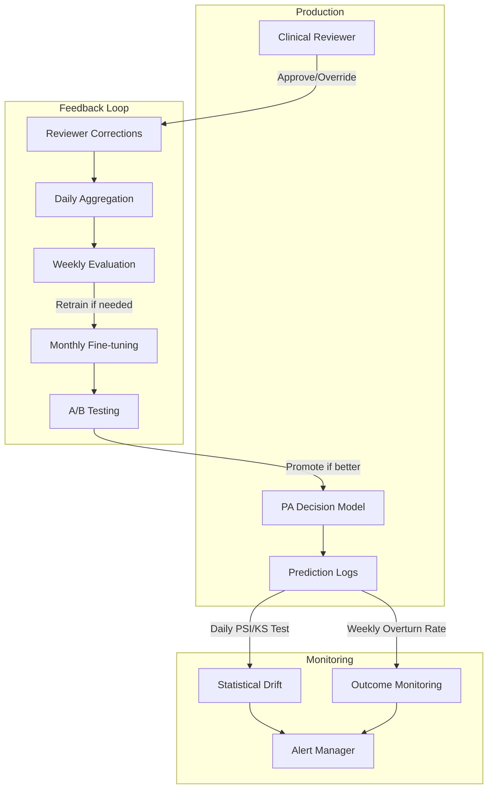
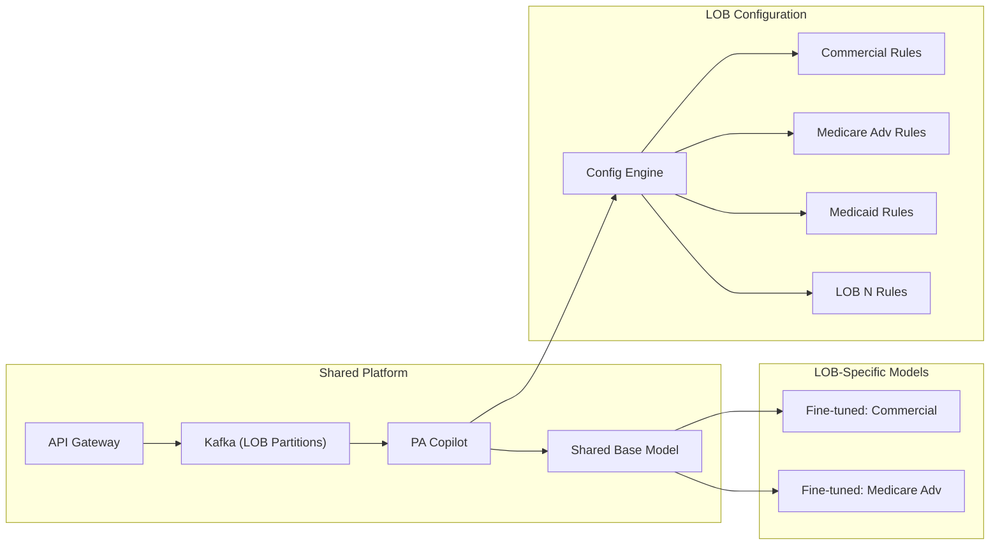

# AI-Driven Prior Authorization: Solution Architecture

**Prepared for**: Autonomize AI Interview Panel
**Prepared by**: Paul Prae, Principal AI Engineer & Architect
**Date**: March 2026
**Engagement**: eng-2026-004

---

## Slide 1: Title

### AI-Driven Prior Authorization Solution Architecture
#### Automating Clinical Review for a National Health Plan Using Autonomize AI

**Paul Prae** | Principal AI Engineer & Architect
Modular Earth LLC | www.paulprae.com

---

**Speaker Notes (3 min)**:
Good morning. I'm Paul Prae — Principal AI Engineer and Architect with 15 years of experience delivering healthcare AI solutions at AWS, Booz Allen Hamilton, and Arine, where I currently manage data operations for a clinical AI platform serving 50 million members across 45 health plans. Today I'll walk you through a solution architecture for automating prior authorization processing using Autonomize AI's platform. I'll cover the end-to-end technical architecture, two critical integration designs, our security posture for HIPAA compliance, a 12-week implementation roadmap, and advanced architectural challenges including MLOps and multi-tenant scaling. Let's begin.

---

## Slide 2: Executive Summary — The Case for AI-Driven PA

### The Problem
| Metric | Current State | Target State |
|--------|--------------|--------------|
| PA Turnaround | 5 business days | < 24 hours |
| Auto-Determination Rate | 15% | 60% (Phase 1) |
| PA Processing FTEs | 450 | 270 (-40%) |
| Annual PA Cost | $33.75M | $22M (-35%) |
| CMS-0057-F Compliance | Not compliant | Compliant by Jan 2027 |

### The Solution
Deploy Autonomize AI's multi-agent PA Copilot integrated with the payer's AWS infrastructure to automate intake, clinical data aggregation, guidelines matching, and determination — while preserving human oversight for complex cases.

### Why Now
- **CMS-0057-F deadline**: January 1, 2027 requires FHIR-based PA APIs
- **$11.7M annual savings** from 40% FTE reduction alone
- **Proven platform**: Autonomize AI already serves 3 of the top 5 US health plans
- **2-month payback**: Implementation cost recovered in < 60 days of operation

---

**Speaker Notes (5 min)**:
Let me frame the business case before we dive into architecture. This health plan processes 2.5 million PA requests per month across 45 million members. Today, 60% of those arrive via fax — requiring manual data entry, manual clinical review, and manual determination. The result is a 5-day average turnaround, 450 dedicated FTEs, and $33.75 million in annual PA operational costs.

Our solution targets 60% auto-determination in Phase 1 — meaning 1.5 million requests per month are handled by AI with no human touch, while complex cases get routed to clinical reviewers with pre-assembled evidence packages. The economic case is compelling: $11.7 million in annual savings with a 2-month payback period.

But the real urgency comes from CMS-0057-F — the Prior Authorization Final Rule requires FHIR-based PA APIs by January 2027. This architecture delivers compliance as a byproduct of modernization, not as a separate workstream. And Autonomize AI isn't unproven here — they're already live at 3 of the top 5 US health plans.

---

## Slides 3-4: High-Level Architecture — PA Request Lifecycle

### System Context Diagram



### Component Summary

| Layer | Components | Technology |
|-------|-----------|------------|
| **Ingestion** | API Gateway, Document Processing, Data Normalizer | AWS API Gateway, Textract, Comprehend Medical, Lambda |
| **Event Bus** | Apache Kafka with PA-specific topics | Amazon MSK |
| **AI Platform** | PA Copilot multi-agent pipeline | Autonomize AI Genesis Platform |
| **Clinical Data** | FHIR R4 Facade, Legacy Adapters | AWS HealthLake, SMART on FHIR, JDBC/PrivateLink |
| **Payer Core** | Eligibility Service, Guidelines Matching | Facets API, InterQual/MCG APIs |
| **Delivery** | Response Router, Audit Service | Lambda, DynamoDB (immutable), SNS |
| **Analytics** | Operational Dashboards | Snowflake, dbt, QuickSight |

### Data Flow: Single PA Request

1. **Receive** — PA request arrives via fax, portal, or EDI
2. **Ingest** — OCR/parse → normalize → publish to Kafka
3. **Enrich** — Eligibility check (Facets) + clinical data aggregation (FHIR Facade)
4. **Determine** — PA Copilot: guidelines matching → confidence scoring → determination
5. **Route** — High confidence (>= 0.85): auto-determine. Low confidence: human reviewer queue
6. **Deliver** — Determination sent back via originating channel
7. **Audit** — Every step captured in immutable audit trail

---

**Speaker Notes (8 min)**:
This is the end-to-end system context. Let me walk you through the flow of a single PA request.

A request enters from one of three channels — fax, the provider portal, or EDI X12 278. The ingestion layer normalizes all three formats into a unified PA Request schema. For faxes, we use Amazon Textract for OCR and Comprehend Medical for clinical entity extraction. For portal submissions, we validate against a JSON schema. For EDI, we parse the X12 278 transaction against the ASC X12 grammar.

All normalized requests flow through Apache Kafka — Amazon MSK — which serves as our event backbone. Kafka gives us decoupled, ordered, replayable event streams. We partition by LOB ID, enabling parallel processing across lines of business.

The Autonomize AI PA Copilot consumes from Kafka and orchestrates a multi-agent pipeline: Document Agent, Clinical NLP Agent, Eligibility Agent, Guidelines Agent, and Decision Agent. Each agent is specialized — the Eligibility Agent calls Facets, the Guidelines Agent calls InterQual and MCG, and the Decision Agent synthesizes everything into a determination with a confidence score.

If confidence is >= 0.85, the determination is auto-delivered. Below that threshold, the request is routed to a clinical reviewer with a pre-assembled evidence package — so the reviewer doesn't need to access multiple systems manually.

Every step is captured in an immutable DynamoDB audit trail with cryptographic hashing for tamper evidence. This is critical for HIPAA compliance and CMS-0057-F, which requires specific denial reasons and full auditability.

The architecture is event-driven by design. If Autonomize AI's platform goes down, Kafka retains the events for replay when it recovers. Simultaneously, a fallback workflow routes all requests to the human review queue — PA processing never stops.

---

## Slides 5-6: Integration Design — Inbound PA Request Ingestion

### Ingestion Architecture



### Channel-Specific Processing

| Channel | Volume | Protocol | Processing | Output |
|---------|--------|----------|-----------|--------|
| **Fax** | 1.5M/mo (60%) | SFTP → S3 | Textract OCR → Comprehend Medical NLP → Entity extraction | Structured PA request with extracted clinical entities |
| **Portal** | 625K/mo (25%) | REST API (HTTPS) | JSON schema validation → field mapping | Validated PA request (highest data quality) |
| **EDI X12 278** | 375K/mo (15%) | AS2/SFTP | ASC X12 grammar parsing → segment extraction | Parsed PA request (already structured) |

### Key Design Decisions

1. **Async fax processing**: Textract async API with S3 output avoids rate limiting. SQS queue smooths throughput spikes.
2. **Unified schema**: All channels converge to a common PA Request data model before Kafka — downstream components are channel-agnostic.
3. **PHI encryption**: All documents encrypted with KMS (AES-256) at rest in S3. TLS 1.2+ in transit. PHI field-level encryption for sensitive identifiers.
4. **Idempotency**: Each PA request gets a unique ID at ingestion — prevents duplicate processing if fax is rescanned or EDI retransmitted.

---

**Speaker Notes (7 min)**:
Let me detail the first critical integration — inbound PA request ingestion. The challenge here is converting three fundamentally different input formats into a unified structure that the AI engine can process.

Fax is the hardest problem and the highest volume — 60% of requests, 1.5 million per month. Faxed documents arrive as TIFF or PDF images via SFTP. We stage them in S3, which triggers a Lambda function invoking Amazon Textract for OCR. Textract handles printed clinical forms well — we target >95% character accuracy on printed text. The extracted text then flows through Amazon Comprehend Medical, which identifies clinical entities: diagnosis codes, medication names, procedure descriptions, patient identifiers.

For handwritten notes — which are a subset of faxed documents — OCR accuracy drops. Our design handles this gracefully: low-confidence OCR results automatically lower the overall PA determination confidence, which routes those cases to human review. We don't need perfect OCR on everything — we need to know when we don't have perfect OCR.

Portal submissions are the cleanest channel — structured JSON validated against our PA Request schema. We're building this channel to become the dominant intake path as providers adopt the portal.

EDI X12 278 transactions are already structured but use a complex segment-based format. Our parser validates against the ASC X12 grammar specification and extracts the relevant segments into our unified schema.

The key insight is the unified PA Request schema. Once data enters Kafka, every downstream component — the PA Copilot, the eligibility service, the audit service — works with the same data model regardless of how the request originally arrived. This dramatically simplifies the AI pipeline and makes adding new intake channels trivial.

---

## Slide 7: Integration Design — Clinical Data Access

### Clinical Data Architecture



### FHIR/HL7 Role in the Design

| Standard | Role | Scope |
|----------|------|-------|
| **FHIR R4** | Primary clinical data interchange format. All clinical data normalized to FHIR Resources. | Patient, Condition, Observation, DiagnosticReport, MedicationRequest |
| **SMART on FHIR** | Authentication standard for FHIR endpoint access. Scoped OAuth 2.0 tokens per resource type. | 15-minute token expiry. Patient/*.read scope only. |
| **HL7 v2** | Legacy messaging standard for older EMR systems. Transformed to FHIR R4 by Legacy Data Adapter. | ADT, ORU, ORM messages → FHIR Resources |
| **Da Vinci PAS** | CMS-0057-F compliance. FHIR R4 API for PA submission and status inquiry. | Claim, ClaimResponse, CommunicationRequest |

### Design: FHIR Facade Pattern

The FHIR R4 Facade abstracts heterogeneous clinical data sources behind a unified FHIR R4 interface:

- **FHIR-native sources** (~40%): Direct FHIR R4 REST queries via SMART on FHIR
- **Legacy sources** (~60%): JDBC connectors via AWS PrivateLink transform proprietary schemas into FHIR R4 Resources
- **Clinical Evidence Package**: Aggregated FHIR Bundle per patient containing all relevant clinical context for the PA decision

This pattern future-proofs the architecture: as EMR systems adopt FHIR R4, legacy adapters are retired without changing the AI pipeline.

---

**Speaker Notes (5 min)**:
The second critical integration is clinical data access. The AI system needs comprehensive patient clinical data to make accurate determinations — but that data is spread across 12+ EMR systems with inconsistent standards.

Our solution is the FHIR R4 Facade pattern. Think of it as an abstraction layer that presents all clinical data sources — whether they're modern FHIR R4 endpoints or legacy Oracle databases — through a single, standardized FHIR R4 interface.

For the ~40% of clinical data in FHIR-compliant systems, we use SMART on FHIR authentication — the industry standard for healthcare API authorization. Each query is scoped to specific FHIR resource types with 15-minute token expiry, following the principle of minimum necessary access required by HIPAA.

For the ~60% still in legacy databases, our Legacy Data Adapter connects via JDBC through AWS PrivateLink — ensuring no PHI traverses the public internet. The adapter transforms proprietary schemas into FHIR R4 Resources, so the downstream AI pipeline works with a consistent data model.

The Clinical Aggregator produces a FHIR Bundle per patient containing everything the PA Copilot needs: conditions, observations, diagnostic reports, medication history. This assembled evidence package is what enables the AI to make clinically accurate determinations — and it's the same package presented to human reviewers for complex cases.

This design directly supports CMS-0057-F compliance. The Da Vinci Prior Authorization Support Implementation Guide specifies FHIR R4 Resources for PA transactions — our architecture natively speaks this language.

---

## Slides 8-9: Security & Compliance

### Top 3 Risks and Architectural Mitigations

| # | Risk | Severity | Architectural Mitigation |
|---|------|----------|------------------------|
| 1 | **PHI Exposure in Transit** — PA requests contain PHI flowing between 8+ systems | Critical | End-to-end TLS 1.2+. AWS PrivateLink for all cross-VPC connectivity (no public internet for PHI). PHI field-level encryption with dedicated KMS key. mTLS for service-to-service. |
| 2 | **Unauthorized Clinical Data Access** — AI system querying 12+ EMR systems amplifies blast radius | Critical | SMART on FHIR per-system scoped auth (15-min tokens). RBAC with LOB-level data isolation. Zero-trust: every request authenticated, every action authorized, every access logged. |
| 3 | **AI Decision Audit Trail Integrity** — Regulatory requirement for tamper-proof, reconstructable decisions | High | Immutable DynamoDB audit trail with cryptographic hash chain. Decision lineage: input docs → clinical data → guidelines → AI rationale → confidence → determination. Separate audit AWS account with read-only cross-account access. 7-year retention. |

### HIPAA Compliance Architecture

```
                    ┌─────────────────────────────────────┐
                    │       Defense-in-Depth (5 Layers)    │
                    ├─────────────────────────────────────┤
                    │ L1: Network     │ WAF, PrivateLink,  │
                    │    Perimeter    │ VPC segmentation    │
                    ├─────────────────┼────────────────────┤
                    │ L2: Identity    │ OAuth 2.0, SAML,    │
                    │    & Access     │ mTLS, SMART on FHIR │
                    ├─────────────────┼────────────────────┤
                    │ L3: Application │ Input validation,   │
                    │    Security     │ AI guardrails, PHI  │
                    │                 │ detection           │
                    ├─────────────────┼────────────────────┤
                    │ L4: Data        │ AES-256 KMS, TLS    │
                    │    Protection   │ 1.2+, field-level   │
                    │                 │ PHI encryption       │
                    ├─────────────────┼────────────────────┤
                    │ L5: Monitoring  │ CloudTrail, VPC     │
                    │    & Audit      │ Flow Logs, immutable│
                    │                 │ audit trail          │
                    └─────────────────┴────────────────────┘
```

### AI-Specific Security Controls

| Control | Implementation |
|---------|---------------|
| **Prompt Injection Prevention** | Input sanitization, system prompt isolation, output format validation. Deterministic guardrail: no AI approval without positive InterQual/MCG guideline match. |
| **PHI in Model Output** | Comprehend PII detection on all AI outputs. Cross-patient data leak detection. |
| **Data Poisoning Prevention** | Training data de-identified (Safe Harbor). Reviewer correction anomaly detection. Two-reviewer validation for guideline-contradicting corrections. |
| **Hallucination Mitigation** | All determinations grounded in specific guideline citations. Citation IDs validated against InterQual/MCG API. |

---

**Speaker Notes (7 min)**:
Security in healthcare AI isn't optional — it's the foundation. Let me walk through our three highest risks and the specific architectural patterns that mitigate each.

Risk one: PHI exposure in transit. PA requests contain some of the most sensitive data in healthcare — diagnoses, clinical notes, member identifiers. And this data flows between 8+ systems. Our mitigation isn't one control — it's defense in depth. TLS 1.2+ encrypts everything in transit. AWS PrivateLink ensures PHI never traverses the public internet — not even within AWS. And for the most sensitive fields — SSNs, medical record numbers, dates of birth — we apply field-level encryption with a dedicated KMS key, so even if someone gains access to the database, they can't read PHI without the specific decryption key.

Risk two: the blast radius of AI accessing clinical data. When you connect an AI system to 12 EMR systems, a compromised component could theoretically access patient data across all of them. We follow zero-trust principles: SMART on FHIR authentication with scoped tokens that expire every 15 minutes, RBAC that enforces LOB-level data isolation, and every access logged to CloudTrail. No component has standing access to anything — it's all just-in-time, minimum-necessary.

Risk three: audit trail integrity. HIPAA and CMS-0057-F require that every PA decision be fully reconstructable — who or what made the decision, what data was considered, what guidelines were applied. Our audit trail in DynamoDB is append-only with a cryptographic hash chain — each record's hash includes the previous record's hash, making tampering detectable. The audit data replicates to a separate AWS account with read-only cross-account access, and we retain for 7 years per HIPAA requirements.

On the AI-specific side, I want to highlight our approach to prompt injection — which is the OWASP #1 risk for LLM applications. We sanitize all clinical text inputs, isolate system prompts from user content, and — most importantly — we have a deterministic guardrail: no PA request can be auto-approved unless the Guidelines Matching Service returns a positive match from InterQual or MCG. The AI can't hallucinate an approval — it must be backed by published clinical criteria.

---

## Slide 10: Implementation Roadmap — 12 Weeks

### Phased Timeline

```
Week:  1   2   3   4   5   6   7   8   9  10  11  12
       ├───┤   ├───────┤   ├───────┤   ├───────┤  ├──┤
       P-001   P-002       P-003       P-004      P-005
       Disc.   Integration AI Integ.   QA/UAT     Go-
       & Arch  Build       & Platform  & Security  Live
       Sign-Off                        Hardening

       G-001 ▲         G-002 ▲              G-003 ▲
       Arch             Integration          Pre-Prod
       Approved         Checkpoint           Readiness
```

### Phase Details

| Phase | Weeks | Key Deliverables | Decision Gate |
|-------|-------|-----------------|---------------|
| **Discovery & Architecture** | 1-2 | ADR signed, AWS infra provisioned, CI/CD live, Autonomize AI API verified | G-001: Architecture sign-off (CIO) |
| **Integration Build** | 3-6 | Ingestion (fax/portal/EDI), FHIR Facade, Eligibility Service, Kafka, Audit | G-002: End-to-end data flow verified |
| **AI Integration** | 5-8 | PA Copilot live, guidelines matching, human review workflow, LOB config | — |
| **QA/UAT/Security** | 9-11 | Integration tests, pen test, clinical accuracy UAT, breach tabletop | G-003: Pre-production readiness (CIO + CMO + Compliance) |
| **Go-Live** | 12 | Production deployment (Commercial LOB), monitoring active, hypercare | Production sign-off |

### Architectural Decision Points

| Week | Decision | Impact |
|------|----------|--------|
| 2 | FHIR Facade vs. direct legacy connectors | Determines integration complexity for Phase 2+ |
| 4 | Fax OCR accuracy — Textract sufficient or custom model needed? | Scope and cost of fax processing pipeline |
| 6 | Confidence threshold for auto-determination (0.85 baseline) | Directly affects auto-determination rate and clinical accuracy trade-off |
| 8 | Phase 1 LOB scope — Commercial only or add Medicare Advantage? | Resource allocation and timeline impact |
| 10 | Auto-denial in Phase 2 — clinical and regulatory review | Legal and compliance approval required |

---

**Speaker Notes (5 min)**:
Here's our 12-week roadmap. It's aggressive but achievable because Autonomize AI provides the AI platform — we're building the integration layer, not the AI from scratch.

Weeks 1-2 are Discovery and Architecture Sign-Off. We provision the AWS infrastructure using CDK, establish CI/CD, and validate the Autonomize AI API integration. Decision gate G-001 at the end of Week 2 requires CIO approval of the architecture.

Weeks 3-6 are the core Integration Build. This is where we build the ingestion pipeline for all three channels, the FHIR R4 Facade, the eligibility service, and the Kafka event bus. We've mapped this as the critical path — if FHIR Facade development slips, everything downstream shifts. Gate G-002 at Week 6 verifies end-to-end data flow in staging.

Weeks 5-8 overlap — AI Integration begins in Week 5 while integration build continues. This is where we connect the Autonomize AI PA Copilot, configure the multi-agent pipeline, and build the human review workflow.

Weeks 9-11 are QA, UAT, and Security Hardening. This includes integration testing at production scale, a penetration test focused on cross-tenant isolation and prompt injection, clinical accuracy UAT with SMEs, and a HIPAA breach response tabletop exercise. Gate G-003 requires sign-off from CIO, CMO, and Compliance Director.

Week 12 is Go-Live for the Commercial LOB — our first line of business. We deploy blue/green, activate MLOps monitoring, and begin hypercare support. Additional LOBs onboard via configuration in Phase 2 — no re-architecture needed.

I want to highlight the architectural decision points mapped to this timeline. The most consequential is the confidence threshold decision in Week 6 — this directly determines the trade-off between auto-determination rate and clinical accuracy. We start at 0.85 and tune based on UAT results.

---

## Slide 11: AI/ML Strategy — MLOps Architecture

### MLOps Pipeline



### Drift Detection — Dual Approach

| Method | What It Detects | Cadence | Tool |
|--------|----------------|---------|------|
| **Population Stability Index (PSI)** | Feature distribution shift — e.g., change in diagnosis code mix, procedure type distribution | Daily | SageMaker Model Monitor |
| **Kolmogorov-Smirnov (KS) Test** | Statistical significance of distribution change | Daily | SageMaker Model Monitor |
| **Approval Overturn Rate** | Clinical reviewer overriding AI-approved determinations | Weekly | Custom metric (Snowflake → QuickSight) |
| **Appeal Rate** | Providers appealing AI-denied determinations | Weekly | Custom metric (Facets data) |

### Automated Feedback Loop

1. **Daily**: Reviewer corrections aggregated in DynamoDB → Lambda → S3 training data
2. **Weekly**: SageMaker Processing job evaluates model against corrections + golden dataset
3. **Monthly**: If drift exceeds thresholds → SageMaker Training job fine-tunes model on new corrections
4. **Before production**: A/B test — new model vs. current model on 10% of traffic for 1 week
5. **Promote**: If new model outperforms → blue/green model endpoint swap

### Safeguards
- Training data **de-identified** (Safe Harbor method) before fine-tuning
- **Golden dataset** holdout: 500 expert-reviewed cases used as accuracy benchmark every evaluation
- **Rollback**: Previous model version always available — 1-click revert via SageMaker endpoint update
- **Anomaly detection**: Statistical monitoring on reviewer correction patterns flags potential data poisoning

---

**Speaker Notes (7 min)**:
The client's top concern is AI model drift — how do we maintain high automation rates as clinical patterns change over time? Our answer is a dual-monitoring approach with an automated feedback loop.

Statistical drift detection runs daily using Amazon SageMaker Model Monitor. We track two established metrics: Population Stability Index — or PSI — which detects shifts in the feature distributions the model sees, and the Kolmogorov-Smirnov test, which measures statistical significance of those shifts. If the diagnosis code mix changes — say, a seasonal flu surge shifts the distribution — PSI catches it before accuracy degrades.

But statistical drift doesn't tell the full story. We complement it with outcome-based monitoring: tracking the rate at which clinical reviewers overturn AI decisions and the rate at which providers appeal. These are the ground-truth signals that tell us if the model is making clinically correct decisions. We track these weekly.

The feedback loop is designed for safety and efficiency. Reviewer corrections are aggregated daily but we don't immediately retrain — that would be reckless. Instead, we evaluate weekly against a golden dataset of 500 expert-reviewed cases. If the evaluation shows degradation beyond our thresholds, we trigger a fine-tuning job monthly. The fine-tuned model goes through A/B testing — 10% of traffic for one week — before it can replace the production model.

Critical safeguard: all training data is de-identified using the HIPAA Safe Harbor method before fine-tuning. We don't want patient PHI memorized in model weights. We also monitor reviewer correction patterns for anomalies — if a reviewer starts submitting statistically unusual corrections, that could indicate data poisoning, and we flag it for review.

---

## Slide 12: Future State Scaling — Multi-Tenant Architecture

### Approach: Multi-Tenant with Configuration Isolation



### Why Multi-Tenant (Not Multi-Instance)

| Dimension | Multi-Tenant | Multi-Instance |
|-----------|-------------|----------------|
| **Cost** | Shared compute, 1 Kafka cluster, 1 deployment | 20x infrastructure cost |
| **Isolation** | Config-driven LOB rules + Kafka partitioning + DB row-level security | Full resource isolation per LOB |
| **Complexity** | Single deployment, configuration-driven | 20 separate deployments to maintain |
| **Scalability** | Add LOB via config in < 2 weeks | Provision + deploy per LOB (weeks) |
| **Recommendation** | **Selected** — all LOBs within same payer organization. Data isolation via configuration is sufficient. | Better for multi-payer SaaS (different organizations). |

### Configuration-Driven LOB Customization

Each LOB gets its own entry in the Configuration Engine (DynamoDB):
- **Approval thresholds**: Confidence score, auto-determination eligibility
- **Clinical guidelines**: Which InterQual/MCG criteria sets apply
- **Workflow rules**: Routing logic, escalation paths, reviewer assignment
- **Model selection**: Shared base model or LOB-specific fine-tuned variant

### Scaling Model: Shared Base + Selective Fine-Tuning

- **High-volume LOBs** (Commercial, Medicare Advantage): LOB-specific fine-tuned models trained on LOB-specific historical determinations. Higher accuracy for LOB-specific patterns.
- **Lower-volume LOBs** (Medicaid, specialty): Shared base model + LOB-specific rules in configuration engine. Cost-effective without sacrificing accuracy for simpler LOB-specific patterns.

This approach scales to 20 LOBs without re-architecture. New LOBs are onboarded by loading configuration — not deploying infrastructure.

---

**Speaker Notes (7 min)**:
The final advanced challenge: scaling to 20 lines of business, each with different administrative rules. I'm recommending multi-tenant with configuration isolation over multi-instance, and I want to explain the trade-off analysis.

Multi-instance means deploying a separate PA processing stack for each LOB — 20 Kafka clusters, 20 sets of ECS services, 20 databases. That's 20x the infrastructure cost and 20 separate deployments to maintain. For a multi-payer SaaS where each customer is a different organization, multi-instance makes sense because you need organizational data isolation.

But here, all 20 LOBs belong to the same payer. The data isolation requirement is between lines of business, not between organizations. Multi-tenant with configuration isolation handles this elegantly: one deployment, shared compute, with LOB-specific behavior driven entirely by configuration.

Our isolation model has three layers. First, Kafka topics are partitioned by LOB ID — Consumer Group ACLs prevent cross-LOB consumption. Second, the FHIR Facade injects a mandatory LOB filter on all clinical data queries. Third, row-level security in PostgreSQL ensures database queries can never cross LOB boundaries.

The configuration engine stores each LOB's specific rules in DynamoDB: which clinical guidelines apply, what confidence thresholds to use, which workflow steps to include, and whether to use the shared base model or a LOB-specific fine-tuned variant.

For high-volume LOBs like Commercial and Medicare Advantage, we recommend LOB-specific model fine-tuning. These LOBs have enough historical data to train specialized models that capture LOB-specific determination patterns. For lower-volume LOBs like individual Medicaid plans, the shared base model with LOB-specific rules in the configuration engine provides accurate determinations without the cost of maintaining a separate model.

The bottom line: adding LOB 21 is a configuration task, not an infrastructure project. New LOBs onboard in less than two weeks — load the configuration, validate with clinical SMEs, and activate.

---

## Appendix: Key References

- **CMS-0057-F**: Prior Authorization Final Rule — compliance deadline January 1, 2027
- **HL7 Da Vinci PAS IG**: FHIR R4 Implementation Guide for Prior Authorization Support
- **Autonomize AI**: Genesis Platform, PA Copilot — live at 3 of top 5 US health plans
- **AWS Services**: Textract, Comprehend Medical, MSK (Kafka), SageMaker, HealthLake, ECS Fargate
- **Clinical Guidelines**: InterQual (Change Healthcare), MCG Health

---

*This document was prepared using the Solutions Architecture Agent — an AI-assisted architecture platform built by Paul Prae.*
