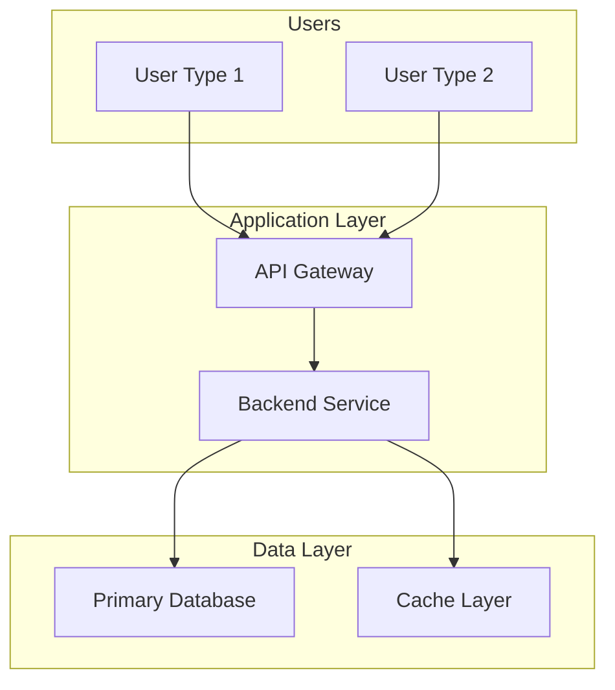
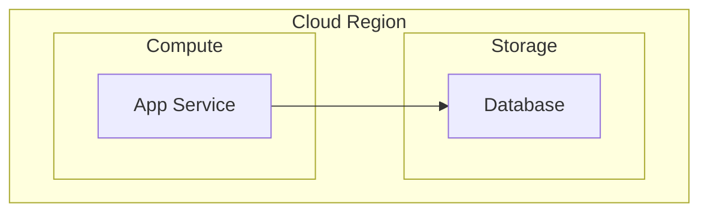
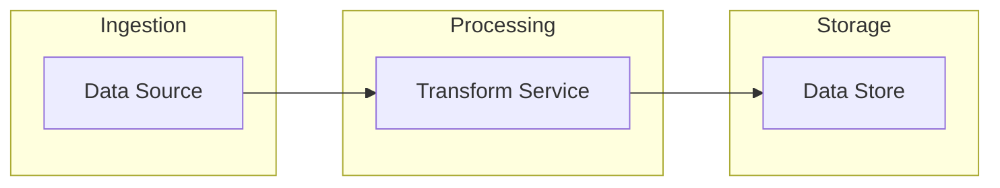

# Architecture Design Template

Output template aligned with `/architecture` skill output fields and `architecture.schema.json`.

## Depth Tier Guidance

| Tier | Required Sections | Optional Sections | Target Length |
|------|-----------------|------------------|---------------|
| QUICK | Executive Summary, Tech Stack, System Context diagram | All others | 2-4 pages |
| STANDARD | All sections below | Extended IaC detail | 6-10 pages |
| COMPREHENSIVE | All sections | None | 10-20 pages |

---

## Executive Summary

- **Recommended Approach**: [One-line recommendation]
- **Confidence Level**: [high / medium / low]
- **Go/No-Go**: [go / go_with_conditions / pause / no_go]
- **Key Benefits**: [List]
- **Key Risks**: [List]
- **Total Investment Range**: [Range]

---

## Tech Stack

### LLM
- **Provider**: [Provider name]
- **Primary Model**: [Model ID]
- **Fallback Model**: [Model ID, if applicable]
- **Hosting**: [Self-hosted / managed service]
- **Rationale**: [Why this choice]

### Orchestration
- **Framework**: [Framework name]
- **Pattern**: [direct_api / rag_with_routing / agent_loop / multi_agent / pipeline]
- **Rationale**: [Why this pattern]

### Backend
- **Language**: [Language]
- **Framework**: [Framework]
- **API Style**: [rest / graphql / grpc / websocket]

### Frontend
- **Framework**: [Framework or none]
- **Type**: [web_app / mobile_app / desktop_app / embedded_widget / cli / none]

### Data Stores
| Name | Technology | Hosting | Purpose |
|------|-----------|---------|---------|
| [Store name] | [Tech] | [Where hosted] | [Purpose] |

### Infrastructure
- **Cloud Provider**: [Provider]
- **Compute**: [Service]
- **Deployment Strategy**: [blue_green / canary / rolling / recreate]
- **Region**: [Region]
- **Monitoring**: [Tool]
- **Logging**: [Tool]

---

## Component Design

| ID | Name | Technology | Purpose | Inputs | Outputs | Cost Driver |
|----|------|-----------|---------|--------|---------|-------------|
| C-001 | [Name] | [Tech] | [Purpose] | [Inputs] | [Outputs] | yes / no |

---

## Data Flows

| ID | Name | Source | Destination | Protocol | Latency Target | Encryption |
|----|------|--------|-------------|----------|----------------|------------|
| DF-001 | [Name] | [Source] | [Dest] | [Protocol] | [N]ms | [Method] |

---

## Diagrams

Follow Mermaid quality rules: quote all node labels with special chars or ` `, quote subgraph titles, quote edge labels with spaces, keep labels 3-5 words, use `UPPER_SNAKE_CASE` or `camelCase` node IDs, declare direction explicitly, avoid `&` parallel links in complex diagrams.

### System Context

### Deployment

### Data Flow

---

## Cloud Infrastructure

[Services, deployment pattern, DR strategy, cost optimization]

---

## AI/ML Components

[Tool Gateway, Identity, Runtime, Memory — if applicable]

---

## Observability

[Logging, metrics, tracing strategy]

---

## Well-Architected Scores

| Pillar | Score | Notes |
|--------|-------|-------|
| Operational Excellence | [0-10] | [Notes] |
| Security | [0-10] | [Notes] |
| Reliability | [0-10] | [Notes] |
| Performance Efficiency | [0-10] | [Notes] |
| Cost Optimization | [0-10] | [Notes] |
| Sustainability | [0-10] | [Notes] |
| **Overall** | **[0-10]** | |

---

## Infrastructure as Code

### IaC Strategy
- **Tool**: [Terraform / CDK / Pulumi / CloudFormation / Bicep / none]
- **Repository Strategy**: [monorepo / separate repo / embedded in app repo]
- **State Management**: [remote backend / local / managed service]

### Module Structure
| Module | Resources | Environment Parity |
|--------|-----------|--------------------|
| [Module name] | [Resources managed] | [dev/staging/prod differences] |

### Deployment Pipeline
- **CI/CD Tool**: [GitHub Actions / GitLab CI / Jenkins / etc.]
- **Environments**: [dev → staging → prod]
- **Approval Gates**: [manual / automated / policy-based]
- **Rollback Strategy**: [automatic / manual / blue-green switch]

---

## Alternatives Considered

| Name | Summary | Why Rejected |
|------|---------|-------------|
| [Alternative] | [Brief description] | [Reason] |
