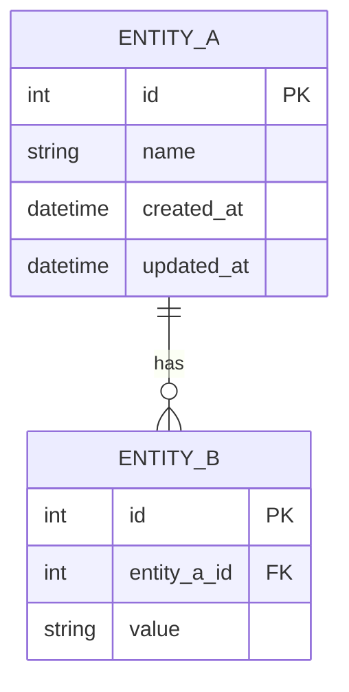

# Data Model Template

Output template aligned with `/data-model` skill and `data_model.schema.json`.

## Document Metadata

- **Engagement ID**: [eng-YYYY-NNN]
- **Version**: [MAJOR.MINOR]
- **Date**: [YYYY-MM-DD]
- **Depth Tier**: [QUICK / STANDARD / COMPREHENSIVE]

## Depth Tier Guidance

| Tier | Required Sections | Optional Sections | Target Length |
|------|-----------------|------------------|---------------|
| QUICK | ER Diagram, Entity Summary, Governance summary | Vector, Graph, Pipeline | 1-2 pages |
| STANDARD | ER + Entity, Governance, Validation | Vector/Graph (if applicable) | 4-8 pages |
| COMPREHENSIVE | All sections | None | 8-15 pages |

---

## Entity-Relationship Diagram

Follow Mermaid quality rules: quote labels with special chars, keep labels short, use `UPPER_SNAKE_CASE` node IDs.

---

## Entity Table

| Entity | Fields | Primary Key | Indexes | Estimated Rows |
|--------|--------|------------|---------|---------------|
| [Entity] | [Fields] | [PK] | [Indexes] | [N] |

---

## Vector Schema (if applicable)

| Collection | Embedding Model | Dimensions | Index Type | Reranking Strategy | Similarity Threshold |
|-----------|----------------|-----------|-----------|-------------------|---------------------|
| [Name] | [Model] | [N] | [HNSW/IVF] | [Bi-encoder/Cross-encoder/BM25-hybrid/RRF] | [N] |

---

## Graph Schema (if applicable)

| Node Type | Properties | Cardinality |
|-----------|-----------|------------|
| [Node] | [Properties] | [N] |

| Edge Type | From | To | Properties | Direction |
|-----------|------|----|-----------|-----------|
| [Edge] | [Node] | [Node] | [Properties] | directed/undirected |

---

## Data Governance

| Data Store | PII Fields | Retention Policy | Encryption | Access Roles |
|-----------|-----------|-----------------|-----------|-------------|
| [Store] | [Fields] | [Policy] | [Method] | [Roles] |
