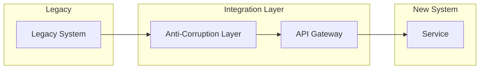

# Integration Plan Template

Output template aligned with `/integration-plan` skill and `integration_plan.schema.json`.

## Document Metadata

- **Engagement ID**: [eng-YYYY-NNN]
- **Version**: [MAJOR.MINOR]
- **Date**: [YYYY-MM-DD]
- **Depth Tier**: [QUICK / STANDARD / COMPREHENSIVE]

## Depth Tier Guidance

| Tier | Required Sections | Optional Sections | Target Length |
|------|-----------------|------------------|---------------|
| QUICK | Integration Points, Migration Strategy | CI/CD, Legacy Bridging | 1-2 pages |
| STANDARD | All core sections | CI/CD Pipeline | 4-8 pages |
| COMPREHENSIVE | All sections | None | 8-15 pages |

---

## Integration Points

| ID | Source System | Target System | Direction | Protocol | Data Format | Volume |
|----|-------------|--------------|-----------|---------|------------|--------|
| INT-001 | [Source] | [Target] | inbound/outbound/bidirectional | REST/GraphQL/gRPC/MCP | JSON/XML/CSV | [N/day] |

---

## API Contracts

| ID | Endpoint / Operation | Method | Auth | Rate Limit | SLA |
|----|---------------------|--------|------|-----------|-----|
| API-001 | [Path or operation] | GET/POST/PUT/DELETE | [Auth type] | [N/min] | [Availability %] |

---

## Migration Strategy

**Chosen Pattern**: [Strangler Fig / Big Bang / Parallel Run / Phased]

**Rationale**: [Why this approach]

| Stage | Description | Duration | Validation Criteria | Rollback Plan |
|-------|------------|----------|--------------------|--------------:|
| [Stage 1] | [Description] | [N weeks] | [Criteria] | [Rollback] |

---

## Data Flow Diagram

Follow Mermaid quality rules.

---

## Data Flow Mappings

| ID | Source Field | Target Field | Transformation | Validation Rule |
|----|-------------|-------------|---------------|----------------|
| DFM-001 | [source.field] | [target.field] | [None/Transform] | [Rule] |
